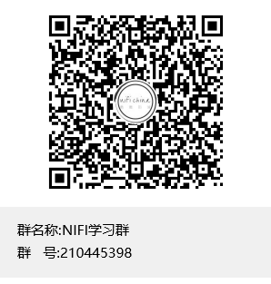
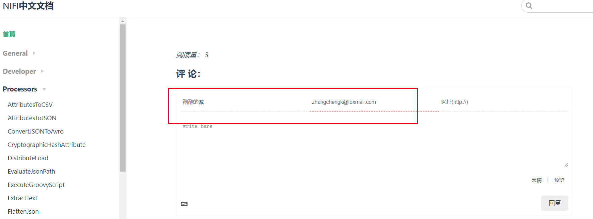

# 首页

文档中如有错误，烦劳在页面最下方留言指正。如有转载，请标明出处。

# 文档版本

翻译的文档对照官方文档1.9.2版本，如有出入，以官方文档为准（可以以此中文文档为参照，但建议多看官方文档原文）除了官方文档的说明外，还有一些关于组件的小demo说明，一些与各个组件可能有关系的其他文献资料的整理等等。

官方文档地址：http://nifi.apache.org/docs.html

# 文档维护

NIFI中文文档暂时由酷酷的诚自己维护，时间有限，能力不足，翻译能力也一般，工作量也比较大，过程中可能还会加入自己的一些理解，所以翻译过来的文档可能有诸多瑕疵，希望有发现问题的同学能及时反馈我。

# 联系方式

邮箱：zhangchengk@foxmail.com

QQ群: 210445398

# tip

文档下方有无需登录的评论功能，在评论时可以给自己起一个昵称，建议在评论时填写自己的邮箱(他人不可见)，这样在你的评论得到回复时，会以邮件形式通知你。
评论服务器架设在免费的LearnCloud中，免费服务有强制休眠策略，所以偶尔评论功能异常也是正常的。

