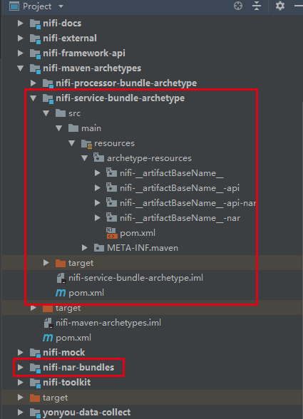
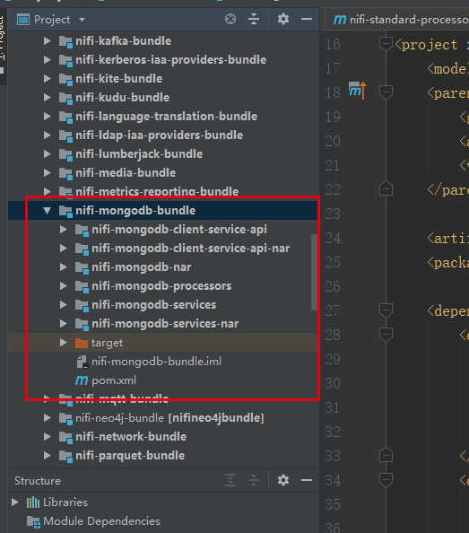
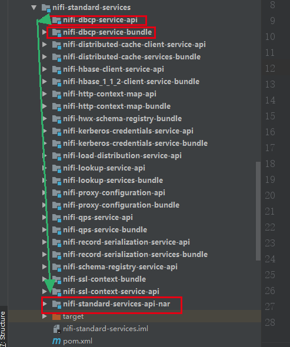
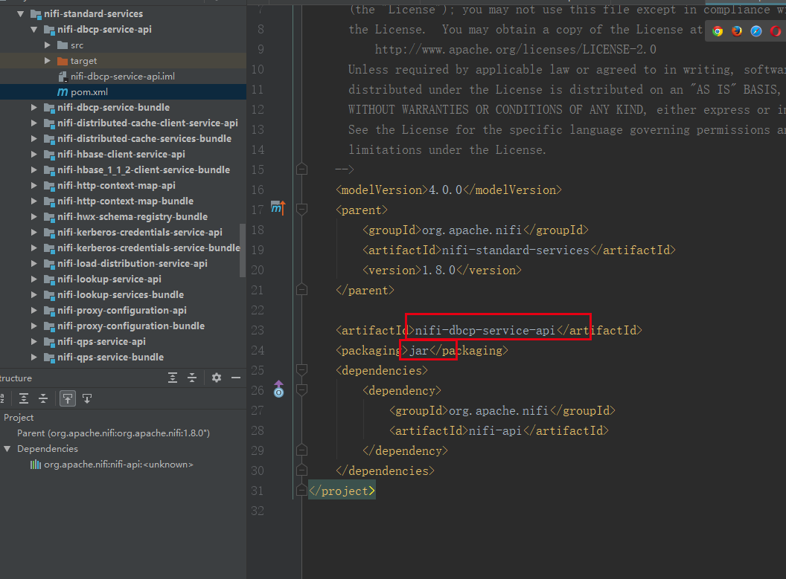
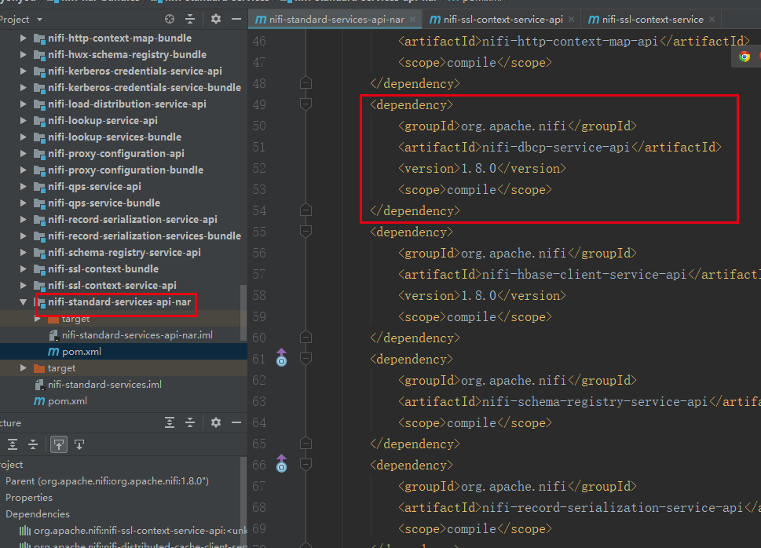
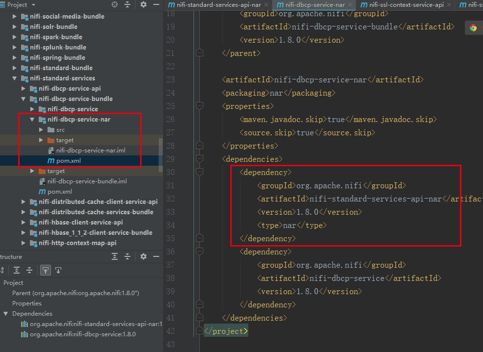

# 扩展开发Controller Service的项目结构规范
***
编辑人：__**酷酷的诚**__  邮箱：**zhangchengk@foxmail.com**
***
内容：

两种结构方式：

## 在nifi-nar-bundles中新建子Module，结构继承nifi-service-bundle-archetype

注意：新建子Module中有API nar包和Service nar包，在Service nar的pom.xml中加入对API nar包的依赖

这种的尤为适合纯扩展的Controller Service和Processor，比如nifi-mongodb-bundle

## 在nifi-standard-services中新建api Module和service Module

将Api-Module打成jar包，将这个jar包打进nifi-standard-services-api-nar中，同时service Module中的nar包依赖nifi-standard-services-api-nar

以dbcp为例：

将dbcp 的API 打成jar包

将jar包打进nifi-standard-services-api-nar中

在nifi-dbcp-service-nar中依赖nifi-standard-services-api-nar，如此在加载nar的时候会先加载nifi-standard-services-api-nar

[具体的具体的原理源码说明](../code/nifi-nar-classloader)