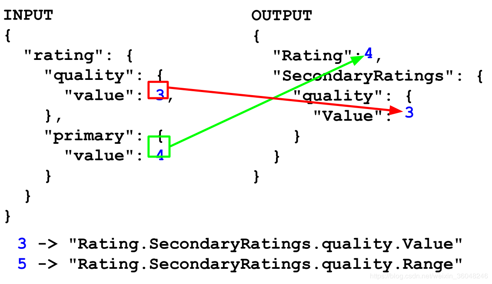

# JSON JOLT介绍 及语法详解-shift篇
***
编辑人：__**酷酷的诚**__  邮箱：**zhangchengk@foxmail.com**
***
内容：

## 一 什么是JOLT ？

json与json转换的库，是一个很强大的json转json的工具。在我们涉及Cassandra, ElasticSearch, Mongo的时候，很有可能就有这方面的需求  。另写代码又不灵活，使用JOLT就很好了。

基本流程就是输入格式A数据 json，使用jolt描述语言（也是json ），得到想要的格式B数据json

## 二 JOLT的几个理念

1：对于输入的数据 （或者 数据的节点），它要输出到输出数据的哪个位置？如下：



2：要确定输出的格式 ，你想要什么样格式的输出json？

3：使用 jolt规范语言去描述json转换动作。

## 三 jolt 语法  -shift

### 1 概述

1.1 jolt其实是操作map

1.2 每一个小的转换都是基于一个DSL

1.3 可以把若干个小的转换串（chain ）起来

1.4 基本样式如下：

```json
[
    {
        "operation" : "shift",
        "spec": { ... }
        },
    {
        "operation" : "java",
        "classname" : "com.bazaar..",
        "spec": { ... } // optional
        },
    {
        "operation" : "default",
        "spec" : { ... }
        }
]
```

operation  ： "shift","default","remove","sort","java"

1.5 在线转换工具（或者使用NIFI里的转换页面 ）

https://jolt-demo.appspot.com/#modify-stringFunctions

以下示例 皆在以上这个在线工具（可能需要小翻一下）

### 2 语法讲解

以下会以示例为先，在示例中层层递进得讲述jolt的语法规则。

有输入数据，有想要输出数据的格式，那么关键就是这个JOLT SPEC 怎么写（如下图 ）


1 先看正确的写法（如下图）：jolt spec 最简单的理解就是 （前面提过，将json当做map处理）key是“匹配”，value是“去哪”，告诉程序，匹配哪部分数据，这部分数据在输出数据的什么位置 。


2 现在，我们用jolt 去匹配输入数据，并将匹配到的数据发送到输出数据的两个位置：


3 现在，匹配输入数据多个值，发送到输出数据同一个位置：


4：以上 3个示例，匹配数据或者发送数据都是 使用字符串 指明的，下面我们介绍  jolt中的通配符  *   和  &

首先看一个 没有通配符的示例：


再看使用通配符达到与上面这个示例同样的效果：*   &


从示例中可以看出 ，*  是匹配输出数据一个节点下的所有子节点。& 是 匹配 输出数据的key(前面提过，将json当做map处理)，将key当做数据来使用 。

需要注意的一点优先级问题 ，看下面这个示例 ：


通配符的匹配优先级 是在精确 匹配之后的

5 & 的深入理解：&其实是取    *（或其他）  匹配到的节点的 key


接着上面的示例，再对比看一个示例：


在上面示例中，& &(0) &(0,0)都是等价的，拿到的key是：    stats--colour--196--avgRating

&(0,1)   取到的是  第一个通配符  *  匹配到的key值  ：colour

&(0,2)   取到的是  第二个通配符  *  匹配到的key值  ：196

6  $符的使用与理解

在上面的示例与 讲解 中，我们已经 体会到了  &符号   是 如何将匹配到的key值作为data数据使用的

但是，  &   是 在描述数据发送到输出数据 的什么位置上 使用的（即jolt spet 的json脚本中的 value里、冒号右边）

如果，我们需要 在 匹配 输入数据 的时候 有这样的需求呢（即jolt spet 的json脚本中的 key里、冒号左 边）  

下面介绍 $，看 示例：


其取值 含义与&基本一样 。


7 @ 符号的理解与使用 


@比较难描述 ，对于上面的示例，用下面这个规则去理解。


再举一个$ 与 @  一起使用的例子


同样，@也是可以加数字的，与上面的通配符的加数字用法差不多。

