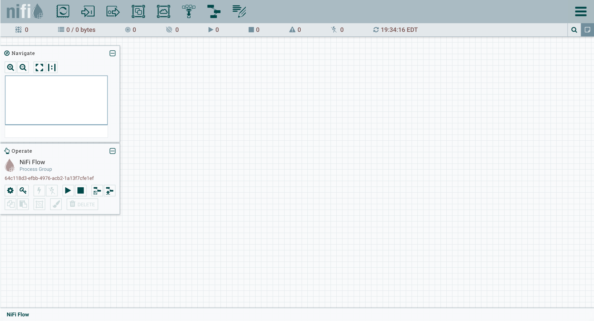
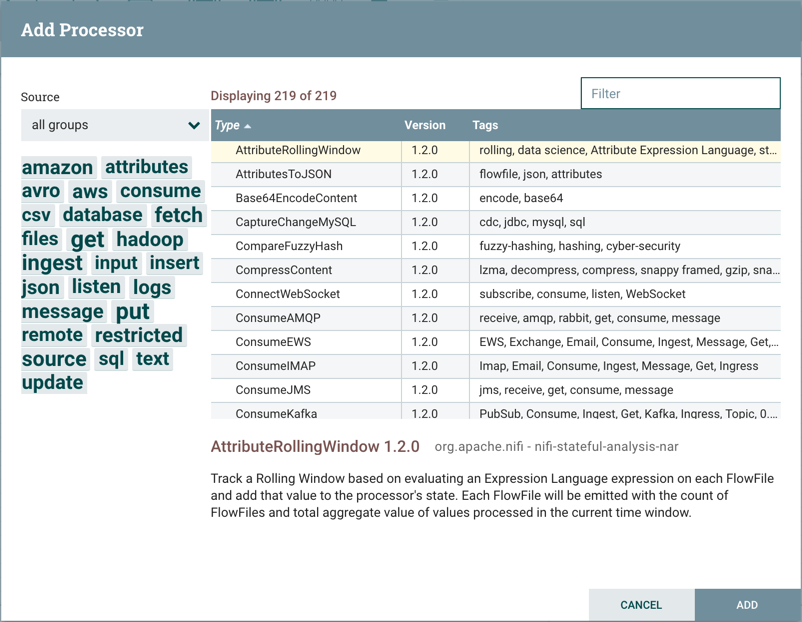
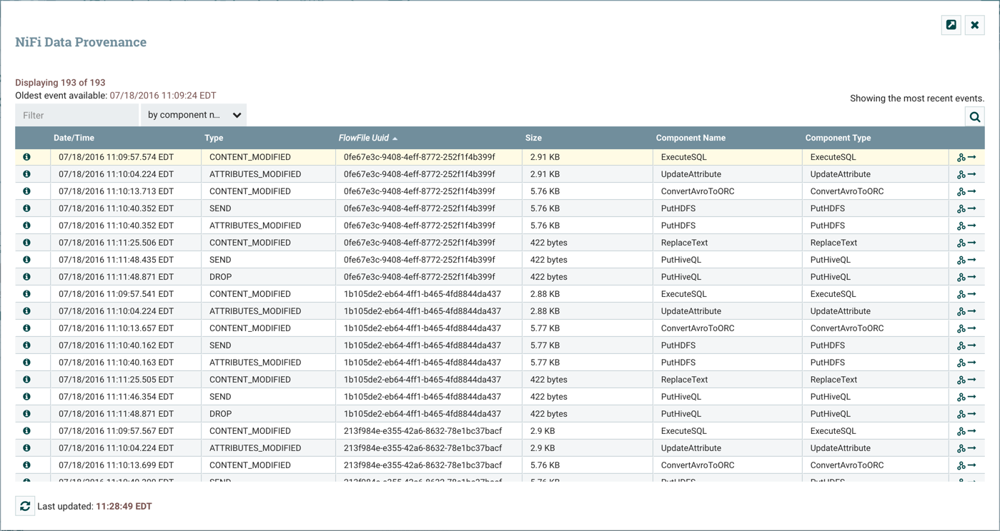
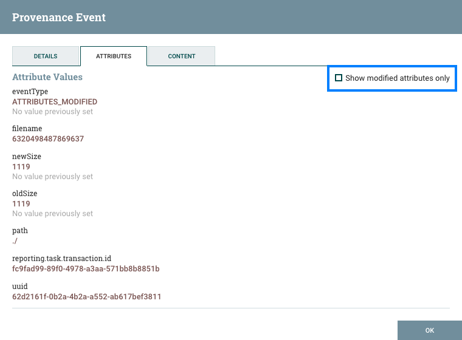

# 入门(Getting Started with Apache NiFi)
***
编辑人：__**酷酷的诚**__  邮箱：**zhangchengk@foxmail.com** 
***
内容：

## 此指南适用的用户

本指南适用于从未使用过,或者对NiFi接触较少或仅在NIFI中完成过特定任务的用户。本指南并不是详尽的说明手册或参考指南,反而[用户指南](./UserGuide)作为参考指南会非常有用,用户指南中会提供大量信息,旨在提供更加详尽的指导学习资源。相比之下,本指南旨是为了帮助用户了解如何使用NiFi,以便快速轻松地构建强大而灵活的数据处理流程。

本指南中的某些信息是仅适用于初次使用的用户的,而其他信息可能适用于那些使用过NiFi的人,本指南分为几个不同的部分,其中某些部分读者可能并不感兴趣,可以随意跳转到最适合我们的部分。

本指南希望可以帮助用户基本地了解NiFi是什么,而不是去深入研究,想要深入研究可以在[Overview](./overview)文档中找到更详细的信息 。

## 本指南用到的术语

在此之前,读者应该熟悉一些关键术语。我们将在这里从更高的层次解释这些特定于nifi的术语。

**FlowFile**：每条"用户数据"（即用户带进NiFi的需要进行处理和分发的数据）称为FlowFile。FlowFile由两部分组成：Attributes 和 Content。Content是用户数据本身。Attributes是与用户数据关联的键值对。

**Processor**：处理器,是NiFi组件,负责创建,发送,接收,转换,路由,拆分,合并和处理FlowFiles。它是NiFi用户可用于构建其数据流的最重要的构建块。

## 下载安装NIFI

NiFi可以从NiFi[官方页面下载](http://nifi.apache.org/download.html)。有两种可用的打包选项：针对Linux定制的"tarball"和更适用于Windows用户的zip文件。Mac OS X用户也可以使用tarball或通过Homebrew安装。

要通过Homebrew安装,只需运行命令brew install nifi即可。

对于未运行OS X或未安装Homebrew的用户,在下载您想要使用的NiFi版本后,只需将存档解压缩到您希望运行该应用程序的位置。

有关如何配置NiFi实例的信息（例如,配置安全性,数据存储配置或运行NiFi的端口）,请参阅[系统管理员指南](./AdminGuide)。

## 启动NIFI

一旦按照上述方式下载并安装了NiFi,就可以使用适合您操作系统的机制启动它。

### Windows用户

对于Windows用户,进入安装NiFi的文件夹,在此文件夹中有一个名为bin的子文件夹。进入此子文件夹,然后双击run-nifi.bat文件。

这将启动NiFi并让它在前台运行。要关闭NiFi,请选择已启动的窗口,按住Ctrl+C。

### Linux、Mac用户

对于Linux和OS X用户,使用终端窗口进入安装NiFi的目录。要在前台运行NiFi,就运行bin/nifi.sh run,直到用户按下Ctrl-C,NIFI就关闭了。

要在后台运行NiFi,请运行bin/nifi.sh start。这将启动应用程序并开始运行。要检查状态并查看NiFi当前是否正在运行,请执行bin/nifi.sh status命令。可以通过执行命令bin/nifi.sh stop关闭NiFi 。

### 作为一个服务进行安装

目前,仅支持Linux和Mac OS X用户作为服务进行NiFi的安装。要将应用程序作为服务去安装,首先进入安装目录,然后执行命令bin/nifi.sh install,这样就以默认名称nifi安装服务了。要为服务指定自定义名称,请使用可选的第二个参数（该服务的名称）执行该命令。例如,要将NiFi作为具有dataflow名称的服务安装,请使用该命令：bin/nifi.sh install dataflow。

安装后,可以使用适当的命令启动和停止服务,例如sudo service nifi start 和sudo service nifi stop。此外,可以通过执行sudo service nifi status命令检查运行状态。

## 启动NIFI后,要做什么？

现在NiFi已经启动好了,我们可以调出用户界面（UI）来创建和监控我们的流程。请打开Web浏览器,输入地址 http://localhost:8080/nifi 就可以开始使用了。可以通过编辑conf目录中的nifi.properties文件来更改端口,但默认端口为8080。

打开用户界面,此时这是一个用于编排数据流程的空白画布：

用户界面有多种工具可用于创建和管理我们的第一个数据流：

全局菜单(global menu)包含以下选项：

### 添加处理器

我们现在可以通过在画布中添加Processor来开始创建数据流处理流程。要执行此操作,请将处理器图标()从屏幕左上方拖动到画布中间,并将其放在那里。拖拽时NIFI将为我们提供一个对话框,允许我们选择要添加的处理器：

我们有很多可选组件。方便演示,这里假设我们的需求只是想将本地磁盘中的文件导入NiFi。当开发人员写处理器的时候,开发人员可以为该处理器分配"tags",这些tags就是关键字,我们可以通过在对话框右上角的过滤器框中输入关键字或处理器名称进行过滤。想要从本地磁盘中提取文件,在过滤框输入关键字,例如,输入关键字"file"将为我们筛选出一些处理文件的处理器。按"local"一词过滤也会很快缩小列表范围。从列表中选择处理器,我们将在对话框底部附近看到处理器的简要说明,这会告诉我们处理器的确切功能。**GetFile** Processor告诉我们它将数据从我们的本地磁盘拉入NiFi,然后删除本地文件。随后我们可以双击处理器类型或选择处理器并点击Add按钮,这样,处理器将被添加到画布中我们拖拽到的位置上。

### 配置处理器

现在我们已经添加了GetFile处理器,我们可以通过右键单击Processor并选择Configure菜单项来配置它。弹出的对话框有许多配置项,可以到[用户指南](./UserGuide)详细了解,在本指南中,我们将重点关注"Properties"选项卡。选择Properties选项卡后,我们将获得一个可以为Processor作配置的列表。不同的组件属性也是不同的,粗体属性是必需属性。在配置完所有必需属性之后,才能够启动处理器。为GetFile配置的最重要的属性是文件的目录。比如我们将目录名是./data-in,这将导致处理器开始拉取中data-in目录下的所有数据。我们可以选择为此处理器配置多个不同的属性,如果不确定特定属性的作用,我们可以将鼠标悬停在问号图标上,即属性名称旁边的帮助图标,以便阅读该属性的描述。此外,将鼠标悬停在图标上时显示的工具提示将提供该属性的默认值（如果存在）,以及有关该属性是否支持表达式语言的信息（请参阅文档的[表达式语言/在Property值中使用attribute](#表达式语言-在Property值中使用attribute)）,以及之前为该属性配置的值。

要使此属性有效,请在NIFI主目录中创建一个名为data-in的目录,然后单击确定按钮关闭对话框。

### 连接处理器

每个处理器都有一组定义好的"Relationships",数据将发送到这些关系中。处理器完成FlowFile的处理后,会将其传输到其中一个(或多个)关系。这允许用户根据处理的结果配置如何路由FlowFiles。例如,许多处理器定义了两个关系：success和failure。然后,如果处理器能够成功处理数据则可以将数据流传入success,如果处理器由于某种原因无法处理数据则可以将数据流传入failure。或者,可以简单地将两个关系路由到流中的相同路由（比如success和failure目的到相同的路由）。

现在我们已经添加并配置了我们的GetFile处理器,并应用了配置,我们可以在处理器的左上角看到一个警告图标（）,警告图标表示处理器未处于有效状态。将鼠标悬停在此图标上,我们可以看到该success关系尚未定义的警告信息,意思是我们没有告诉NiFi如何处理Processor转移到success关系的数据。

为了解决这个问题,让我们按照上面的相同步骤添加另一个可以连接GetFile的处理器。这一次,我们假设只需记录FlowFile存在的属性。为此,我们将添加一个LogAttributes处理器。

我们现在可以将GetFile处理器的输出发送到LogAttribute。用鼠标悬停在GetFile处理器上,连接出现在处理器中间的图标。我们可以将此图标从GetFile拖到LogAttribute。这时会弹出一个对话框,用于选择我们要为此连接包含哪些关系。由于GetFile只有一个关系success,因此会自动为我们选择关系。

单击连接的"Settings",选项卡提供了一些用于配置此连接的行为方式的选项：

如果我们愿意,我们可以给Connection起一个名字。我们还可以设置数据的到期时间。默认情况下,它设置为"0秒",表示数据不应过期。但是,我们可以更改该值,以便当此Connection中的数据达到特定期限时,它将自动删除FlowFile（并将创建相应的EXPIRE Provenance事件,后面会有介绍）。

背压阈值(backpressure)允许我们在来源源处理器运行时指定当前队列可以存多大的数据(可以超,但超过阈值背压机制就使上游组件停止处理数据)。这使我们能够处理上下游处理数据速度不一致的问题。(比如组件A读取数据输出到连接C,连接C的队列中的数据流数量达到背压值,则A停止读取数据,直到C队列积压的数据低于背压值)

最后,我们在右侧可配置优先级。这允许我们控制如何排序此队列中的数据。我们可以将优先级从"Available prioritizers"列表拖到"Selected prioritizers"列表中,以激活优先级排序器。如果激活了多个优先级排序器,则会将对它们进行评估,首先评估先列出的优先级排序器,如果根据该优先级排序器确定两个FlowFiles相等,则将使用第二个优先级排序器,以此类推。

为了便于讨论,我们只需单击Add将Connection添加到画布中即可。我们现在应该看到Alert图标已更改为Stopped图标。但是,LogAttribute现在显示无效,因为它的success关系尚未连接到任何下游组件。我们将LogAttribute 的success配置成Auto Terminated(当FlowFile在LogAttribute中处理完成后,会产出drop事件),单击OK将关闭对话框,界面 显示两个处理器是停止状态。

### 启动和停止处理器

此时,我们的画布上有两个处理器,但并没有发生任何事情。我们可以单独单击每个处理器,然后右键单击并选择Start菜单项来启动处理器。或者,我们可以选择第一个处理器,然后在选择其他处理器的同时按住Shift键以选择两者,然后,我们可以右键单击并选择Start。我们也可以选择处理器,然后单击Operate面板中的Start图标。

启动后,处理器左上角的图标将从停止的图标更改为正在运行的图标。然后,我们可以使用Operate面板Stop按钮或菜单项中的Stop菜单来停止处理器。

处理器启动后,我们无法再配置它。但我们可以右键单击处理器查看其当前配置。为了配置处理器,我们必须先停止处理器并等待当前正在执行的任务完成,当前正在执行的任务数显示在处理器的右上角附近,但如果当前没有任务,则不会显示任何内容。

### 获取处理器的更多信息

由于每个处理器都可以拥有多个不同的属性和关系,因此记住每个处理器的工作原理是很困难的。我们可以右键单击处理器并选择Usage菜单项去获得处理器的使用信息,例如处理器的描述,可用的关系,何时使用不同的关系,处理器的属性,以及哪些FlowFile属性（如果有的话）在FlowFiles传入的时候是需要携带的,以及哪些属性（如果有的话）被添加到传出的FlowFiles中。

### 其他组件

用户可以将处理器拖放到画布上的工具栏中还包括了可用于构建数据处理流程的其他几个组件,这些组件包括输入和输出端口,漏斗,进程组和远程进程组,我们暂时不会在此讨论这些元素,但可以在[用户指南](/general/UserGuide.md)的[构建dataflow](./UserGuide.md#构建dataflow)部分中找到相关信息 

## 有哪些类别的处理器

为了创建有效的数据流处理流程,用户必须了解可用的处理器类型。NiFi包含许多不同的处理器。这些处理器提供了可从众多不同系统中提取数据,路由,转换,处理,拆分和聚合数据以及将数据分发到多个系统的功能。

几乎每个NiFi版本中可用的处理器数量都在增加。因此,我们不会尝试在这里介绍每一个可用的处理器,但我们将重点介绍一些最常用的处理器,按功能对它们进行分类。

### 数据转换

- CompressContent：压缩或解压

- ConvertCharacterSet：将用于编码内容的字符集从一个字符集转换为另一个字符集

- EncryptContent：加密或解密

- ReplaceText：使用正则表达式修改文本内容

- TransformXml：应用XSLT转换XML内容

- JoltTransformJSON：应用JOLT规范来转换JSON内容

### 路由和调解

- ControlRate：限制流程中数据流经某部分的速率

- DetectDuplicate：根据一些用户定义的标准去监视发现重复的FlowFiles。通常与HashContent一起使用

- DistributeLoad：通过只将一部分数据分发给每个用户定义的关系来实现负载平衡或数据抽样

- MonitorActivity：当用户定义的时间段过去而没有任何数据流经此节点时发送通知。（可选）在数据流恢复时发送通知。

- RouteOnAttribute：根据FlowFile包含的属性路由FlowFile。

- ScanAttribute：扫描FlowFile上用户定义的属性集,检查是否有任何属性与用户定义的字典匹配。

- RouteOnContent：根据FlowFile的内容是否与用户自定义的正则表达式匹配。如果匹配,则FlowFile将路由到已配置的关系。

- ScanContent：在流文件的内容中搜索用户定义字典中存在的术语,并根据这些术语的存在或不存在来路由。字典可以由文本条目或二进制条目组成。。

- ValidateXml：以XML模式验证XML内容; 根据用户定义的XML Schema,判断FlowFile的内容是否有效,进而来路由FlowFile。

### 数据库访问

- ConvertJSONToSQL：将JSON文档转换为SQL INSERT或UPDATE命令,然后可以将其传递给PutSQL Processor

- ExecuteSQL：执行用户定义的SQL SELECT命令,结果为Avro格式的FlowFile

- PutSQL：通过执行FlowFile内容定义的SQL DDM语句来更新数据库

- SelectHiveQL：对Apache Hive数据库执行用户定义的HiveQL SELECT命令,结果为Avro或CSV格式的FlowFile

- PutHiveQL：通过执行FlowFile内容定义的HiveQL DDM语句来更新Hive数据库

### 属性提取

- EvaluateJsonPath：用户提供JSONPath表达式（类似于XPath,用于XML解析/提取）,然后根据JSON内容评估这些表达式,用结果值替换FlowFile内容或将结果值提取到用户自己命名的Attribute中。

- EvaluateXPath：用户提供XPath表达式,然后根据XML内容评估这些表达式,用结果值替换FlowFile内容或将结果值提取到用户自己命名的Attribute中。

- EvaluateXQuery：用户提供XQuery查询,然后根据XML内容评估此查询,用结果值替换FlowFile内容或将结果值提取到用户自己命名的Attribute中。

- ExtractText：用户提供一个或多个正则表达式,然后根据FlowFile的文本内容对其进行评估,然后将结果值提取到用户自己命名的Attribute中。

- HashAttribute：对用户定义的现有属性列表的串联进行hash。

- HashContent：对FlowFile的内容进行hash,并将得到的hash值添加到Attribute中。

- IdentifyMimeType：评估FlowFile的内容,以确定FlowFile封装的文件类型。此处理器能够检测许多不同的MIME类型,例如图像,文字处理器文档,文本和压缩格式,仅举几例。

- UpdateAttribute：向FlowFile添加或更新任意数量的用户定义的属性。这对于添加静态的属性值以及使用表达式语言动态计算出来的属性值非常有用。该处理器还提供"高级用户界面(Advanced User Interface)",允许用户根据用户提供的规则有条件地去更新属性。

### 系统交互

- ExecuteProcess：运行用户自定义的操作系统命令。进程的StdOut被重定向,以便StdOut的内容输出为FlowFile的内容。此处理器是源处理器(不接受数据流输入,没有上游组件) - 其输出预计会生成新的FlowFile,并且系统调用不会接收任何输入。如果要为进程提供输入,请使用ExecuteStreamCommand Processor。

- ExecuteStreamCommand：运行用户定义的操作系统命令。FlowFile的内容可选地流式传输到进程的StdIn。StdOut的内容输出为FlowFile的内容。此处理器不能用作源处理器 - 必须传入FlowFiles才能执行。要使用源处理器执行相同类型的功能,请参阅ExecuteProcess Processor。

### 数据提取

- GetFile：将文件内容从本地磁盘（或网络连接的磁盘）流式传输到NiFi,然后删除原始文件。此处理器应将文件从一个位置移动到另一个位置,而不是用于复制数据。

- GetFTP：通过FTP将远程文件的内容下载到NiFi中,然后删除原始文件。此处理器应将文件从一个位置移动到另一个位置,而不是用于复制数据。

- GetSFTP：通过SFTP将远程文件的内容下载到NiFi中,然后删除原始文件。此处理器应将文件从一个位置移动到另一个位置,而不是用于复制数据。

- GetJMSQueue：从JMS队列下载消息,并根据JMS消息的内容创建FlowFile。可选地,JMS属性也可以作为属性复制。

- GetJMSTopic：从JMS主题下载消息,并根据JMS消息的内容创建FlowFile。可选地,JMS属性也可以作为属性复制。此处理器支持持久订阅和非持久订阅。

- GetHTTP：将基于HTTP或HTTPS的远程URL的请求内容下载到NiFi中。处理器将记住ETag和Last-Modified Date,以确保不会持续摄取数据。

- ListenHTTP：启动HTTP（或HTTPS）服务器并侦听传入连接。对于任何传入的POST请求,请求的内容将作为FlowFile写出,并返回200响应。

- ListenUDP：侦听传入的UDP数据包,并为每个数据包或每个数据包创建一个FlowFile（取决于配置）,并将FlowFile发送到"success"。

- GetHDFS：监视HDFS中用户指定的目录。每当新文件进入HDFS时,它将被复制到NiFi并从HDFS中删除。此处理器应将文件从一个位置移动到另一个位置,而不是用于复制数据。如果在集群中运行,此处理器需仅在主节点上运行。要从HDFS复制数据并使其保持原状,或者从群集中的多个节点流式传输数据,请参阅ListHDFS处理器。

- ListHDFS / FetchHDFS：ListHDFS监视HDFS中用户指定的目录,并发出一个FlowFile,其中包含它遇到的每个文件的文件名。然后,它通过分布式缓存在整个NiFi集群中保持此状态。然后可以在集群中,将其发送到FetchHDFS处理器,后者获取这些文件的实际内容并发出包含从HDFS获取的内容的FlowFiles。

- FetchS3Object：从Amazon Web Services（AWS）简单存储服务（S3）获取对象的内容。输出的FlowFile包含从S3接收的内容。

- GetKafka：从Apache Kafka获取消息,特别是0.8.x版本。消息可以作为每个消息的FlowFile发出,也可以使用用户指定的分隔符一起进行批处理。

- GetMongo：对MongoDB执行用户指定的查询,并将内容写入新的FlowFile。

- GetTwitter：允许用户注册过滤器以收听Twitter"garden hose"或企业端点,为收到的每条推文创建一个FlowFile。

### 数据出口/发送数据

- PutEmail：向配置的收件人发送电子邮件。FlowFile的内容可选择作为附件发送。

- PutFile：将FlowFile的内容写入本地（或网络连接）文件系统上的目录。

- PutFTP：将FlowFile的内容复制到远程FTP服务器。

- PutSFTP：将FlowFile的内容复制到远程SFTP服务器。

- PutJMS：将FlowFile的内容作为JMS消息发送到JMS代理,可选择将Attributes添加JMS属性。

- PutSQL：将FlowFile的内容作为SQL DDL语句（INSERT,UPDATE或DELETE）执行。FlowFile的内容必须是有效的SQL语句。属性可以用作参数,FlowFile的内容可以是参数化的SQL语句,以避免SQL注入攻击。

- PutKafka：将FlowFile的内容作为消息发送到Apache Kafka,特别是0.8.x版本。FlowFile可以作为单个消息或分隔符发送,例如可以指定换行符,以便为单个FlowFile发送许多消息。

- PutMongo：将FlowFile的内容作为INSERT或UPDATE发送到Mongo。

### 分裂和聚合

- SplitText：SplitText接收单个FlowFile,其内容为文本,并根据配置的行数将其拆分为1个或多个FlowFiles。例如,可以将处理器配置为将FlowFile拆分为多个FlowFile,每个FlowFile只有一行。

- SplitJson：允许用户将包含数组或许多子对象的JSON对象拆分为每个JSON元素的FlowFile。

- SplitXml：允许用户将XML消息拆分为多个FlowFiles,每个FlowFiles包含原始段。这通常在多个XML元素与"wrapper"元素连接在一起时使用。然后,此处理器允许将这些元素拆分为单独的XML元素。

- UnpackContent：解压缩不同类型的存档格式,例如ZIP和TAR。然后,归档中的每个文件都作为单个FlowFile传输。

- MergeContent：此处理器负责将许多FlowFiles合并到一个FlowFile中。可以通过将其内容与可选的页眉,页脚和分界符连接在一起,或者通过指定存档格式（如ZIP或TAR）来合并FlowFiles。FlowFiles可以根据公共属性进行分箱(binned),或者如果这些流是被其他组件拆分的,则可以进行"碎片整理(defragmented)"。根据元素的数量或FlowFiles内容的总大小(每个bin的最小和最大大小是用户指定的)并且还可以配置可选的Timeout属性,即FlowFiles等待其bin变为配置的上限值最大时间。

- SegmentContent：根据某些已配置的数据大小将FlowFile划分为可能的许多较小的FlowFile。不对任何类型的分界符执行拆分,而是仅基于字节偏移执行拆分。这是在传输FlowFiles之前使用的,以便通过并行发送许多不同的部分来提供更低的延迟。而另一方面,MergeContent处理器可以使用碎片整理模式重新组装这些FlowFiles。

- SplitContent：将单个FlowFile拆分为可能的许多FlowFile,类似于SegmentContent。但是,对于SplitContent,不会在任意字节边界上执行拆分,而是指定要拆分内容的字节序列。

### HTTP

- GetHTTP：将基于HTTP或HTTPS的远程URL的内容下载到NiFi中。处理器将记住ETag和Last-Modified Date,以确保不会持续摄取数据。

- ListenHTTP：启动HTTP（或HTTPS）服务器并侦听传入连接。对于任何传入的POST请求,请求的内容将作为FlowFile写出,并返回200响应。

- InvokeHTTP：执行用户配置的HTTP请求。此处理器比GetHTTP和PostHTTP更通用,但需要更多配置。此处理器不能用作源处理器,并且需要具有传入的FlowFiles才能被触发以执行其任务。

- PostHTTP：执行HTTP POST请求,将FlowFile的内容作为消息正文发送。这通常与ListenHTTP结合使用,以便在无法使用s2s的情况下在两个不同的NiFi实例之间传输数据（例如,节点无法直接访问并且能够通过HTTP进行通信时代理）。 注意：除了现有的RAW套接字传输之外,HTTP还可用作s2s传输协议。它还支持HTTP代理。建议使用HTTP s2s,因为它更具可扩展性,并且可以使用具有更好用户身份验证和授权的输入/输出端口的方式来提供双向数据传输。

- HandleHttpRequest / HandleHttpResponse：HandleHttpRequest Processor是一个源处理器,与ListenHTTP类似,启动嵌入式HTTP（S）服务器。但是,它不会向客户端发送响应（比如200响应）。相反,流文件是以HTTP请求的主体作为其内容发送的,所有典型servlet参数、头文件等的属性作为属性。然后,HandleHttpResponse能够在FlowFile完成处理后将响应发送回客户端。这些处理器总是彼此结合使用,并允许用户在NiFi中可视化地创建Web服务。这对于将前端添加到非基于Web的协议或围绕已经由NiFi执行的某些功能（例如数据格式转换）添加简单的Web服务特别有用。

### 亚马逊网络服务

- FetchS3Object：获取存储在Amazon Simple Storage Service中的对象的内容（S3）。然后,从S3检索的内容将写入FlowFile的内容。

- PutS3Object：使用配置的凭据,密钥和存储桶名称将FlowFile的内容写入Amazon S3对象。

- PutSNS：将FlowFile的内容作为通知发送到Amazon Simple Notification Service（SNS）。

- GetSQS：从Amazon Simple Queuing Service（SQS）中提取消息,并将消息内容写入FlowFile的内容。

- PutSQS：将FlowFile的内容作为消息发送到Amazon Simple Queuing Service（SQS）。

- DeleteSQS：从Amazon Simple Queuing Service（SQS）中删除消息。这可以与GetSQS一起使用,以便从SQS接收消息,对其执行一些处理,然后仅在成功完成处理后才从队列中删除该对象。

## 使用属性

每个FlowFile都拥有多个属性,这些属性将在FlowFile的生命周期中发生变化。FlowFile的概念非常强大,并提供三个主要优点。
- 首先,它允许用户在流中做出路由决策,以便满足某些条件的FlowFiles可以与其他FlowFiles进行不同地处理。这可以由RouteOnAttribute和其他类似的处理器完成的。

- 其次,利用属性配置处理器：处理器的配置依赖于数据本身。例如,PutFile能够使用Attributes来知道每个FlowFile的存储位置,而每个FlowFile的目录和文件名属性可能不同（结合表达式语言,比如每个流都有filename属性,组件中就可以这样配置文件名：${filename},就可以获取到当前FlowFIle中filename的属性值）。

- 最后,属性提供了有关数据的极有价值的上下文。在查看FlowFile的Provenance数据时非常有用,它允许用户搜索符合特定条件的Provenance数据,并且还允许用户在检查Provenance事件的详细信息时查看此上下文。通过简单地浏览该上下文,用户能够知道为什么以这样或那样的方式处理数据。

### 共同属性

每个FlowFile都有一组属性：

- filename：可用于将数据存储到本地或远程文件系统的文件名。

- path：可用于将数据存储到本地或远程文件系统的目录的名称。

- uuid：一个通用唯一标识符,用于区分FlowFile与系统中的其他FlowFiles。

- entryDate：FlowFile进入系统的日期和时间（即已创建）。此属性的值是一个数字,表示自1970年1月1日午夜（UTC）以来的毫秒数。

- lineageStartDate：任何时候克隆,合并或拆分FlowFile,都会导致创建子FlowFile。该值表示当前FlowFile最早的祖先进入系统的日期和时间。该值是一个数字,表示自1970年1月1日午夜（UTC）以来的毫秒数。

- fileSize：此属性表示FlowFile内容占用的字节数。

需要注意的是uuid,entryDate,lineageStartDate,和fileSize属性是系统生成的,不能改变。

### 提取属性

NiFi提供了几种不同的处理器,用于从FlowFiles中提取属性。可以在上面的[属性提取](#数据提取)部分中找到常用的处理器列表。这是构建自定义处理器的一个非常常见的用例,其实编写处理器是为了理解特定的数据格式,并从FlowFile的内容中提取相关信息,创建属性来保存该信息,以便可以决定如何路由或处理数据。

### 添加用户自定义的属性

NIFI除了提供能够将特定信息从FlowFile内容提取到属性中的处理器之外,NIFI还允许用户将自定义属性添加到每个FlowFile中的特定位置。UpdateAttribute就是专为此目的而设计。用户可以通过单击属性选项卡右上角的+按钮,在配置对话框中向处理器添加新属性。然后UI会提示用户输入属性的名称,然后输入值。对于此UpdateAttribute处理的每个FlowFile,都会添加用户自定义属性。Attribute的名称将与添加的属性的名称相同。

属性的值也可以包含表达式语言。这样就允许基于其他属性修改或添加属性。例如,如果我们想要将处理文件的主机名和日期添加到文件名之前,我们可以通过添加${hostname()}-${now():format('yyyy-dd-MM')}-${filename}来实现来实现。虽然这一开始可能会让人感到困惑,但之后关于[表达式语言/在Property值中使用attribute](#表达式语言-在Property值中使用attribute)中的属性的部分介绍将有助于我们理解这里发生的事情。

除了添加一组自定义的属性外,UpdateAttribute还具有一个高级UI,允许用户配置一组规则,以便在何时添加属性。要访问此功能,请在配置对话框的属性选项卡中,单击Advanced对话框底部的按钮。将弹出此处理器特定的UI界面。在此UI中,用户可以配置规则引擎,实质上是指定必须匹配的规则,以便将已配置的属性添加到FlowFile。

### 属性路由

NiFi最强大的功能之一是能够根据属性路由FlowFiles。执行此操作的主要机制是RouteOnAttribute。此处理器与UpdateAttribute一样,通过添加用户自定义的属性进行配置。通过单击处理器的配置对话框中属性选项卡右上角的+按钮,可以添加任意数量的属性。

每个FlowFile的属性将与配置的属性进行比较,以确定FlowFile是否满足指定的条件。每个属性的值应该是一个表达式语言并返回一个布尔值。有关表达式语言的更多信息,请参阅下面的[表达式语言/在Property值中使用attribute](#表达式语言-在Property值中使用attribute)部分。

在评估针对FlowFile的属性提供的表达式语言之后,处理器根据所选的路由策略确定如何路由FlowFile。最常见的策略是"Route to Property name"策略。选择此策略后,处理器将为配置的每个属性公开关系(可拖拽出去指向下一个处理器)。如果FlowFile的属性满足给定的表达式,则FlowFile的副本将路由到相应的Relationship。例如,如果我们有一个名为"begin-with-r"的新属性和值"$ {filename：startsWith（\'r'）}"的表达式,那么任何文件名以字母'r'开头的FlowFile将是路由到那个关系。所有其他FlowFiles将被路由到"unmatched"关系。

### 表达式语言/在Property值中使用attribute

当我们从FlowFiles的内容中提取属性并添加用户定义的属性时,除非我们有一些可以使用它们的机制,否则它们不会作为运算符进行计算。NiFi表达式语言允许我们在配置流时访问和操作FlowFile属性值。并非所有处理器属性都允许使用表达式语言,但很多处理器都可以。为了确定属性是否支持表达式语言,用户可以将鼠标悬停在处理器配置对话框的属性选项卡中的图标上,然后会有一个提示,显示属性的描述,默认值（如果有）以及属性是否支持表达式语言。

对于支持表达式语言的属性,可以通过在 开始标记 ${ 和结束标记 } 中添加表达式来使用它。表达式可以像属性名一样简单。例如,要引用uuid Attribute,我们可以简单地使用 ${uuid}。如果属性名称以字母以外的任何字符开头,或者包含除数字,字母,句号（.）或下划线（_）以外的字符,则需要加引号。例如,${My Attribute Name} 将无效,但${'My Attribute Name'}将引用属性My Attribute Name。

除了引用属性值之外,我们还可以对这些属性执行许多功能和比较。例如,如果我们想检查filename属性是否不分大小写（大写或小写）地包含字母'r',我们可以使用表达式来完成${filename:toLower():contains('r')}。请注意,函数由冒号分隔。我们可以将任意数量的函数链接在一起,以构建更复杂的表达式。重要的是要明白,即使我们正在调用filename:toLower(),这也不会改变filename属性的值,而只是返回给我们一个新的值。

我们也可以在一个表达式中嵌入另一个表达式。例如,如果我们想要将attr1 Attribute 的值与attr2 Attribute的值进行比较,我们可以使用以下表达式来执行此操作：${attr1:equals( ${attr2} )}。

表达式语言包含许多不同的函数,详细信息请参阅[Expression Language Guide](/general/ExpressionLanguageGuide.md)。

此外,此表达式语言指南内置于应用程序中,以便用户可以轻松查看哪些功能可用,并在输入时查看其文档。设置支持表达式语言的属性的值时,如果光标位于表达式语言的开始和结束标记内,则在关键字上按 Ctrl + Space 将弹出所有可用的函数(快捷键冲突被占用会无法使用此功能),并将提供自动填充的功能。单击或使用键盘上下键指向弹出窗口中列出的某个功能会有提示,提示解释了该功能的作用,它所期望的参数以及函数的返回类型。

## 表达式语言中的自定义属性

除了使用FlowFile属性外,您还可以定义表达式语言使用的自定义属性。定义自定义属性为处理和配置数据流提供了额外的灵活性。创建自定义属性后,您可以在nifi.properties文件nifi.variable.registry.properties的字段中标识它们的位置。更新'nifi.properties'文件并重新启动NiFi后,您可以根据需要使用自定义属性。

## 使用模板

当我们使用处理器在NiFi中设计复杂的数据流处理流程时,我们经常会发现我们将相同的处理器序列串在一起以执行某些任务。这种情况下,NiFi提供了模板概念。模板可以被认为是可重用的子流。要创建模板,请按照下列步骤操作：

- 选择要包含在模板中的组件。我们可以通过单击第一个组件,然后按住Shift键同时选择其他组件（以包括这些组件之间的连接）,或者在画布上拖动所需组件周围的框时按住Shift键选择多个组件。

- 从操作面板中选择图标。

- 提供模板的名称和描述。

- 单击Create按钮。

一旦我们创建了一个模板,我们就可以将它用作流程中的构建块,就像处理器一样。单击并将模板图标从组件工具栏拖动到我们的画布上。然后,我们可以选择要添加到画布的模板,然后单击Add按钮。

最后,我们可以使用模板管理(Template Management )对话框来管理模板。要访问此对话框,请从全局菜单( Global Menu)中选择模板。在这里,我们可以看到存在哪些模板并设置过滤条件以找到感兴趣的模板。在表的右侧是一个图标,用于将模板导出或下载为XML文件。然后可以将其提供给其他人,以便他们可以复用模板。

要将模板导入NiFi实例,请上传模板 从操作选项板中选择上载模板,单击搜索图标并选择本地计算机上的文件。然后单击Upload按钮。模板将显示在您的表格中,您可以将其拖动到画布上,就像您创建的任何其他模板一样。

使用模板时需要记住一些重要注意事项：

- 任何标记为敏感属性的属性（例如在处理器中配置的密码）都不会添加到模板中。每次将模板添加到画布时,都必须填充这些敏感属性。

- 如果模板中包含的组件引用Controller Service,则Controller Service也将添加到模板中。这意味着每次将模板添加到图表时,它都会创建Controller Service的副本。

## 监控NiFi

当数据在NiFi中流经您的数据流处理流程时,了解您的系统执行情况以评估您是否需要更多资源以及评估当前资源的运行状况非常重要。NiFi提供了一些监控系统的机制。

### 状态栏

在组件工具栏下的NiFi屏幕顶部附近有一个条形,称为状态栏。它包含一些关于NiFi当前健康状况的重要统计数据。活动线程的数量可以指示NiFi当前的工作状态,排队统计数据表示当前在整个流程中排队的FlowFile数量以及这些FlowFiles的总大小。

如果NiFi实例位于群集中,我们还会在此处看到一个指示器,告诉我们群集中有多少节点以及当前连接的节点数。在这种情况下,活动线程的数量和队列大小指示当前连接的所有节点的所有总和。

### 组件统计

画布上的每个处理器,进程组(Group)和远程进程组都提供了有关组件处理了多少数据的若干统计信息。这些统计信息提供有关在过去五分钟内处理了多少数据的信息。这是一个滚动窗口,允许我们查看处理器消耗的FlowFiles数量,以及处理器发出的FlowFiles数量。

处理器之间的连接还会显示当前排队的项目数。

查看这些指标的历史值以及（如果是群集的）不同节点相互比较也可能很有价值。我们可以右键单击组件并选择Stats菜单项查看此信息,nifi会向我们展示一个图表,该图表涵盖自NiFi启动以来的时间,或最多24小时,以较少者为准（通过更改属性文件中的配置,可以扩展或减少此处显示的时间量）

在此对话框的右上角有一个下拉列表,允许用户选择他们正在查看的指标。底部的图表允许用户选择图表的较小部分进行放大。

### 公告

除了为每个组件提供的统计信息之外,用户还想知道流程是否出现问题。虽然我们可以监视日志中的任何内容,但在屏幕上弹出通知会更方便。如果处理器将日志级别设置为WARNING或ERROR,我们将在处理器的右上角看到"Bulletin Indicator"。此指示器看起来像一个粘滞便笺,将在事件发生后持续显示五分钟。将鼠标悬停在公告上可提供有关所发生情况的信息,以便用户无需筛选日志消息即可查找。如果是在集群中,公告还会指示是集群中的哪个节点发布了公告。我们还可以在处理器的"配置"对话框的"设置"选项卡中更改公告的日志级别。

如果框架发布了公告,我们还会在屏幕右上方突出显示公告指示符。在全局菜单中是公告板选项(Bulletin Board)。单击此选项我们将看到公告板,在那里我们可以看到NiFi实例中出现的所有公告,并可以根据组件,消息等进行过滤。

## 数据来源

NiFi对其摄取的每个数据保持非常精细的细节。当数据通过系统处理并被转换,路由,拆分,聚合和分发到其他端点时,这些信息都存储在NiFi的Provenance Repository中。为了搜索和查看此信息,我们可以从全局菜单中选择数据源(Data Provenance)。会弹出一个表格,列出我们搜索过的Provenance事件：

此表列出了最近发生的1,000个Provenance事件（尽管事件发生后可能需要几秒钟才能处理信息）。在此对话框中,有一个Search按钮,允许用户搜索特定处理器发生的事件,按文件名或UUID或其他几个字段搜索特定的FlowFile。在nifi.properties文件中提供了配置这些属性中的哪些属性可编入索引或可作搜索条件的功能。此外,配置文件还允许您指定将被索引的FlowFile属性。因此,您可以指定哪些属性对您的特定数据流很重要,并使这些属性可搜索。

### 事件详情

一旦我们执行了搜索,我们的表格将仅展示与搜索条件匹配的事件。在这里,我们可以选择细节图标来查看该事件的详细信息：

在这里,我们可以确切地看到该事件发生的时间,事件影响的FlowFile,事件执行的组件（处理器等）,事件花费的时间以及事件发生时NiFi数据的总体时间（总潜伏期）。

下一个选项卡提供事件发生时FlowFile上存在的所有属性的列表：

在这里,我们可以看到事件发生时FlowFile上存在的所有属性,以及这些属性的先前值。我们可以知道哪些属性因此事件而发生变化以及它们如何变化。此外,在右侧角是一个复选框,允许用户仅查看那些已更改的属性。如果FlowFile只有少量属性,这可能不是特别有用,但当FlowFile有数百个属性时,它可能非常有用。

这非常重要,因为它允许用户理解FlowFile处理的确切上下文,对理解FlowFile的处理逻辑是有帮助的,特别是在使用表达式语言配置处理器时。

最后,还有Content选项卡：

此选项卡向我们提供有关存储FlowFile content的内容存储库位置的信息。如果事件修改了FlowFile的内容,我们将看到'input claim和'outputclaim'。如果数据格式是NiFi了可以识别的可以呈现的数据格式,我们可以选择下载或查看NiFi内部的内容。

此外,在选项卡的重播部分,有一个Replay按钮,允许用户将FlowFile重新插入到流中,并从事件发生的时间点重新处理它。这提供了一种非常强大的机制,因为我们能够实时修改流程,重新处理FlowFile,然后查看结果。如果它们不符合预期,我们可以再次修改流程,并再次重新处理FlowFile。我们能够执行流程的迭代开发,直到它完全按照预期处理数据。

### 谱系图

除了查看Provenance事件的详细信息之外,我们还可以通过单击视图中的Lineage图标来查看所涉及的FlowFile的血缘关系。

这为我们提供了一个图形表示,说明了在遍历系统时该数据发生了什么：

在这里,我们可以右键单击任何事件,然后单击View Details菜单项以查看[事件详细信息](#事件详情)。此图形表示向我们准确显示了数据发生的事件。有一些"特殊"事件类型需要注意。如果我们看到JOIN,FORK或CLONE事件,我们可以右键单击并选择Find Parents或Expand。这允许我们查看父FlowFiles和创建的子FlowFiles的血缘关系。

左下角的滑块允许我们查看这些事件发生的时间。通过左右滑动,我们可以看到哪些事件花费了较长的时间,这样我们可以分析瓶颈,得知哪些节点需要更多资源,例如配置处理器的并发任务数。它也可能揭示其他信息,例如,大多数延迟是由JOIN事件引入的,我们在等待更多的FlowFiles连接在一起。在任何一种情况下,都能够轻松查看数据处理发生的位置是一项非常强大的功能,可帮助用户了解企业的​​运营方式。

## 获取更多信息

NiFi社区已经建立了大量关于如何使用该软件的文档。除本入门指南外,还提供以下指南：

- Apache NiFi概述 http://nifi.apache.org/docs/nifi-docs/html/overview.html

- Apache NiFi用户指南 http://nifi.apache.org/docs/nifi-docs/html/user-guide.html

- 管理指南 - 为生产环境设置和管理Apache NiFi的指南。本指南提供有关不同系统级设置的信息,例如设置NiFi群集以及保护对Web UI和数据的访问。http://nifi.apache.org/docs/nifi-docs/html/administration-guide.html

- 表达语言指南 - 比上面提供的更为详尽的理解表达式语言的指南。本指南是NiFi表达语言的权威文档。它提供了EL的介绍以及每个函数的说明,函数的参数和返回类型的解释以及相关示例。http://nifi.apache.org/docs/nifi-docs/html/expression-language-guide.html

- 开发人员指南 - http://nifi.apache.org/docs/nifi-docs/html/developer-guide.html

- 贡献者指南 - https://cwiki.apache.org/confluence/display/NIFI/Contributor+Guide

Apache NiFi博客网站：[https://blogs.apache.org/nifi/](https://blogs.apache.org/nifi/)

除了此处提供的博客和指南,您还可以浏览不同的 NiFi邮件列表,或发送电子邮件至users@nifi.apache.org或 dev@nifi.apache.org之一的邮件列表 。

NiFi社区的许多成员也可以通过Twitter获得,并积极监控提及@apachenifi的推文。