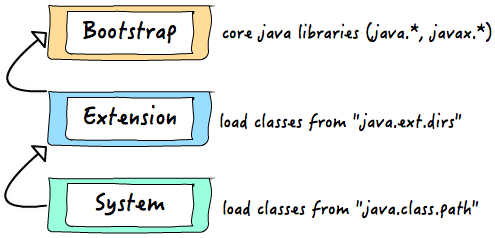

# 深度分析Java的ClassLoader机制（源码级别）
***
编辑人：__**酷酷的诚**__  邮箱：**zhangchengk@foxmail.com**
***
内容：

> 写在前面：Java中的所有类，必须被装载到jvm中才能运行，这个装载工作是由jvm中的类装载器完成的，类装载器所做的工作实质是把类文件从硬盘读取到内存中，JVM在加载类的时候，都是通过ClassLoader的loadClass（）方法来加载class的，loadClass使用双亲委派模式。

## ClassLoader基础

java程序不是本地的可执行程序，它的执行依赖jvm，jvm运行后将 class 文件加载到jvm，然后才能在jvm内部运行。负责加载这些class的组件就是ClassLoader。

JVM本身包含了一个ClassLoader称为BootstrapClassLoader，和JVM自身一样，BootstrapClassLoader是用本地代码(c/c++等)实现的，它负责加载核心Java class（如rt.jar里的class）。另外JVM还提供了两个ClassLoader，它们都是用Java语言编写的，由BootstrapClassLoader加载到jvm，它们是ExtClassLoader和AppClassLoader，其中ExtClassLoader负责加载Java扩展 class（如jre/lib/ext下的类），AppClassLoader负责加载应用程序自身的类（如-classpath下的class）。

当运行一个程序的时候，JVM启动，运行Bootstrap ClassLoader，该ClassLoader加载java核心API（ExtClassLoader和AppClassLoader也在此时被加载），然后调用ExtClassLoader加载扩展API，最后调用AppClassLoader加载应用CLASSPATH下定义的Class，这就是一个程序最基本的加载流程。

JVM自带的ClassLoader只是懂得从本地文件系统加载标准的java class文件，但是我们可能会有下面的应用场景： 
1）在执行类加载之前，自动验证数字签名 
2）动态地创建符合用户特定需要的定制化构建类 
3）从特定的场所取得 class，例如数据库、网络等 
1) 自定义加解密Class 等等 
这时候我们就需要定制自己的ClassLoader，java提供了很方便的api供我们定制自己的ClassLoader。

> 事实上当使用Applet的时候，就用到了特定的ClassLoader，因为需要从网络上加载java class，并且要检查相关的安全信息。另外，应用服务器大都使用了自定义ClassLoader技术，了解类加载原理也有助于我们更好地开发自己的应用。

## ClassLoader结构

java中内置了很多类加载器，本文只讨论几个核心类加载器：<br>
**ClassLoader**:所有类加载器的基类，它是抽象的，定义了类加载最核心的操作。 <br>
**SecureClassLoader**：继承自ClassLoader，添加了关联类源码、关联系统policy权限等支持。 <br>
**URLClassLoader**：继承自SecureClassLoader，支持从jar文件和文件夹中获取class <br>
**ExtClassLoader**：扩展类加载器，继承自URLClassLoader，负责加载java的扩展类(javax.*等)，查看源码可知其查找范围为System.getProperty(“java.ext.dirs”)，通常是jre/lib/ext <br>
**AppClassLoader**：应用类加载器，继承自URLClassLoader，也叫系统类加载器（ClassLoader.getSystemClassLoader()可得到它），它负载加载应用的classpath下的类，查找范围System.getProperty(“java.class.path”)，通过-cp或-classpath指定的类都会被其加载

> java没有提供Launcher的源码，可参考openjdk的Launcher类源码。

上面介绍的是ClassLoader的静态类结构，在概念上，它们还有树形结构，**java中的每个ClassLoader都有自己的父加载器（注意区分，不是类关系上的 super）**，可以通过ClassLoader.getParent() 获取到，当jvm启动完成后，默认情况下，他们的树形结构是这样的： 
自定义的ClassLoader其父加载器为AppClassLoader， 
AppClassLoader的父加载器为ExtClassLoader， 
ExtClassLoader的父加载器为null， 
null表示其父加载器为 BootstrapClassLoader（非java实现故显示为null）。

## 源码分析
为了更好的理解类的加载机制，我们来深入研究一下ClassLoader和他的loadClass（）方法。
```java
public abstract class ClassLoader
```
ClassLoader类是一个抽象类，sun公司是这么解释这个类的：
```java
/**
 * A class loader is an object that is responsible for loading classes. The
 * class <tt>ClassLoader</tt> is an abstract class.  Given the <a
 * href="#name">binary name</a> of a class, a class loader should attempt to
 * locate or generate data that constitutes a definition for the class.  A
 * typical strategy is to transform the name into a file name and then read a
 * "class file" of that name from a file system.
**/
```
大致意思如下：
> class loader是一个负责加载classes的对象，ClassLoader类是一个抽象类，需要给出类的二进制名称，class loader尝试定位或者产生一个class的数据，一个典型的策略是把二进制名字转换成文件名然后到文件系统中找到该文件。

接下来我们看loadClass方法的实现方式：
```java
protected Class<?> loadClass(String name, boolean resolve)
        throws ClassNotFoundException
    {
        synchronized (getClassLoadingLock(name)) {
            // First, check if the class has already been loaded
            Class c = findLoadedClass(name);
            if (c == null) {
                long t0 = System.nanoTime();
                try {
                    if (parent != null) {
                        c = parent.loadClass(name, false);
                    } else {
                        c = findBootstrapClassOrNull(name);
                    }
                } catch (ClassNotFoundException e) {
                    // ClassNotFoundException thrown if class not found
                    // from the non-null parent class loader
                }

                if (c == null) {
                    // If still not found, then invoke findClass in order
                    // to find the class.
                    long t1 = System.nanoTime();
                    c = findClass(name);

                    // this is the defining class loader; record the stats
                    sun.misc.PerfCounter.getParentDelegationTime().addTime(t1 - t0);
                    sun.misc.PerfCounter.getFindClassTime().addElapsedTimeFrom(t1);
                    sun.misc.PerfCounter.getFindClasses().increment();
                }
            }
            if (resolve) {
                resolveClass(c);
            }
            return c;
        }
    }
```
还是来看sun公司对该方法的解释：
```java
/**
     * Loads the class with the specified <a href="#name">binary name</a>.  The
     * default implementation of this method searches for classes in the
     * following order:
     *
     * <p><ol>
     *
     *   <li><p> Invoke {@link #findLoadedClass(String)} to check if the class
     *   has already been loaded.  </p></li>
     *
     *   <li><p> Invoke the {@link #loadClass(String) <tt>loadClass</tt>} method
     *   on the parent class loader.  If the parent is <tt>null</tt> the class
     *   loader built-in to the virtual machine is used, instead.  </p></li>
     *
     *   <li><p> Invoke the {@link #findClass(String)} method to find the
     *   class.  </p></li>
     *
     * </ol>
     *
     * <p> If the class was found using the above steps, and the
     * <tt>resolve</tt> flag is true, this method will then invoke the {@link
     * #resolveClass(Class)} method on the resulting <tt>Class</tt> object.
     *
     * <p> Subclasses of <tt>ClassLoader</tt> are encouraged to override {@link
     * #findClass(String)}, rather than this method.  </p>
     *
     * <p> Unless overridden, this method synchronizes on the result of
     * {@link #getClassLoadingLock <tt>getClassLoadingLock</tt>} method
     * during the entire class loading process.
     *
     */
```
大致内容如下:
> 使用指定的二进制名称来加载类，这个方法的默认实现按照以下顺序查找类： 调用findLoadedClass(String)方法检查这个类是否被加载过 使用父加载器调用loadClass(String)方法，如果父加载器为Null，类加载器装载虚拟机内置的加载器调用findClass(String)方法装载类， 如果，按照以上的步骤成功的找到对应的类，并且该方法接收的resolve参数的值为true,那么就调用resolveClass(Class)方法来处理类。 ClassLoader的子类最好覆盖findClass(String)而不是这个方法。 除非被重写，这个方法默认在整个装载过程中都是同步的（线程安全的）

接下来，我们开始分析该方法。
```java
protected Class loadClass(String name, boolean resolve)
```
该方法的访问控制符是protected，也就是说该方法同包内和派生类中可用 返回值类型Class，这里用到**泛型**。这里使用通配符?作为泛型实参表示对象可以 接受任何类型(类类型)。因为该方法不知道要加载的类到底是什么类，所以就用了通用的泛型。String name要查找的类的名字，boolean resolve，一个标志，true表示将调用resolveClass(c)处理该类

**throws ClassNotFoundException** 该方法会抛出找不到该类的异常，这是一个非运行时异常

**synchronized (getClassLoadingLock(name))** 看到这行代码，我们能知道的是，这是一个同步代码块，那么synchronized的括号中放的应该是一个对象。我们来看getClassLoadingLock(name)方法的作用是什么：
```java
protected Object getClassLoadingLock(String className) {
        Object lock = this;
        if (parallelLockMap != null) {
            Object newLock = new Object();
            lock = parallelLockMap.putIfAbsent(className, newLock);
            if (lock == null) {
                lock = newLock;
            }
        }
        return lock;
    }
```
以上是getClassLoadingLock(name)方法的实现细节，我们看到这里用到变量parallelLockMap ，根据这个变量的值进行不同的操作，如果这个变量是Null，那么直接返回this，如果这个属性不为Null，那么就新建一个对象，然后在调用一个putIfAbsent(className, newLock);方法来给刚刚创建好的对象赋值，这个方法的作用我们一会讲。那么这个parallelLockMap变量又是哪来的那，我们发现这个变量是ClassLoader类的成员变量：
```java
private final ConcurrentHashMap<String, Object> parallelLockMap;
```
这个变量的初始化工作在ClassLoader的构造函数中：
```java
private ClassLoader(Void unused, ClassLoader parent) {
        this.parent = parent;
        if (ParallelLoaders.isRegistered(this.getClass())) {
            parallelLockMap = new ConcurrentHashMap<>();
            package2certs = new ConcurrentHashMap<>();
            domains =
                Collections.synchronizedSet(new HashSet<ProtectionDomain>());
            assertionLock = new Object();
        } else {
            // no finer-grained lock; lock on the classloader instance
            parallelLockMap = null;
            package2certs = new Hashtable<>();
            domains = new HashSet<>();
            assertionLock = this;
        }
    }
```
这里我们可以看到构造函数根据一个属性ParallelLoaders的Registered状态的不同来给parallelLockMap 赋值。 我去，隐藏的好深，好，我们继续挖，看看这个ParallelLoaders又是在哪赋值的呢？我们发现，在ClassLoader类中包含一个静态内部类private static class ParallelLoaders，在ClassLoader被加载的时候这个静态内部类就被初始化。这个静态内部类的代码我就不贴了，直接告诉大家什么意思，sun公司是这么说的：Encapsulates the set of parallel capable loader types，意识就是说：封装了并行的可装载的类型的集合。

> 上面这个说的是不是有点乱，那让我们来整理一下： 首先，在ClassLoader类中有一个静态内部类ParallelLoaders，他会指定的类的并行能力，如果当前的加载器被定位为具有并行能力，那么他就给parallelLockMap定义，就是new一个 ConcurrentHashMap<>()，那么这个时候，我们知道如果当前的加载器是具有并行能力的，那么parallelLockMap就不是Null，这个时候，我们判断parallelLockMap是不是Null，如果他是null，说明该加载器没有注册并行能力，那么我们没有必要给他一个加锁的对象，getClassLoadingLock方法直接返回this,就是当前的加载器的一个实例。如果这个parallelLockMap不是null，那就说明该加载器是有并行能力的，那么就可能有并行情况，那就需要返回一个锁对象。然后就是创建一个新的Object对象，调用parallelLockMap的putIfAbsent(className, newLock)方法，这个方法的作用是：首先根据传进来的className,检查该名字是否已经关联了一个value值，如果已经关联过value值，那么直接把他关联的值返回，如果没有关联过值的话，那就把我们传进来的Object对象作为value值，className作为Key值组成一个map返回。然后无论putIfAbsent方法的返回值是什么，都把它赋值给我们刚刚生成的那个Object对象。 这个时候，我们来简单说明一下getClassLoadingLock(String className)的作用，就是： 为类的加载操作返回一个锁对象。为了向后兼容，这个方法这样实现:如果当前的classloader对象注册了并行能力，方法返回一个与指定的名字className相关联的特定对象，否则，直接返回当前的ClassLoader对象。
```java
Class c = findLoadedClass(name); 
```
在这里，在加载类之前先调用findLoadedClass方法检查该类是否已经被加载过，findLoadedClass会返回一个Class类型的对象，如果该类已经被加载过，那么就可以直接返回该对象（在返回之前会根据resolve的值来决定是否处理该对象，具体的怎么处理后面会讲）。 如果，该类没有被加载过，那么执行以下的加载过程
```java
try {
    if (parent != null) {
           c = parent.loadClass(name, false);
    } else {
            c = findBootstrapClassOrNull(name);
     }
} catch (ClassNotFoundException e) {
         // ClassNotFoundException thrown if class not found
          // from the non-null parent class loader
}
```
如果父加载器不为空，那么调用父加载器的loadClass方法加载类，如果父加载器为空，那么调用虚拟机的加载器来加载类。

如果以上两个步骤都没有成功的加载到类，那么
```java
c = findClass(name);
```
调用自己的findClass(name)方法来加载类。

这个时候，我们已经得到了加载之后的类，那么就根据resolve的值决定是否调用resolveClass方法。resolveClass方法的作用是：
> 链接指定的类。这个方法给Classloader用来链接一个类，如果这个类已经被链接过了，那么这个方法只做一个简单的返回。否则，这个类将被按照 Java™规范中的Execution描述进行链接。。。

至此，ClassLoader类以及loadClass方法的源码我们已经分析完了，那么。结合源码的分析，我们来总结一下：

## 总结

### java中的类大致分为三种：
> 1.系统类 2.扩展类 3.由程序员自定义的类

### 类装载方式，有两种:
>1.隐式装载， 程序在运行过程中当碰到通过new 等方式生成对象时，隐式调用类装载器加载对应的类到jvm中。<br> 
2.显式装载， 通过class.forname()等方法，显式加载需要的类

### 类加载的动态性体现:
> 一个应用程序总是由n多个类组成，Java程序启动时，并不是一次把所有的类全部加载后再运行，它总是先把保证程序运行的基础类一次性加载到jvm中，其它类等到jvm用到的时候再加载，这样的好处是节省了内存的开销，因为java最早就是为嵌入式系统而设计的，内存宝贵，这是一种可以理解的机制，而用到时再加载这也是java动态性的一种体现

### java类装载器

Java中的类装载器实质上也是类，功能是把类载入jvm中，值得注意的是jvm的类装载器并不是一个，而是三个，层次结构如下：



为什么要有三个类加载器，一方面是分工，各自负责各自的区块，另一方面为了实现委托模型，下面会谈到该模型

### 类加载器之间是如何协调工作的
前面说了，java中有三个类加载器，问题就来了，碰到一个类需要加载时，它们之间是如何协调工作的，即java是如何区分一个类该由哪个类加载器来完成呢。 在这里java采用了委托模型机制，这个机制简单来讲，就是“类装载器有载入类的需求时，会先请示其Parent使用其搜索路径帮忙载入，如果Parent 找不到,那么才由自己依照自己的搜索路径搜索类”


下面举一个例子来说明，为了更好的理解，先弄清楚几行代码：
```java
Public class Test{
    Public static void main(String[] arg){
        ClassLoader c  = Test.class.getClassLoader();  //获取Test类的类加载器
        System.out.println(c); 
        ClassLoader c1 = c.getParent();  //获取c这个类加载器的父类加载器
        System.out.println(c1);
        ClassLoader c2 = c1.getParent();//获取c1这个类加载器的父类加载器
        System.out.println(c2);
  }
}
```
运行结果：
```java
。。。AppClassLoader。。。

。。。ExtClassLoader。。。

Null
```
可以看出Test是由AppClassLoader加载器加载的，AppClassLoader的Parent 加载器是 ExtClassLoader,但是ExtClassLoader的Parent为 null 是怎么回事呵，朋友们留意的话，前面有提到Bootstrap Loader是用C++语言写的，依java的观点来看，逻辑上并不存在Bootstrap Loader的类实体，所以在java程序代码里试图打印出其内容时，我们就会看到输出为null。

### 类装载器ClassLoader（一个抽象类）描述一下JVM加载class文件的原理机制
类装载器就是寻找类或接口字节码文件进行解析并构造JVM内部对象表示的组件，在java中类装载器把一个类装入JVM，经过以下步骤：
>  1、装载：查找和导入Class文件 <br>
2、链接：其中解析步骤是可以选择的 （a）检查：检查载入的class文件数据的正确性 （b）准备：给类的静态变量分配存储空间 （c）解析：将符号引用转成直接引用<br>
 3、初始化：对静态变量，静态代码块执行初始化工作

类装载工作由ClassLoder和其子类负责。JVM在运行时会产生三个ClassLoader：根装载器，ExtClassLoader(扩展类装载器)和AppClassLoader，其中根装载器不是ClassLoader的子类，由C++编写，因此在java中看不到他，负责装载JRE的核心类库，如JRE目录下的rt.jar,charsets.jar等。ExtClassLoader是ClassLoder的子类，负责装载JRE扩展目录ext下的jar类包；AppClassLoader负责装载classpath路径下的类包，这三个类装载器存在父子层级关系****，即根装载器是ExtClassLoader的父装载器，ExtClassLoader是AppClassLoader的父装载器。默认情况下使用AppClassLoader装载应用程序的类
 
Java装载类使用“全盘负责委托机制”。“全盘负责”是指当一个ClassLoder装载一个类时，除非显示的使用另外一个ClassLoder，该类所依赖及引用的类也由这个ClassLoder载入；“委托机制”是指先委托父类装载器寻找目标类，只有在找不到的情况下才从自己的类路径中查找并装载目标类。这一点是从安全方面考虑的，试想如果一个人写了一个恶意的基础类（如java.lang.String）并加载到JVM将会引起严重的后果，但有了全盘负责制，java.lang.String永远是由根装载器来装载，避免以上情况发生 除了JVM默认的三个ClassLoder以外，第三方可以编写自己的类装载器，以实现一些特殊的需求。类文件被装载解析后，在JVM中都有一个对应的java.lang.Class对象，提供了类结构信息的描述。数组，枚举及基本数据类型，甚至void都拥有对应的Class对象。Class类没有public的构造方法，Class对象是在装载类时由JVM通过调用类装载器中的defineClass()方法自动构造的

原文地址：http://www.hollischuang.com/archives/199 
感谢hollischuang大神的知识分享

原文地址：https://blog.csdn.net/conquer0715/article/details/51283632 
感谢conquer0715大神的知识分享

