# Java socket详解（转）
***
编辑人：__**酷酷的诚**__  邮箱：**zhangchengk@foxmail.com**
***
内容：

刚给大家讲解Java socket通信后，好多童鞋私信我，有好多地方不理解，看不明白。特抽时间整理一下，详细讲述Java socket通信原理和实现案例。整个过程楼主都是通过先简单明了的示例让大家了解整个基本原理，后慢慢接近生产实用示例，先概况后脉络给大家梳理出来的，所有涉及示例都可以直接拷贝运行。楼主才疏学浅，如有部分原理错误请大家及时指正.

请尊重作者劳动成果，转载请标明原文链接：https://www.jianshu.com/p/cde27461c226

整理和总结了一下大家常遇到的问题：

1.    客户端socket发送消息后，为什么服务端socket没有收到？

2.    使用while 循环实现连续输入，是不是就是多线程模式？

3.    对多线程处理机制不是很明白，希望详细讲解？

4.    希望详细讲解ServerSocketChannel和SocketChannel与ServerSoket和Socket的区别？

5.    希望有详细的例子，可以直接拷贝下来运行？

针对童鞋们提出的问题，我会在本文章中详细一一简答，并且给出详细的例子，下面言归正传。

一：socket通信基本原理。

首先socket 通信是基于TCP/IP 网络层上的一种传送方式，我们通常把TCP和UDP称为传输层。

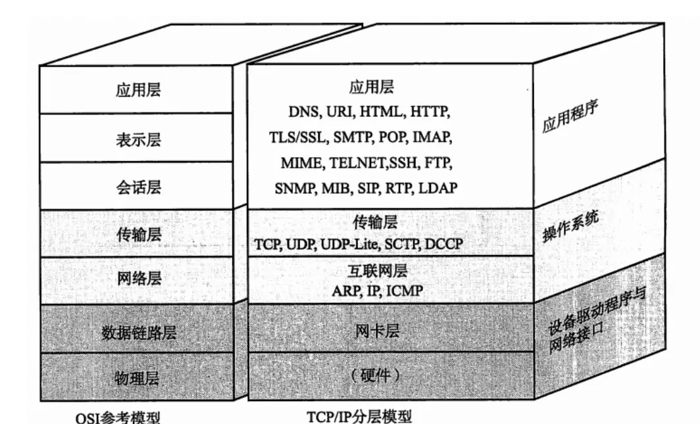

如上图，在七个层级关系中，我们将的socket属于传输层，其中UDP是一种面向无连接的传输层协议。UDP不关心对端是否真正收到了传送过去的数据。如果需要检查对端是否收到分组数据包，或者对端是否连接到网络，则需要在应用程序中实现。UDP常用在分组数据较少或多播、广播通信以及视频通信等多媒体领域。在这里我们不进行详细讨论，这里主要讲解的是基于TCP/IP协议下的socket通信。

socket是基于应用服务与TCP/IP通信之间的一个抽象，他将TCP/IP协议里面复杂的通信逻辑进行分装，对用户来说，只要通过一组简单的API就可以实现网络的连接。借用网络上一组socket通信图给大家进行详细讲解：

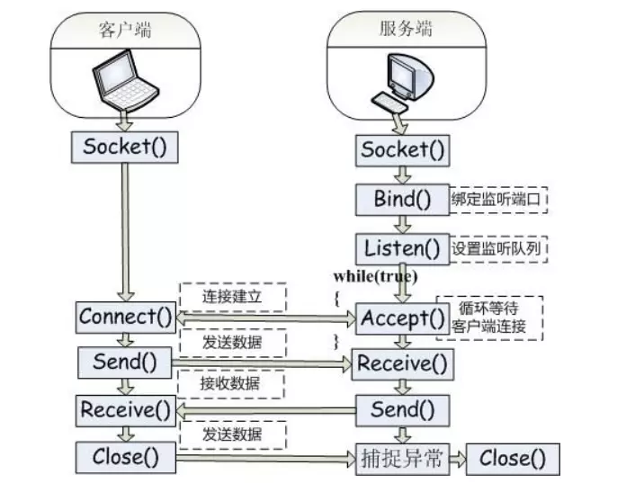

首先，服务端初始化ServerSocket，然后对指定的端口进行绑定，接着对端口及进行监听，通过调用accept方法阻塞，此时，如果客户端有一个socket连接到服务端，那么服务端通过监听和accept方法可以与客户端进行连接。

二：socket通信基本示例：

在对socket通信基本原理明白后，那我们就写一个最简单的示例，展示童鞋们常遇到的第一个问题：客户端发送消息后，服务端无法收到消息。

服务端：

```java
package socket.socket1.socket;

import java.io.BufferedReader;

import java.io.BufferedWriter;

import java.io.IOException;

import java.io.InputStreamReader;

import java.net.ServerSocket;

import java.net.Socket;

public class ServerSocketTest {

public static void main(String[] args) {

try {

// 初始化服务端socket并且绑定9999端口

ServerSocket serverSocket  =new ServerSocket(9999);

//等待客户端的连接

Socket socket = serverSocket.accept();

//获取输入流

BufferedReader bufferedReader =new BufferedReader(new InputStreamReader(socket.getInputStream()));

//读取一行数据

String str = bufferedReader.readLine();

//输出打印

System.out.println(str);

}catch (IOException e) {

e.printStackTrace();

}

}

}
```

客户端：
```java
package socket.socket1.socket;

import java.io.BufferedWriter;

import java.io.IOException;

import java.io.OutputStreamWriter;

import java.net.Socket;

public class ClientSocket {

public static void main(String[] args) {

try {

Socket socket =new Socket("127.0.0.1",9999);

BufferedWriter bufferedWriter =new BufferedWriter(new OutputStreamWriter(socket.getOutputStream()));

String str="你好，这是我的第一个socket";

bufferedWriter.write(str);

}catch (IOException e) {

e.printStackTrace();

}

}

}
```
启动服务端：

发现正常，等待客户端的的连接

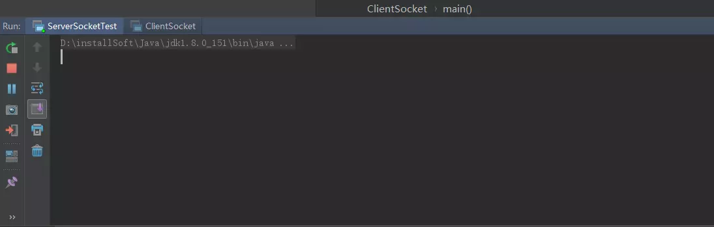

启动客户端：

发现客户端启动正常后，马上执行完后关闭。同时服务端控制台报错：

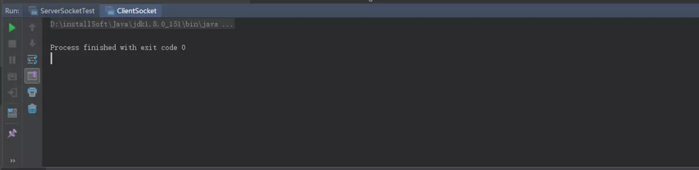

服务端控制台报错：

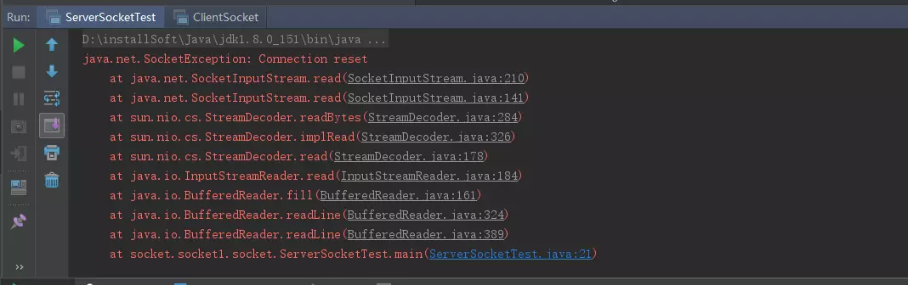

然后好多童鞋，就拷贝这个java.net.SocketException: Connection reset上王查异常，查询解决方案，搞了半天都不知道怎么回事。解决这个问题我们首先要明白，socket通信是阻塞的，他会在以下几个地方进行阻塞。第一个是accept方法，调用这个方法后，服务端一直阻塞在哪里，直到有客户端连接进来。第二个是read方法，调用read方法也会进行阻塞。通过上面的示例我们可以发现，该问题发生在read方法中。有朋友说是Client没有发送成功，其实不是的，我们可以通debug跟踪一下，发现客户端发送了，并且没有问题。而是发生在服务端中，当服务端调用read方法后，他一直阻塞在哪里，因为客户端没有给他一个标识，告诉是否消息发送完成，所以服务端还在一直等待接受客户端的数据，结果客户端此时已经关闭了，就是在服务端报错：java.net.SocketException: Connection reset

那么理解上面的原理后，我们就能明白，客户端发送完消息后，需要给服务端一个标识，告诉服务端，我已经发送完成了，服务端就可以将接受的消息打印出来。

通常大家会用以下方法进行进行结束：

socket.close() 或者调用socket.shutdownOutput();方法。调用这俩个方法，都会结束客户端socket。但是有本质的区别。socket.close() 将socket关闭连接，那边如果有服务端给客户端反馈信息，此时客户端是收不到的。而socket.shutdownOutput()是将输出流关闭，此时，如果服务端有信息返回，则客户端是可以正常接受的。现在我们将上面的客户端示例修改一下啊，增加一个标识告诉流已经输出完毕：

客户端2：
```java
package socket.socket1.socket;

import java.io.BufferedWriter;

import java.io.IOException;

import java.io.OutputStreamWriter;

import java.net.Socket;

public class ClientSocket {

public static void main(String[] args) {

try {

Socket socket =new Socket("127.0.0.1",9999);

BufferedWriter bufferedWriter =new BufferedWriter(new OutputStreamWriter(socket.getOutputStream()));

String str="你好，这是我的第一个socket";

bufferedWriter.write(str);

//刷新输入流

bufferedWriter.flush();

//关闭socket的输出流

socket.shutdownOutput();

}catch (IOException e) {

e.printStackTrace();

}

}

}
```
在看服务端控制台：

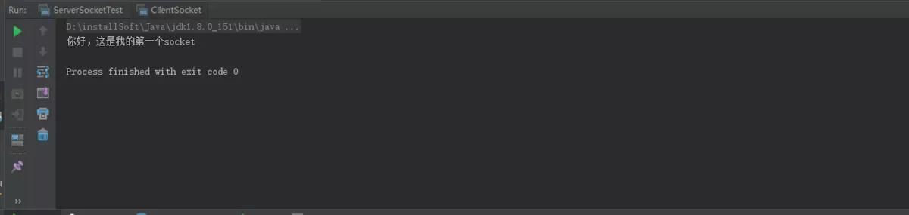

服务端在接受到客户端关闭流的信息后，知道信息输入已经完毕，苏哦有就能正常读取到客户端传过来的数据。通过上面示例，我们可以基本了解socket通信原理，掌握了一些socket通信的基本api和方法，实际应用中，都是通过此处进行实现变通的。

三：while循环连续接受客户端信息：

上面的示例中scoket客户端和服务端固然可以通信，但是客户端每次发送信息后socket就需要关闭，下次如果需要发送信息，需要socket从新启动，这显然是无法适应生产环境的需要。比如在我们是实际应用中QQ，如果每次发送一条信息，就需要重新登陆QQ，我估计这程序不是给人设计的，那么如何让服务可以连续给服务端发送消息？下面我们通过while循环进行简单展示：

服务端：
```java
package socket.socket1.socket;

import java.io.BufferedReader;

import java.io.BufferedWriter;

import java.io.IOException;

import java.io.InputStreamReader;

import java.net.ServerSocket;

import java.net.Socket;

public class ServerSocketTest {

public static void main(String[] args) {

try {

// 初始化服务端socket并且绑定9999端口

ServerSocket serverSocket  =new ServerSocket(9999);

//等待客户端的连接

Socket socket = serverSocket.accept();

//获取输入流,并且指定统一的编码格式

BufferedReader bufferedReader =new BufferedReader(new InputStreamReader(socket.getInputStream(),"UTF-8"));

//读取一行数据

String str;

//通过while循环不断读取信息，

while ((str = bufferedReader.readLine())!=null){

//输出打印

System.out.println(str);

}

}catch (IOException e) {

e.printStackTrace();

}

}

}
```
客户端：
``` java
package socket.socket1.socket;

import java.io.*;

import java.net.Socket;

public class ClientSocket {

public static void main(String[] args) {

try {

//初始化一个socket

Socket socket =new Socket("127.0.0.1",9999);

//通过socket获取字符流

BufferedWriter bufferedWriter =new BufferedWriter(new OutputStreamWriter(socket.getOutputStream()));

//通过标准输入流获取字符流

BufferedReader bufferedReader =new BufferedReader(new InputStreamReader(System.in,"UTF-8"));

while (true){

String str = bufferedReader.readLine();

bufferedWriter.write(str);

bufferedWriter.write("\n");

bufferedWriter.flush();

}

}catch (IOException e) {

e.printStackTrace();

}

}

}
```
客户端控制中心：

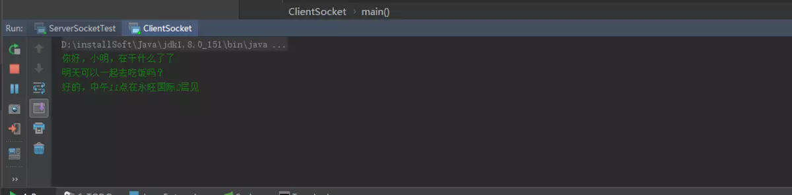

服务端控制中心：

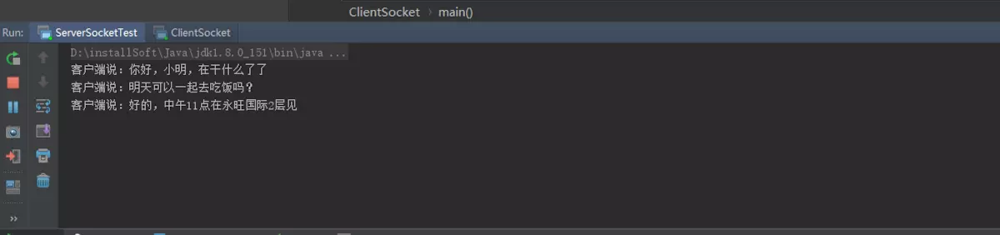

大家可以看到，通过一个while 循环，就可以实现客户端不间断的通过标准输入流读取来的消息，发送给服务端。_在这里有个细节，大家看到没有，我客户端没有写socket.close() 或者调用socket.shutdownOutput();服务端是如何知道客户端已经输入完成了？服务端接受数据的时候是如何判断客户端已经输入完成呢？这就是一个核心点，双方约定一个标识，当客户端发送一个标识给服务端时，表明客户端端已经完成一个数据的载入。_而服务端在结束数据的时候，也通过这个标识进行判断，如果接受到这个标识，表明数据已经传入完成，那么服务端就可以将数据度入后显示出来。

在上面的示例中，客户端端在循环发送数据时候，每发送一行，添加一个换行标识“\n”标识，在告诉服务端我数据已经发送完成了。而服务端在读取客户数据时，通过while ((str = bufferedReader.readLine())!=null)去判断是否读到了流的结尾，负责服务端将会一直阻塞在哪里，等待客户端的输入。

通过while方式，我们可以实现多个客户端和服务端进行聊天。但是，下面敲黑板，划重点。由于socket通信是阻塞式的，假设我现在有A和B俩个客户端同时连接到服务端的上，当客户端A发送信息给服务端后，那么服务端将一直阻塞在A的客户端上，不同的通过while循环从A客户端读取信息，此时如果B给服务端发送信息时，将进入阻塞队列，直到A客户端发送完毕，并且退出后，B才可以和服务端进行通信。简单地说，我们现在实现的功能，虽然可以让客户端不间断的和服务端进行通信，与其说是一对一的功能，因为只有当客户端A关闭后，客户端B才可以真正和服务端进行通信，这显然不是我们想要的。 下面我们通过多线程的方式给大家实现正常人类的思维。

四：多线程下socket编程

服务端：
```java
package socket.socket1.socket;

import java.io.BufferedReader;

import java.io.BufferedWriter;

import java.io.IOException;

import java.io.InputStreamReader;

import java.net.ServerSocket;

import java.net.Socket;

public class ServerSocketTest {

public static void main(String[] args)throws IOException {

// 初始化服务端socket并且绑定9999端口

ServerSocket serverSocket  =new ServerSocket(9999);

while (true){

//等待客户端的连接

Socket socket = serverSocket.accept();

//每当有一个客户端连接进来后，就启动一个单独的线程进行处理

new Thread(new Runnable() {

@Override

public void run() {

//获取输入流,并且指定统一的编码格式

BufferedReader bufferedReader =null;

try {

bufferedReader =new BufferedReader(new InputStreamReader(socket.getInputStream(),"UTF-8"));

//读取一行数据

String str;

//通过while循环不断读取信息，

while ((str = bufferedReader.readLine())!=null){

//输出打印

System.out.println("客户端说："+str);

}

}catch (IOException e) {

e.printStackTrace();

}

}

}).start();

}

}

}
```
客户端：
```java
package socket.socket1.socket;

import java.io.*;

import java.net.Socket;

public class ClientSocket {

public static void main(String[] args) {

try {

//初始化一个socket

Socket socket =new Socket("127.0.0.1",9999);

//通过socket获取字符流

BufferedWriter bufferedWriter =new BufferedWriter(new OutputStreamWriter(socket.getOutputStream()));

//通过标准输入流获取字符流

BufferedReader bufferedReader =new BufferedReader(new InputStreamReader(System.in,"UTF-8"));

while (true){

String str = bufferedReader.readLine();

bufferedWriter.write(str);

bufferedWriter.write("\n");

bufferedWriter.flush();

}

}catch (IOException e) {

e.printStackTrace();

}

}

}
```
通过客户端A控制台输入：

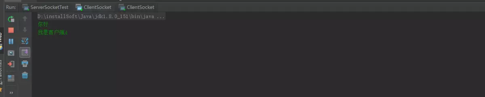

通过客户端B控制台输入：

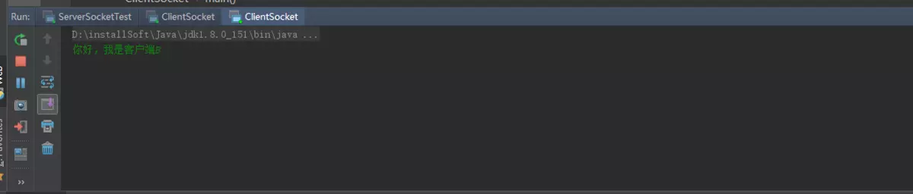

服务端控制台：

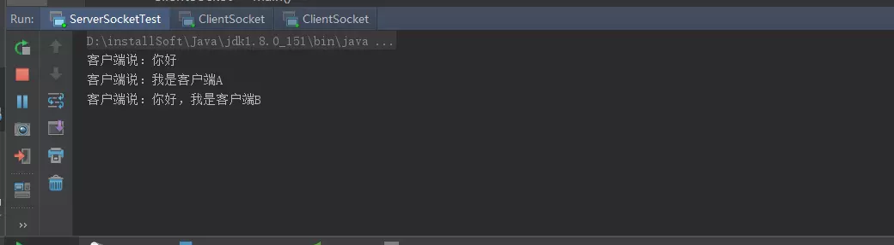

通过这里我们可以发现，客户端A和客户端B同时连接到服务端后，都可以和服务端进行通信，也不会出现前面讲到使用while（true）时候客户端A连接时客户端B不能与服务端进行交互的情况。在这里我们看到，主要是通过服务端的 new Thread(new Runnable() {}实现的，每一个客户端连接进来后，服务端都会单独起个一线程，与客户端进行数据交互，这样就保证了每个客户端处理的数据是单独的，不会出现相互阻塞的情况，这样就基本是实现了QQ程序的基本聊天原理。

但是实际生产环境中，这种写法对于客户端连接少的的情况下是没有问题，但是如果有大批量的客户端连接进行，那我们服务端估计就要歇菜了。假如有上万个socket连接进来，服务端就是新建这么多进程，反正楼主是不敢想，而且socket 的回收机制又不是很及时，这么多线程被new 出来，就发送一句话，然后就没有然后了，导致服务端被大量的无用线程暂用，对性能是非常大的消耗，在实际生产过程中，我们可以通过线程池技术，保证线程的复用，下面请看改良后的服务端程序。

改良后的服务端：
```java
package socket.socket1.socket;

import java.beans.Encoder;

import java.io.BufferedReader;

import java.io.BufferedWriter;

import java.io.IOException;

import java.io.InputStreamReader;

import java.net.ServerSocket;

import java.net.Socket;

import java.util.concurrent.ExecutorService;

import java.util.concurrent.Executors;

public class ServerSocketTest {

public static void main(String[] args)throws IOException {

// 初始化服务端socket并且绑定9999端口

ServerSocket serverSocket =new ServerSocket(9999);

//创建一个线程池

ExecutorService executorService = Executors.newFixedThreadPool(100);

while (true) {

//等待客户端的连接

Socket socket = serverSocket.accept();

Runnable runnable = () -> {

BufferedReader bufferedReader =null;

try {

bufferedReader =new BufferedReader(new InputStreamReader(socket.getInputStream(), "UTF-8"));

//读取一行数据

String str;

//通过while循环不断读取信息，

while ((str = bufferedReader.readLine()) !=null) {

//输出打印

System.out.println("客户端说：" + str);

}

}catch (IOException e) {

e.printStackTrace();

}

};

executorService.submit(runnable);

}

}

}
```
运行后服务端控制台：

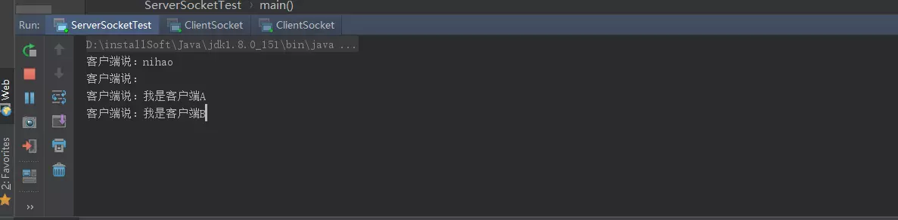

通过线程池技术，我们可以实现线程的复用。其实在这里executorService.submit在并发时，如果要求当前执行完毕的线程有返回结果时，这里面有一个大坑，在这里我就不一一详细说明，具体我在我的另一篇文章中《把多线程说个透》里面详细介绍。本章主要讲述socket相关内容。

在实际应用中，socket发送的数据并不是按照一行一行发送的，比如我们常见的报文，那么我们就不能要求每发送一次数据，都在增加一个“\n”标识，这是及其不专业的，在实际应用中，通过是采用**数据长度+类型+数据的方式**，在我们常接触的热Redis就是采用这种方式，

五：socket 指定长度发送数据

在实际应用中，网络的数据在TCP/IP协议下的socket都是采用数据流的方式进行发送，那么在发送过程中就要求我们将数据流转出字节进行发送，读取的过程中也是采用字节缓存的方式结束。那么问题就来了，在socket通信时候，我们大多数发送的数据都是不定长的，所有接受方也不知道此次数据发送有多长，因此无法精确地创建一个缓冲区（字节数组）用来接收，在不定长通讯中，通常使用的方式时每次默认读取8*1024长度的字节，若输入流中仍有数据，则再次读取，一直到输入流没有数据为止。但是如果发送数据过大时，发送方会对数据进行分包发送，这种情况下或导致接收方判断错误，误以为数据传输完成，因而接收不全。在这种情况下就会引出一些问题，诸如半包，粘包，分包等问题，为了后续一些例子中好理解，我在这里直接将半包，粘包，分包概念性东西在写一下（引用度娘）

**5.1 半包**

接受方没有接受到一个完整的包，只接受了部分。

原因：TCP为提高传输效率，将一个包分配的足够大，导致接受方并不能一次接受完。

影响：长连接和短连接中都会出现

**5.2 粘包**

发送方发送的多个包数据到接收方接收时粘成一个包，从接收缓冲区看，后一包数据的头紧接着前一包数据的尾。

分类：一种是粘在一起的包都是完整的数据包，另一种情况是粘在一起的包有不完整的包

出现粘包现象的原因是多方面的:

1)发送方粘包：由TCP协议本身造成的，TCP为提高传输效率，发送方往往要收集到足够多的数据后才发送一包数据。若连续几次发送的数据都很少，通常TCP会根据优化算法把这些数据合成一包后一次发送出去，这样接收方就收到了粘包数据。

2)接收方粘包：接收方用户进程不及时接收数据，从而导致粘包现象。这是因为接收方先把收到的数据放在系统接收缓冲区，用户进程从该缓冲区取数据，若下一包数据到达时前一包数据尚未被用户进程取走，则下一包数据放到系统接收缓冲区时就接到前一包数据之后，而用户进程根据预先设定的缓冲区大小从系统接收缓冲区取数据，这样就一次取到了多包数据。

5.3**分包**

分包（1）：在出现粘包的时候，我们的接收方要进行分包处理；

分包（2）：一个数据包被分成了多次接收；

原因：1. IP分片传输导致的；2.传输过程中丢失部分包导致出现的半包；3.一个包可能被分成了两次传输，在取数据的时候，先取到了一部分（还可能与接收的缓冲区大小有关系）。

影响：粘包和分包在长连接中都会出现

那么如何解决半包和粘包的问题，就涉及一个一个数据发送如何标识结束的问题，通常有以下几种情况

固定长度：每次发送固定长度的数据；

特殊标示：以回车，换行作为特殊标示；获取到指定的标识时，说明包获取完整。

字节长度：包头+包长+包体的协议形式，当服务器端获取到指定的包长时才说明获取完整；

所以大部分情况下，双方使用socket通讯时都会约定一个定长头放在传输数据的最前端，用以标识数据体的长度，通常定长头有整型int，短整型short，字符串Strinng三种形式。

下面我们通过几个简单的小示例，演示发送接受定长数据，前面我们讲过通过特殊标识的方式，可是有什么我们发送的数据比较大，并且数据本身就会包含我们约定的特殊标识，那么我们在接受数据时，就会出现半包的情况，通过这种情况下，我们都是才有包头+包长+包体的协议模式，每次发送数据的时候，我们都会固定前4个字节为数据长度，那到数据长度后，我们就可以非常精确的创建一个数据缓存区用来接收数据。

那么下面就先通过包类型+包长度+消息内容定义一个socket通信对象，数据类型为byte类型，包长度为int类型，消息内容为byte类型。

首先我们创建府服务端socket。
```java
package socket.socket1.socket5;

import java.io.DataInputStream;

import java.io.IOException;

import java.io.InputStream;

import java.net.ServerSocket;

import java.net.Socket;

public class ServerSocketTest {

public static void main(String[] args) {

try {

ServerSocket serverSocket =new ServerSocket(9999);

Socket client = serverSocket.accept();

InputStream inputStream = client.getInputStream();

DataInputStream dataInputStream =new DataInputStream(inputStream);

while (true){

byte b = dataInputStream.readByte();

int len = dataInputStream.readInt();

byte[] data =new byte[len -5];

dataInputStream.readFully(data);

String str =new String(data);

System.out.println("获取的数据类型为："+b);

System.out.println("获取的数据长度为："+len);

System.out.println("获取的数据内容为："+str);

}

}catch (IOException e) {

e.printStackTrace();

}

}

}
```
在服务端创建后，我们通过DataInputStream 数据流进行数据获取，首先我们获取数据的类型，然后在获取数据的长度，因为数据实际有效长度是整个数据的长度减去5，（包括前个字节为数据类型，前二到五个字节为数据长度）。然后根据数据的实际有效长度创建数据缓存区，用户存放数据，这边确保每次接接受数据的完整性，不会出现半包与粘包的情况。在数据读取的时候，我们通过readFully（）方法读取数据。下面我们来创建socket的客户端：
```java
package socket.socket1.socket5;

import java.io.*;

import java.net.Socket;

import java.util.Scanner;

public class ClientSocketTest {

public static void main(String[] args) {

try {

Socket socket =new Socket("127.0.0.1",9999);

OutputStream outputStream = socket.getOutputStream();

DataOutputStream dataOutputStream =new DataOutputStream(outputStream);

Scanner scanner =new Scanner(System.in);

if(scanner.hasNext()){

String str = scanner.next();

int type =1;

byte[] data = str.getBytes();

int len = data.length +5;

dataOutputStream.writeByte(type);

dataOutputStream.writeInt(len);

dataOutputStream.write(data);

dataOutputStream.flush();

}

}catch (IOException e) {

e.printStackTrace();

}

}

}
```
客户端socket创建后，我们通过dataOutputStream输出流中的writeByte（）方法，设置数据类型，writeInt（）方法设置数据长度，然后通过write（）方法将数据发送到服务端进行通信，发送完毕后，为了确保数据完全发送，通过调用flush()方法刷新缓冲区。

下面我们通过控制可以看到服务端接受数据的情况：

客户端发送数据：

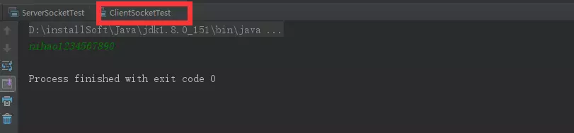

服务端接受数据：

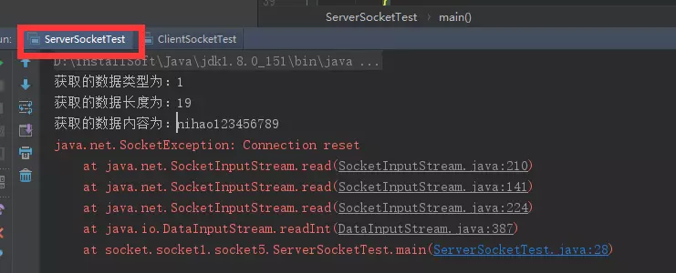

上面服务端分别接受到数据的类型，长度和详细内容，具体下面的错误异常是由于客户端发送一次后关闭，服务端任在接受数据，就会出现连接重置的错误，这是一个简单的通过数据类型+数据长度+数据内容的方法发送数据的一个小例子，让大家了解socket通信数据发送的原理，在实际应用中，原理不出其左右，只是在业务逻辑上完善而已。

六：socket 建立长连接

在了解socket长连接和短连接之前，我们先通过一个概念性的东西，理解一下什么叫长连接，什么叫短连接，长连接的原理和短连接的原理，

**6.1 长连接**

指在一个连接上可以连续发送多个[数据包](https://links.jianshu.com/go?to=https%3A%2F%2Fbaike.baidu.com%2Fitem%2F%25E6%2595%25B0%25E6%258D%25AE%25E5%258C%2585%2F489739)，在连接保持期间，如果没有数据包发送，需要双方发链路检测包。整个通讯过程，客户端和服务端只用一个Socket对象，长期保持Socket的连接。

**6.2 短连接**

短连接服务是每次请求都建立链接，交互完之后关闭链接，

**6.3 长连接与短连接的优势**

长连接多用于操作频繁，点对点的通讯，而且连接数不能太多情况。每个TCP连接都需要三步握手，这需要时间，如果每个操作都是短连接，再操作的话那么处理速度会降低很多，所以每个操作完后都不断开，下次处理时直接发送数据包就OK了，不用建立TCP连接。例如：数据库的连接用长连接，如果用短连接频繁的通信会造成socket错误，而且频繁的socket 创建也是对资源的浪费。

而像WEB网站的http服务一般都用[短链接](https://links.jianshu.com/go?to=https%3A%2F%2Fbaike.baidu.com%2Fitem%2F%25E7%259F%25AD%25E9%2593%25BE%25E6%258E%25A5)，因为长连接对于服务端来说会耗费一定的资源，而像WEB网站这么频繁的成千上万甚至上亿客户端的连接用[短连接](https://links.jianshu.com/go?to=https%3A%2F%2Fbaike.baidu.com%2Fitem%2F%25E7%259F%25AD%25E8%25BF%259E%25E6%258E%25A5)会更省一些资源，如果用长连接，而且同时有成千上万的用户，如果每个用户都占用一个连接的话，那可想而知吧。所以并发量大，但每个用户无需频繁操作情况下需用短连好。（度娘）

在这章之前，你看到所有的例子，都是短连接，每次连接完毕后，都是自动断开，如果需要重新连接，则需要建立新的连接对象，比如像前一章我们看到的例子中，服务端有connection reset错误，就是短连接的一种。接下来，我们主要讲解一下长连接原理，在实际应用中，长连接他并不是真正意义上的长连接，（他不像我们打电话一样，电话通了之后一直不挂的这种连接）。他们是通过一种称之为心跳包或者叫做链路检测包，去定时检查socket 是否关闭，输入/输出流是否关闭。

**_在这里有个问题，也是好多初学者比较困惑的，也是好多初学socket时候，遇到的一个问题，那就是socket是通过流的方式通信的，既然关闭流，就是关闭socket，那么长连接不是很简单吗？就是我们读取流中的信息后，不关闭流，等下次使用时，直接往流中扔数据不就行了？_**

针对这个问题，我做个详细的解答，尽可能的描述清楚，首先我们socket是针对应用层与TCP/ip数据传输协议封装的一套方案，那么他的底层也是通过Tcp/Tcp/ip或则UDP通信的，所以说socket本身并不是一直通信协议，而是一套接口的封装。而tcp/IP协议组里面的应用层包括FTP、HTTP、TELNET、SMTP、DNS等协议，我们知道，http1.0是短连接，http1.1是长连接，我们在打开http通信协议里面在Response headers中可以看到这么一句Connection:keep-alive。他是干什么的，他就是表示长连接，但是他并不是一直保持的连接，他有一个时间段，如果我们想一直保持这个连接怎么办？那就是在制定的时间内让客户端和服务端进行一个请求，请求可以是服务端发起，也可以是客户端发起，通常我们是在客户端不定时的发送一个字节数据给服务端，这个就是我们称之为心跳包，想想心跳是怎么跳动的，是不是为了检测人活着，心会定时的跳动，就是这个原理。