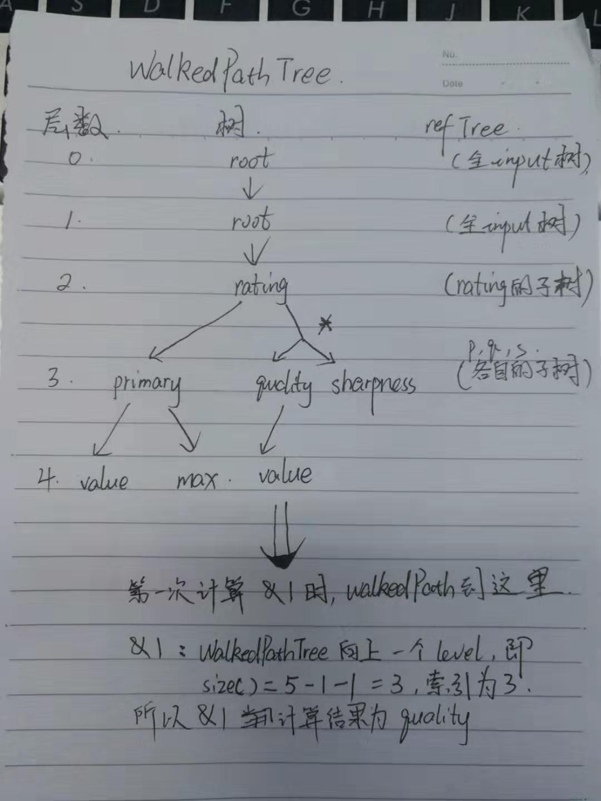
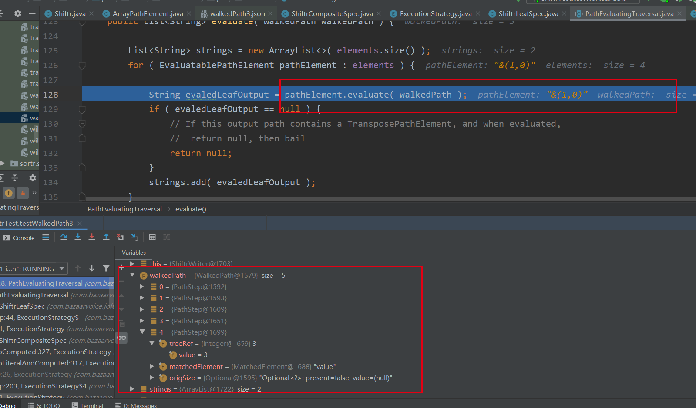
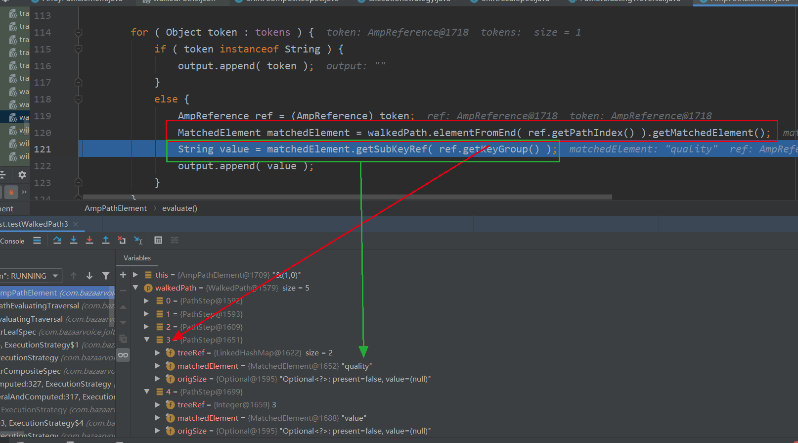
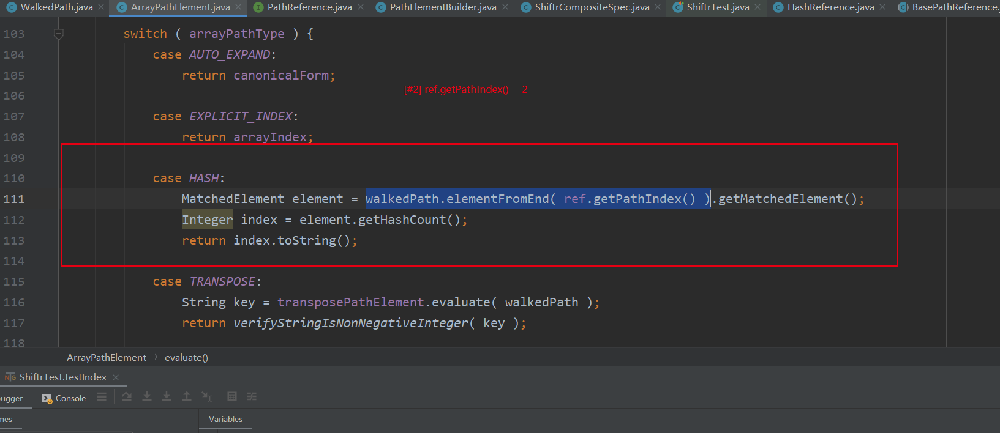
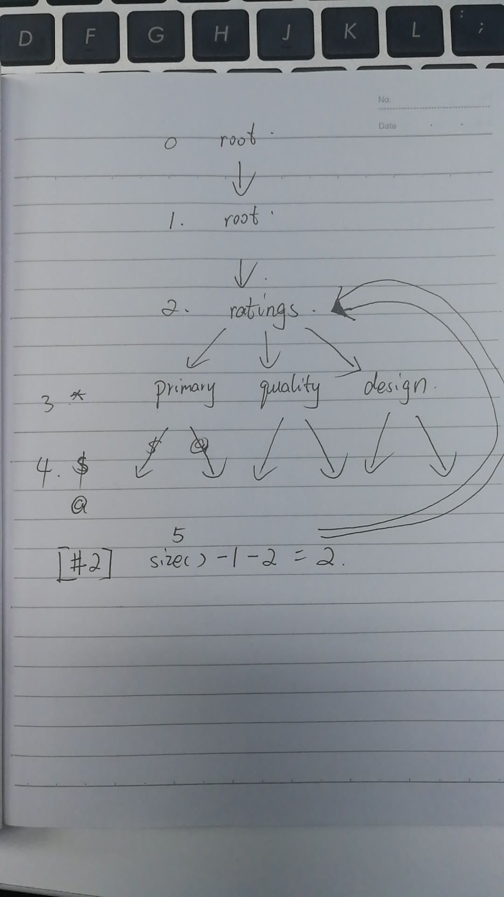
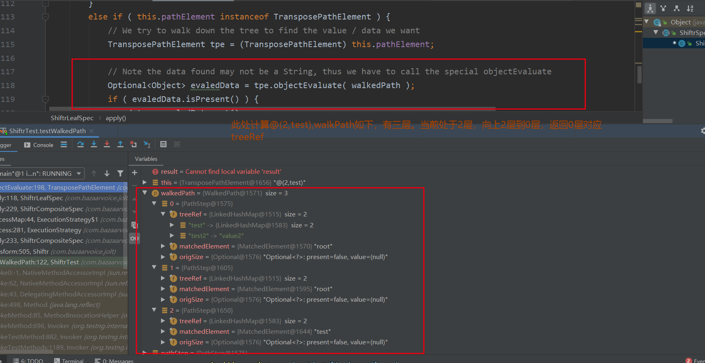
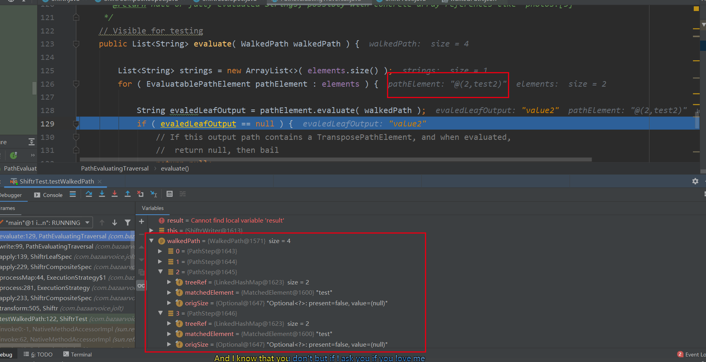
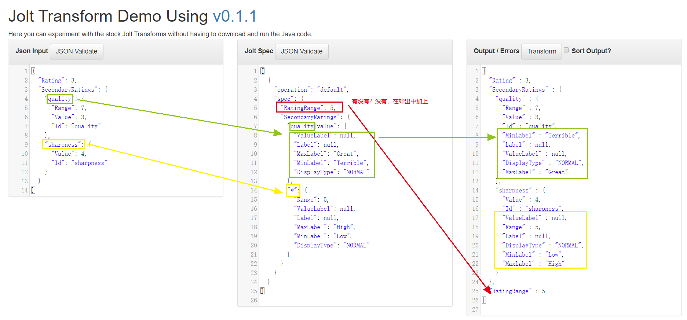
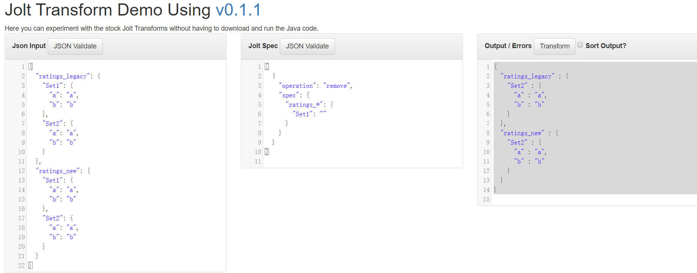
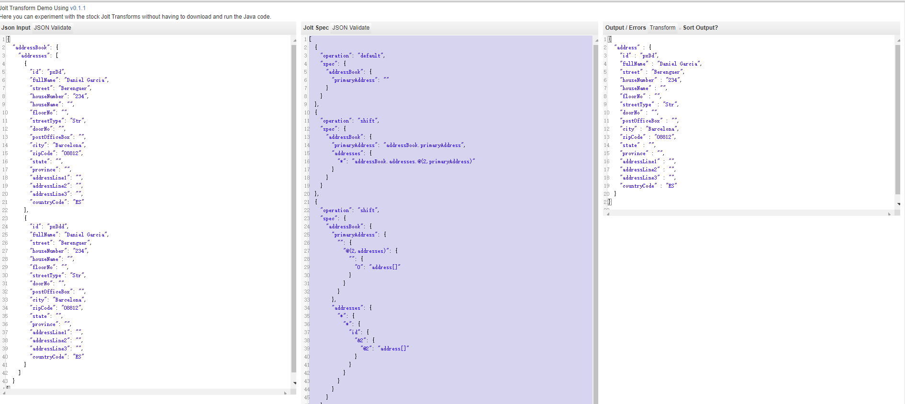

# Json Jolt Tutorial
***
author：__**酷酷的诚**__  E-Mail：**zhangchengk@foxmail.com**
***
Content：

If there is any mistake, please leave a message.If reproduced, please indicate the source.

Jolt GitHub: <a href="https://github.com/bazaarvoice/jolt">https://github.com/bazaarvoice/jolt</a>

Jolt online demo: <a href="https://jolt-demo.appspot.com">https://jolt-demo.appspot.com</a>

JSON to JSON transformation library written in Java where the "specification" for the transform is itself a JSON document.In the following documents, I use 'Spec' instead of "specification" json document . LHS(left hand side) represents the keys of Spec json, and RHS(right hand side) represents the values of Spec json. Some of the examples are referenced Jolt source code comment documents.

Useful For:
1.  Transforming JSON data from ElasticSearch, MongoDb, Cassandra, etc before sending it off to the world
2.  Extracting data from a large JSON documents for your own consumption

## 概览

Jolt :

* provides a set of transforms, that can be "chained" together to form the overall JSON to JSON transform.
* focuses on transforming the structure of your JSON data, not manipulating specific values

    * The idea being: use Jolt to get most of the structure right, then write code to fix values

* consumes and produces "hydrated" JSON : in-memory tree of Maps, Lists, Strings, etc

    * use Jackson (or whatever) to serialize and deserialize the JSON text

## Alternatives

Being in the Java JSON processing "space", here are some other interesting JSON manipulation tools to look at / consider :

- [jq](https://stedolan.github.io/jq)Awesome command line tool to extract data from JSON files (use it all the time, available via brew)

- [JsonPath](https://github.com/jayway/JsonPath) Java : Extract data from JSON using XPATH like syntax.

- [JsonSurfer](https://github.com/jsurfer/JsonSurfer)Java : Streaming JsonPath processor dedicated to processing big and complicated JSON data.

## Performance

The primary goal of Jolt was to improve "developer speed" by providing the ability to have a declarative rather than imperative transforms. That said, Jolt should have a better runtime than the alternatives listed above.

Work has been done to make the stock Jolt transforms fast:

1. Transforms can be initialized once with their spec, and re-used many times in a multi-threaded environment.
   - We reuse initialized Jolt transforms to service multiple web requests from a DropWizard service.
2. "*" wildcard logic was redone to reduce the use of Regex in the common case, which was a dramatic speed improvement.
3. The parallel tree walk performed by Shiftr was optimized.

Two things to be aware of :

1. Jolt is not "stream" based, so if you have a very large Json document to transform you need to have enough memory to hold it.
2. The transform process will create and discard a lot of objects, so the garbage collector will have work to do.
   

## Stock Transforms


```
shift       : copy data from the input tree and put it the output tree
default     : apply default values to the tree
remove      : remove data from the tree
sort        : sort the Map key values alphabetically ( for debugging and human readability )
cardinality : "fix" the cardinality of input data.  Eg, the "urls" element is usually a List, but if there is only one, then it is a String
modify-overwrite-beta:This variant of modifier creates the key/index is missing, and overwrites the value if present
modify-default-beta:This variant of modifier only writes when the key/index is missing or the value is null
modify-define-beta:This variant of modifier only writes when the key/index is missing
full qualified Java ClassName : Class implements the Transform or ContextualTransform interfaces, and can optionally be SpecDriven (marker interface)
```
Each transform has its own DSL (Domain Specific Language) in order to facilitate its narrow job.

Currently, Currently, the top five Transforms just effect the "structure" of the data. To do data manipulation, you will need to write Java code or use modify function. If you write your Java "data manipulation" code to implement the Transform interface, then you can insert your code in the transform chain.

The out-of-the-box Jolt transforms should be able to do most of your structural transformation, with custom Java Transforms implementing your data manipulation.

Here is a Jolt guide in PDF:<a href="../jolt/JOLTIntroduction.pdf" download="JOLTIntroduction.pdf">Jolt介绍</a>

Google document PPT address online：<a href="https://docs.google.com/presentation/d/1sAiuiFC4Lzz4-064sg1p8EQt2ev0o442MfEbvrpD1ls/edit?usp=sharing">https://docs.google.com/presentation/d/1sAiuiFC4Lzz4-064sg1p8EQt2ev0o442MfEbvrpD1ls/edit?usp=sharing</a>
## shift

Shiftr is a kind of JOLT transform that specifies where "data" from the input JSON should be placed in the output JSON, aka how the input JSON/data should be shifted around to make the output JSON/data.

At a base level, a single Shiftr "command" is a mapping from an input path to an output path, similar to the "mv" command in Unix, "mv /var/data/mysql/data /media/backup/mysql".

 In Shiftr, the input path is a JSON tree structure, and the output path is flattened "dot notation" path notation.

 The idea is that you can start with a copy of your JSON input data and modify it into a Shiftr spec by  supplying a "dot notation" output path for each piece of data that you care about.

For example, given this simple input JSON:
```json
{
  "rating": {
       "quality": {
          "value": 3,
          "max": 5
       }
    }
}
```
A simple Shiftr spec could be constructed by copying that input, and modifying it to supply an output path for each piece of data:
```json
 {
    "rating": {
      "quality": {
          "value": "SecondaryRatings.quality.Value",     // copy 3 to "SecondaryRatings.quality.Value"
          "max": "SecondaryRatings.quality.RatingRange"  // copy 5 to "SecondaryRatings.quality.RatingRange"
      }   
    }
}
 ```
would produce the following output JSON:
```json
  {
    "SecondaryRatings": {
      "quality": {
        "Value": 3,
        "RatingRange": 5
      }
    }
  }
```
As shown above, Shiftr specs can be entirely made up of literal string values, but its real power comes from its wildcards.Using wildcards, you can leverage the fact that you know, not just the data and its immediate key, but the whole input path to that data.

Expanding the example above, say we have the following expanded Input JSON:
```json
{
  "rating": {
      "primary": {
          "value": 3,   // want this value to goto output path "Rating"
          "max": 5      // want this value to goto output path "RatingRange"
      },
      "quality": {      // want output path "SecondaryRatings.quality.Id" = "quality", aka we want the value of the key to be used
          "value": 3,   // want this value to goto output path "SecondaryRatings.quality.Value"
          "max": 5      // want this value to goto output path "SecondaryRatings.quality.Range"
      },
      "sharpness": {   // want output path "SecondaryRatings.sharpness.Id" = "sharpness"
          "value": 7,  // want this value to goto output path "SecondaryRatings.sharpness.Value"
          "max": 10    // want this value to goto output path "SecondaryRatings.sharpness.Range"
      }
  }
}
```
Spec:
```json
{
  "rating": {
    "primary": {
        "value": "Rating",                       // output -> "Rating" : 3
        "max": "RatingRange"                      // output -> "RatingRange" : 5
    },
    "*": {                                        // match input data like "rating.[anything-other-than-primary]"
        "value": "SecondaryRatings.&1.Value",    // the data at "rating.*.value" goes to "SecondaryRatings.*.Value"
                                                  // the "&1" means use the value one level up the tree ( "quality" or "sharpness" )
                                                // output -> "SecondaryRatings.quality.Value" : 3 AND
                                                //           "SecondaryRatings.sharpness.Value" : 7

        "max": "SecondaryRatings.&1.Range",      // the data at "rating.*.max" goes to "SecondaryRatings.*.Range"
                                                 // the "&1" means use the value one level up the tree ( "quality" or "sharpness" )
                                                 // output -> "SecondaryRatings.quality.Range" : 5 AND
                                                  //           "SecondaryRatings.sharpness.Range" : 10

        "$": "SecondaryRatings.&1.Id"            // Special operator $ means, use the value of the input key itself as the data
                                                 // output -> "SecondaryRatings.quality.Id" : "quality"
                                                 // output -> "SecondaryRatings.sharpness.Id" : "sharpness"
    }
  }
}
```
Yielding the following output:
```json
{
  "Rating": 3,
  "RatingRange": 5,
  "SecondaryRatings": {
     "quality": {
        "Range": 5,
        "Value": 3,
        "Id": "quality"     // the special $ operator allows us to use input key the text value of "quality", as the "Id" of the output
     },
     "sharpness": {
        "Range": 10,
        "Value": 7,
        "Id": "sharpness"   // the special $ operator allows us to use input key the text value of "sharpness", as the "Id" of the output
     }
  }
}
```
### Shiftr WalkedPathTree

This part of the content is in the study of part of the source code and practice of the summary, there may be some mistakes, if someone see, please be sure to leave a message to correct!

**theory**：

Jolt in shiftr, when processing input according to Spec, keeps a dynamic WalkedPath at all times, which is generally a linkedList.As a new match calculation operation, the current information (including a refTree, which is a reference to the input json, and a subKey, which is the key value matched) is saved to the WalkedPath。When the calculation is completed at the leaf node in the Spec tree(including the matching calculation and the output calculation),the current stored information is removed from the WalkedPath.Although the outer layer of the WalkedPath is a linked list, drawing the entire WalkedPath path becomes a tree because of wildcards, multiple matches at the same level, and so on (recursion is in the code).

For example, we saw an &1 in the above example, and & means to take the key value of the corresponding node, as explained below.Based on the example above, let's draw the WalkedPathTree when we first compute to &1

Here is a screenshot of the program from debug to the first time it was calculated to &1:





### Shiftr wildcards

#### '*' wildcard

1. Valid only on the LHS ( input JSON keys ) side of a Shiftr Spec
2. The '*' wildcard can be used by itself or to match part of a key.

'*' wildcard by itself:

input：
```json
{
  "rating" : {
    "quality": {
      "value": 3,
      "max": 5
    },
    "sharpness" : {
      "value" : 7,
      "max" : 10
    }
  }
}
```
 In this example, "rating.quality" and "rating.sharpness" both have the same structure/format, and thus we can use the '*'  to allow us to write more compact rules and avoid having to explicitly write very similar rules for both "quality" and "sharpness".
Spec:
```json
[
  {
    "operation": "shift",
    "spec": {
      "rating": {
        "*": {
          "max": "Rating.[#2].amx",
          "value": "Rating.[#2].value"
        }
      }
    }
  }
]
```


'*' wildcard as part of a key:

input：
```json
{
   "tag-Pro": "Awesome",
   "tag-Con": "Bogus"
}
```
 A 'tag-*' would match both keys, and make the whole key and "matched" part of the key available.
Spec:
```json
[
  {
    "operation": "shift",
    "spec": {
      "tag-*": "&(0,1)"
    }
  }
]

```
output:


#### '&'wildcard

1. Valid on the LHS (left hand side - input JSON keys) and RHS (output data path)
2. The canonical form of the wildcard is "&(0,0)".The first parameter is where in the input path to look for a value, and the second parameter is which part of the key to use (used with * key).

eg input:
```json
{
  "test": {
    "test": "value",
    "test2": "value2"
  }
}
```
Spec:
```json
[
  {
    "operation": "shift",
    "spec": {
      "test": {
        "&": "ratingNames"
      }
    }
  }
]
```
output：


'&' Path lookup：As Shiftr processes data and walks down the spec, it maintains a data structure describing the path it has walked.The '&' wildcard can access data from that path in a 0 major, upward oriented way.
```json
{
    "foo" : {
        "bar": {
            "baz":  // &0 = baz, &1 = bar, &2 = foo
        }
    }
}
```
& Subkey lookup： '&' subkey lookup allows us to referece the values captured by the '*' wildcard.Example, "tag-*-*" would match "tag-Foo-Bar", making
```
 &(0,0) = "tag-Foo-Bar"
 &(0,1) = "Foo"
 &(0,2) = "Bar"
```

#### '$'Wildcard

1. Valid only on the LHS of the spec.
2. The existence of this wildcard is a reflection of the fact that the "data" of the input JSON, can be both in the "values" and the "keys" of the input JSON
3. The base case operation of Shiftr is to copy input JSON "values", thus we need a way to specify that we want to copy the input JSON "key" instead.

There are two cases where this is useful:

1. when a "key" in the input JSON needs to be a "id" value in the output JSON, see the ' "$": "SecondaryRatings.&1.Id" ' example above.
2. you want to make a list of all the input keys.

Example of "a list of the input keys":
```json
{
  "rating": {
    "primary": {
      "value": 3,
      "max": 5
    },
    "quality": {
      "value": 3,
      "max": 7
    }
  }
}
```
desired output:
```json
{
  "ratings" : [ "primary", "quality" ]    // Aside: this is an example of implicit JSON array creation in the output which is detailed further down.
                                          // For now just observe that the input keys "primary" and "quality" have both made it to the output.
}
```
Spec：

```json
{
  "rating": {
    "*": {               // match all keys below "rating"
      "$": "ratings"     // output each of the "keys" to "ratings" in the output
    }
  }
}
```

#### '#'Wildcard

1. Valid both on the LHS and RHS, but has different behavior / format on either side.
2. On the RHS of the spec, # is only valid in the the context of an array, like "[#2]".What "[#2]" means is, go up the three levels and ask that node how many matches it has had, and then use that as an index in the arrays.
3. On the LHS of the spec, # allows you to specify a hard coded String to be place as a value in the output.
4. On the LHS of the spec,# is the root node and children are not allowed

The initial use-case for this feature was to be able to process a Boolean input value, and if the value is boolean true write out the string "enabled".  Note, this was possible before, but it required two Shiftr steps.

```json
"hidden" : {
    "true" : {                             // if the value of "hidden" is true
        "#disabled" : "clients.clientId"   //write the word "disabled" to the path "clients.clientId"
    }
}
```
Let's do another example

input json:
```json
{
  "ratings": {
    "primary": 5,
    "quality": 4,
    "design": 5
  }
}
```

Spec:
```json
[
  {
    "operation": "shift",
    "spec": {
      "ratings": {
        "*": {
          // 
          // #2 means go three levels up the tree (count from 0),
          //  and ask the "ratings" node, how many of it's
          //  children have been matched.
          //
          // This allows us to put the Name and the Value into
          //  the same object in the Ratings array.
          "$": "Ratings[#2].Name",//$上文已经讲解 使key作为输出value
          "@": "Ratings[#2].Value"//@下文会讲解 
        }
      }
    }
  }
]

```
output json:
```json
{
  "Ratings" : [ {
    "Name" : "primary",
    "Value" : 5
  }, {
    "Name" : "quality",
    "Value" : 4
  }, {
    "Name" : "design",
    "Value" : 5
  } ]
}

```
Jolt demo said '#2 means go three levels up the tree (count from 0)'.But I think 'three levels up' is ambiguous, WalkedPath is an array, starting from 0, assuming the length is 5, then the index corresponding to 'two levels up' is labeled 5-1-2 = 2 ,So I think 'two levels up' is actually the best way to read it.

The key parts of the source code are as follows:

Hand-drawn drawings of walkedPathTree are as follows:


#### '|'Wildcard

1. Valid only on the LHS of the spec.

This 'or' wildcard allows you to match multiple input keys.   Useful if you don't always know exactly what your input data will be.

Spec:
```json
{
  "rating|Rating" : "rating-primary"   // match "rating" or "Rating" copy the data to "rating-primary"
}
```

#### '@'Wildcard

1. Valid on both sides of the spec.
2. On the LHS of the spec,@ is the root node and children are not allowed

This wildcard is necessary if you want to put both the input value and the input key somewhere in the output JSON.

Say we have a spec that just operates on the value of the input key "rating"：
```json
{
  "foo" : "place.to.put.value",  // leveraging the implicit operation of Shiftr which is to operate on input JSON values
}
```
if we want to do something with the "key" as well as the value
Spec
```json
{
   "foo" : {
     "$" : "place.to.put.key",
     "@" : "place.to.put.value"    // '@' explicitly tell Shiftr to operate on the input JSON value of the parent key "foo"
   }
}
```
Thus the '@' wildcard is the mean "copy the value of the data at this level in the tree, to the output".

Advanced '@' sign wildcard.The format is lools like "@(3,title)", where  "3" means go up the WalkedPath tree 3 levels and then lookup the key  "title" and use the value at that key.

eg：


Debug screenshot when calculating @(2,test)：


Then, at the end of the calculation @(2,test2), walkedPathTree adds another level (in fact, @(2,test2), @(3,test2) returns treeRef at level 1 and treeRef at level 0, both subtrees are the root node, the effect is the same, as shown below :)


Replace @(2,test2) with @(3,test2) and the result is the same:


The @ alone is equivalent to @0:


Examples of @ wildcard in RHS:

input json:
```json
{
   "author" : "Stephen Hawking",
   "book" : "A Brief History of Time"
}
```
expected json
```json
{
   "Stephen Hawking" : "A Brief History of Time"
}
```
Spec
```json
{
  "@author" : "@book"
}
```
The @book for RHS is actually one more level than the walkedPathTree for calculating @author

### json Array

Reading from (input) and writing to (output) JSON Arrays is fully supported.

#### Handling Arrays in the input JSON

Shiftr treats JSON arrays in the input data as Maps with numeric keys.
```json
{
   "Photos": [ "AAA.jpg", "BBB.jpg" ]
}
```
Spec
```json
{
   "Photos" :
   {
     "1" : "photo-&-url"      // Specify that we only want to operate on the 1-th index of the "Photos" input array
   }
}
```
output:
```json
{
    "photo-1-url": "BBB.jpg"
}
```
#### Handling Arrays in the output JSON

Traditional array brackets, [ ], are used to specify array index in the output JSON.
**[]'s are only valid on the RHS of the Shiftr spec.**

Example :
```json
{
  "photo-1-id": "327704",
  "photo-1-url": "http://bob.com/0001/327704/photo.jpg"
}
```
Spec:
```json
{
  "photo-1-id": "Photos[1].Id",   // Declare the "Photos" in the output to be an array,
  "photo-1-url": "Photos[1].Url"  // that the 1-th array location should have data
  // same as above but more powerful
  // note '&' logic can be used inside the '[ ]' notation "photo-*-url": "Photos[&(0,1)].Url"
}
```
output:
```json
{
  "Photos": [
    null ,                // note Photos[0] is null, because no data was pushed to it
    {
      "Id":"327704",
      "Url":"http://bob.com/0001/327704/photo.jpg"
    }
  ]
}
```

#### JSON arrays in the spec file

JSON Arrays in Shiftr spec are used to to specify that piece of input data should be copied to two places in the output JSON.

Example :
```json
{ "foo" : 3 }
```
Spec:
```json
{ "foo" : [ "bar", "baz" ] }
```
output:
```json
{
  "bar" : 3,
  "baz" : 3
}
```

#### Implicit Array creation in the output JSON

If a spec file is configured to output multiple pieces of data to the same output location, the output location will be turned into a JSON array.

Example :
```json
{
    "foo" : "bar",
    "tuna" : "marlin"
}
```
Spec:
```json
{
    "foo"  : "baz",
    "tuna" : "baz"
}
```
output：
```json
{
    "baz" : [ "bar", "marlin" ]     // Note the order of this Array should not be relied upon
}
```

### Algorithm High Level

Walk the input data, and Shiftr spec simultaneously, and execute the Shiftr command/mapping each time there is a match.

### Algorithm Low Level

- Simultaneously walk of the spec and input JSon, and maintain a walked "input" path data structure.
- Determine a match between input JSON key and LHS spec, by matching LHS spec keys in the following order :
    - Note that '|' keys are are split into their subkeys, eg "literal", '*', or '&' LHS keys
    1. Try to match the input key with "literal" spec key values
    2. If no literal match is found, try to match against LHS '&' computed values.
        - For deterministic behavior, if there is more than one '&' LHS key, they are applied/matched in alphabetical order,after the '&' syntactic sugar is replaced with its canonical form.
    3. If no match is found, try to match against LHS keys with '*' wildcard values.
        - For deterministic behavior, '*' wildcard keys are sorted and applied/matched in alphabetical order.

Note, processing of the '@' and '$' LHS keys always occur if their parent's match, and do not block any other matching.

## default

Defaultr is a kind of JOLT transform that applies default values in a non-destructive way.

For comparison :

* Shitr walks the input data and asks its spec "Where should this go?"
* Defaultr walks the spec and asks "Does this exist in the data?  If not, add it."

Example : Given input JSON like
```json
{
  "Rating":3,
  "SecondaryRatings":{
     "quality":{
        "Range":7,
        "Value":3,
        "Id":"quality"
     },
     "sharpness": {
        "Value":4,
        "Id":"sharpness"
     }
  }
}
```
With the desired output being :
```json
{
  "Rating":3,
  "RatingRange" : 5,
  "SecondaryRatings":{
     "quality":{
        "Range":7,
        "Value":3,
        "Id":"quality",
        "ValueLabel": null,
        "Label": null,
        "MaxLabel": "Great",
        "MinLabel": "Terrible",
        "DisplayType": "NORMAL"
     },
     "sharpness": {
        "Range":5,
        "Value":4,
        "Id":"sharpness",
        "ValueLabel": null,
        "Label": null,
        "MaxLabel": "High",
        "MinLabel": "Low",
        "DisplayType": "NORMAL"
     }
  }
}
```

Spec
```json
{
  "RatingRange" : 5,
  "SecondaryRatings": {
    "quality|value" : {
       "ValueLabel": null,
       "Label": null,
       "MaxLabel": "Great",
       "MinLabel": "Terrible",
       "DisplayType": "NORMAL"
    },
    "*": {
       "Range" : 5,
       "ValueLabel": null,
       "Label": null,
       "MaxLabel": "High",
       "MinLabel": "Low",
       "DisplayType": "NORMAL"
    }
  }
}
```


### wildcard 

1. '*' Apply these defaults to all input keys at this level
2. '|' Apply these defaults to input keys, if they exist
3. '[]' Signal to Defaultr that the data for this key should be an array.This means all defaultr keys below this entry have to be "integers".

Valid Array Specification :
```json
{
   "photos[]" : {
     "2" : {
       "url" : "http://www.bazaarvoice.com",
       "caption" : ""
     }
   }
}
```

Algorithm：

1. Defaultr walks its Spec in a depth first way.
2. At each level in the Spec tree, Defaultr, works from most specific to least specific Spec key:
   -  Literals key values
   - "|", sub-sorted by how many or values there, then alphabetically (for deterministic behavior)
   - "*"

At a given level in the Defaultr Spec tree, only literal keys force Defaultr to create new entries in the input data: either as a single literal value or adding new nested Array or Map objects.The wildcard operators, are applied after the literal keys, and will not cause the those keys to be added if they are not already present in the input document (either naturally or having been defaulted in from literal spec keys).

Algorithm :
- 1 Walk the spec
- 2 for each literal key in the spec (specKey)
  -  if the the specKey is a map or array, and the input is null, default an empty Map or Array into the output
  -  re-curse on the literal spec
  -  if the the specKey is a map or array, and the input is not null, but of the "wrong" type, skip and do not recurse
  - if the the specKey, is a literal value, default the literal and value into the output and do not recurse
- 3  for each wildcard in the spec
  -  find all keys from the defaultee that match the wildcard
  - treat each key as a literal speckey

To force unambiguity, Defaultr throws an Exception if the input is null.

## remove

remove is a kind of JOLT transform that removes content from the input JSON.

For comparison :

* Shiftr walks the input data and asks its spec "Where should this go?"
* Defaultr walks the spec and asks "Does this exist in the data?  If not, add it."
* While, Removr walks the spec and asks "if this exists, remove it."

Example : Given input JSON like
```json
{
  "~emVersion" : "2",
  "id":"123124",
  "productId":"31231231",
  "submissionId":"34343",
  "this" : "stays",
  "configured" : {
    "a" : "b",
    "c" : "d"
  }
}
```
With the desired output being :
```json
{
  "id":"123124",
  "this" : "stays",
  "configured" : {
    "a" : "b"
  }
}
```
Spec：
```json
{
  "~emVersion" : "",
  "productId":"",
  "submissionId":"",
  "configured" : {
    "c" : ""
  }
}
```


### Wildcard

'*' Valid only on the LHS ( input JSON keys ) side of a Removr Spec,The '*' wildcard can be used by itself or to match part of a key.

'*' wildcard by itself :
```json
{
  "ratings": {
    "Set1": {
      "a": "a",
      "b": "b"
    },
    "Set2": {
      "c": "c",
      "b": "b"
    }
  }
}
```
desired output:
```json
{
    "ratings": {
        "Set1": {
            "a": "a"
        },
        "Set2": {
            "c": "c"
        }
    }
}
```
Spec:
```json
{
 "ratings":{
    "*":{
      "b":""
    }
  }
}
```


'*' wildcard as part of a key :
```json
{
    "ratings_legacy": {
        "Set1": {
            "a": "a",
            "b": "b"
        },
        "Set2": {
            "a": "a",
            "b": "b"
        }
    },
    "ratings_new": {
        "Set1": {
            "a": "a",
            "b": "b"
        },
        "Set2": {
            "a": "a",
            "b": "b"
        }
    }
}
```
Spec
```json
{
      "ratings_*": {
        "Set1": ""
      }
    }
```
desired oiuput json:
```json
{
  "ratings_legacy" : {
    "Set2" : {
      "a" : "a",
      "b" : "b"
    }
  },
  "ratings_new" : {
    "Set2" : {
      "a" : "a",
      "b" : "b"
    }
  }
}

```


Here are two more examples of matching array indexes:

Delete one member of each element of the array:

Remove array elements with index 0:


## cardinality

The CardinalityTransform changes the cardinality of input JSON data elements.The impetus for the CardinalityTransform, was to deal with data sources that are inconsistent with respect to the cardinality of their returned data.

For example, say you know that there will be a "photos" element in a document.  If your underlying data source is trying to be nice, it may adjust the "type" of the photos element, depending on how many photos there actually are.

### Valid Cardinality Values (RHS : right hand side)

'ONE':If the input value is a List, grab the first element in that list, and set it as the data for that element .For all other input value types, no-op.

'MANY':If the input is not a List, make a list and set the first element to be the input value.If the input is "null", make it be an empty list.If the input is a list, no-op

Example：

input json:
```json
{
  "review" : {
    "rating" : [ 5, 4 ]
  }
}
```
Spec:
```json
{
  "review" : {
    "rating" : "ONE"
  }
}
```
output:
```json
{
  "review" : {
    "rating" : 5
  }
}
```


### Wildcards

'*' Valid only on the LHS ( input JSON keys ) side of a Cardinality Spec.Unlike shiftr, the '*' wildcard can only be used by itself. It can be used achieve a for/each manner of processing input.

'@' Valid only on the LHS of the spec.This wildcard should be used when content nested within modified content needs to be modified as well.

Example input json:
```json
{
  "views" : [
    { "count" : 1024 },
    { "count" : 2048 }
  ]
}
```
Spec
```json
{
  "views" : {
    "@" : "ONE",
    "count" : "MANY"
  }
}
```
output:
```json
{
  "views" : {
    "count" : [ 1024 ]
  }
}
```

## sort

Recursively sorts all maps within a JSON object into new sorted LinkedHashMaps so that serialized representations are deterministic.  Useful for debugging and making test fixtures.

Note this will make a copy of the input Map and List objects.

The sort order is standard alphabetical ascending, with a special case for "~" prefixed keys to be bumped to the top.


## modify

modify-overwrite-beta:This variant of modifier creates the key/index is missing, and overwrites the value if present
modify-default-beta:This variant of modifier only writes when the key/index is missing or the value is null
modify-define-beta:This variant of modifier only writes when the key/index is missing

Modify mode contains a series of functions that are native to Java in nature. Below  are the functions and their corresponding source code:

```java
private static final Map<String, Function> STOCK_FUNCTIONS = new HashMap<>(  );

    static {
        STOCK_FUNCTIONS.put( "toLower", new Strings.toLowerCase() );
        STOCK_FUNCTIONS.put( "toUpper", new Strings.toUpperCase() );
        STOCK_FUNCTIONS.put( "concat", new Strings.concat() );
        STOCK_FUNCTIONS.put( "join", new Strings.join() );
        STOCK_FUNCTIONS.put( "split", new Strings.split() );
        STOCK_FUNCTIONS.put( "substring", new Strings.substring() );
        STOCK_FUNCTIONS.put( "trim", new Strings.trim() );
        STOCK_FUNCTIONS.put( "leftPad", new Strings.leftPad() );
        STOCK_FUNCTIONS.put( "rightPad", new Strings.rightPad() );

        STOCK_FUNCTIONS.put( "min", new Math.min() );
        STOCK_FUNCTIONS.put( "max", new Math.max() );
        STOCK_FUNCTIONS.put( "abs", new Math.abs() );
        STOCK_FUNCTIONS.put( "avg", new Math.avg() );
        STOCK_FUNCTIONS.put( "intSum", new Math.intSum() );
        STOCK_FUNCTIONS.put( "doubleSum", new Math.doubleSum() );
        STOCK_FUNCTIONS.put( "longSum", new Math.longSum() );
        STOCK_FUNCTIONS.put( "intSubtract", new Math.intSubtract() );
        STOCK_FUNCTIONS.put( "doubleSubtract", new Math.doubleSubtract() );
        STOCK_FUNCTIONS.put( "longSubtract", new Math.longSubtract() );
        STOCK_FUNCTIONS.put( "divide", new Math.divide() );
        STOCK_FUNCTIONS.put( "divideAndRound", new Math.divideAndRound() );


        STOCK_FUNCTIONS.put( "toInteger", new Objects.toInteger() );
        STOCK_FUNCTIONS.put( "toDouble", new Objects.toDouble() );
        STOCK_FUNCTIONS.put( "toLong", new Objects.toLong() );
        STOCK_FUNCTIONS.put( "toBoolean", new Objects.toBoolean() );
        STOCK_FUNCTIONS.put( "toString", new Objects.toString() );
        STOCK_FUNCTIONS.put( "size", new Objects.size() );

        STOCK_FUNCTIONS.put( "squashNulls", new Objects.squashNulls() );
        STOCK_FUNCTIONS.put( "recursivelySquashNulls", new Objects.recursivelySquashNulls() );

        STOCK_FUNCTIONS.put( "noop", Function.noop );
        STOCK_FUNCTIONS.put( "isPresent", Function.isPresent );
        STOCK_FUNCTIONS.put( "notNull", Function.notNull );
        STOCK_FUNCTIONS.put( "isNull", Function.isNull );

        STOCK_FUNCTIONS.put( "firstElement", new Lists.firstElement() );
        STOCK_FUNCTIONS.put( "lastElement", new Lists.lastElement() );
        STOCK_FUNCTIONS.put( "elementAt", new Lists.elementAt() );
        STOCK_FUNCTIONS.put( "toList", new Lists.toList() );
        STOCK_FUNCTIONS.put( "sort", new Lists.sort() );
    }
```

Example input json:
```json
{
  "x": [ 3, 2, 1, "go"  ],
  "small": "small",
  "BIG": "BIG",

  "people": [
    {
      "firstName": "Bob",
      "lastName": "Smith",
      "address": {
        "state": null
      }
    },
    {
      "firstName": "Sterling",
      "lastName": "Archer"
    }
  ]
}

```
Spec
```json
[
  {
    "operation": "modify-default-beta",//值为null时写入
    "spec": {
      // String join the values in the array x, with a comma and a space
      "y": "=join(',',@(1,x))",
      "z": "=join(' ',@(1,x))",
      //
      // make small big, and make big small
      "small_toUpper": "=toUpper(@(1,small))",
      "BIG_toLower": "=toLower(@(1,BIG))",
      //
      // Here we are dealing with an array of people objects.
      // We want to build a fullName for them, and default them
      // to 'live' in Texas, only if they don't already have an address defined.
      "people": {
        "*": {
          // build the fullName from the first and last names
          //
          // @(1,firstName)
          //  -  is "evaluated" before being passed to the =concat function.
          //  -  means go up two levels, and then come back down and grab
          //      the value from firstName
          "fullName": "=concat(@(1,firstName),' ',@(1,lastName))",
          //
          // Suffix of "?" means only match if the input actually has an "address"
          "address?": {
            // The transform "modify-default-beta" will only match if the
            //  "left hand side" does not exist or is null
            "state": "Texas"
          }
        }
      }
    }
  }
]
```

## Extended 

full qualified Java ClassName : Class implements the Transform or ContextualTransform interfaces, and can optionally be SpecDriven (marker interface)

[Transform](https://github.com/bazaarvoice/jolt/blob/master/jolt-core/src/main/java/com/bazaarvoice/jolt/Transform.java)

[SpecDriven](https://github.com/bazaarvoice/jolt/blob/master/jolt-core/src/main/java/com/bazaarvoice/jolt/SpecDriven.java)

Spec like：
```json
 [
      {
          "operation": "com.bazaarvoice.tuna.CustomTransform",
 
          "spec" : { ... } // optional spec to use to construct a custom {@link Transform} if it has the {@link SpecDriven} marker interface.
      },
      //...
  ]
```

## Chainr

Chainr is a mechanism for wiring together multiple conversion Spec like:
```json
 [
      {
          "operation": "[operation-name]",
          // stuff that the specific transform needs go here
      },
      //...
 ]
```
operation-name may be shift、default、remove、cardinality、sort、java、modify-overwrite-beta、modify-default-beta、modify-define-beta

Example：
```json
{
    // Input data for the unit test
    "input": {
        "rating": {
            "primary": {
                "value": 3,
                "max": 5
            },
            "sharpness": {
                "value": 5,
                "max": 5
            },
            "quality": {
                "value": 3,
                "max": 7
            }
        }
    },

    // The test uses this Chainr spec, on the input data to produce the "expected" JSON below
    "spec": [
        {
            // first operation is shift
            "operation": "shift",
            "spec": {
                "rating": {
                    "primary": {
                        "value": "Rating",
                        "max": "RatingRange"
                    },
                    "*": {
                        "value": "SecondaryRatings.&1.Value",
                        "max": "SecondaryRatings.&1.Range",
                        "$": "SecondaryRatings.&.Id"
                    }
                }
            }
        },
        {
            // second operation is to default some values
            "operation": "default",
            "spec": {
                "~z": "zz",
                "~a": "aa",
                "~id": "id",
                "zz": "zz",
                "~deleteme": "deleteme"
            }
        },
        {
            // third operation is to remove something
            "operation": "remove",
            "spec": {
                "~deleteme": ""
            }
        },
        {
            // last operation is to sort the JSON
            "operation": "sort"
        }
    ],

    // The expected result
    "expected": {
        "~a": "aa",
        "~id": "id",
        "~z": "zz",
        "Rating": 3,
        "RatingRange": 5,
        "SecondaryRatings": {
            "quality": {
                "Id": "quality",
                "Range": 7,
                "Value": 3
            },
            "sharpness": {
                "Id": "sharpness",
                "Range": 5,
                "Value": 5
            }
        },
        "zz": "zz"
    }
}
```


Let's take another example of a slightly more complicated practical Issue I saw on the JOLT GitHub Issue(<a href="https://github.com/bazaarvoice/jolt/issues/900">Conditional based on a input field #900</a>)

input json:
```json
{
  "addressBook": {
    "primaryAddress": "pxDdd",
    "addresses": [
      {
        "id": "pxDd",
        "fullName": "Daniel Garcia",
        "street": "Berenguer",
        "houseNumber": "234",
        "houseName": "",
        "floorNo": "",
        "streetType": "Str",
        "doorNo": "",
        "postOfficeBox": "",
        "city": "Barcelona",
        "zipCode": "08812",
        "state": "",
        "province": "",
        "addressLine1": "",
        "addressLine2": "",
        "addressLine3": "",
        "countryCode": "ES"
      },
      {
        "id": "pxDdd",
        "fullName": "Daniel Garcia",
        "street": "Berenguer",
        "houseNumber": "234",
        "houseName": "",
        "floorNo": "",
        "streetType": "Str",
        "doorNo": "",
        "postOfficeBox": "",
        "city": "Barcelona",
        "zipCode": "08812",
        "state": "",
        "province": "",
        "addressLine1": "",
        "addressLine2": "",
        "addressLine3": "",
        "countryCode": "ES"
      }
    ]
  }
}
```
The ouput file should contains the address that has the same id value than the primaryAddress field value. In case there is not a primaryAddres field, the first address should be written to the output.And I assume that  if more than one have the same id value than the primaryAddress field value, we only need one

The Spec scheme I have given is as follows. This Spec concatenates the three operations of default、 shift 、cardinality:
```json
[
  {
    "operation": "default",//if primaryAddress not exist,add a primaryAddress field
    "spec": {
      "addressBook": {
        "primaryAddress": ""
      }
    }
  },
  {
    "operation": "shift",
    "spec": {
      "addressBook": {
        "primaryAddress": "addressBook.primaryAddress",
        "addresses": {
          "*": "addressBook.addresses.@(2,primaryAddress)"
        }
      }
    }
  },
  {
    "operation": "shift",
    "spec": {
      "addressBook": {
        "primaryAddress": {
          "": {             
            "@(2,addresses)": {
              "": {
                "0": "address[]"
              }
            }
          }
        },
        "addresses": {
          "*": {
            "*": {
              "id": {
                "&2": {  
                  "@2": "address[]"
                }
              }
            }
          }
        }
      }
    }
  }, {
    "operation": "cardinality",
    "spec": {
      "address": "ONE"  
    }
  }
]


```
result：


## Java call

add Maven Dependency
```xml
<dependency>
    <groupId>com.bazaarvoice.jolt</groupId>
    <artifactId>jolt-core</artifactId>
    <version>${latest.jolt.version}</version>
</dependency>
<dependency>
    <groupId>com.bazaarvoice.jolt</groupId>
    <artifactId>json-utils</artifactId>
    <version>${latest.jolt.version}</version>
</dependency>
```
[Release Notes](https://github.com/bazaarvoice/jolt/releases)

- jolt-core :only one dependency on apache.commons for StringUtils.The goal is for the jolt-core artifact to be pure Java, so that it does not cause any dependency issues.

- json-utils : Jackson wrapper and testing utilities. Used by jolt-core as a test dependency.If you are willing to pull in Jackson 2, this artifact provides nice utility methods.

Code and Sample Data:

```java
package com.bazaarvoice.jolt.sample;

import com.bazaarvoice.jolt.Chainr;
import com.bazaarvoice.jolt.JsonUtils;

import java.io.IOException;
import java.util.List;

public class JoltSample {

    public static void main(String[] args) throws IOException {

        // How to access the test artifacts, i.e. JSON files
        //  JsonUtils.classpathToList : assumes you put the test artifacts in your class path
        //  JsonUtils.filepathToList : you can use an absolute path to specify the files

        List chainrSpecJSON = JsonUtils.classpathToList( "/json/sample/spec.json" );
        Chainr chainr = Chainr.fromSpec( chainrSpecJSON );

        Object inputJSON = JsonUtils.classpathToObject( "/json/sample/input.json" );

        Object transformedOutput = chainr.transform( inputJSON );
        System.out.println( JsonUtils.toJsonString( transformedOutput ) );
    }
}

```
input json:
```json
{
    "rating": {
        "primary": {
            "value": 3
        },
        "quality": {
            "value": 3
        }
    }
}
```
Spec
```json
[
    {
        "operation": "shift",
        "spec": {
            "rating": {
                "primary": {
                    "value": "Rating"
                },
                "*": {
                    "value": "SecondaryRatings.&1.Value",
                    "$": "SecondaryRatings.&.Id"
                }
            }
        }
    },
    {
        "operation": "default",
        "spec": {
            "Range" : 5,
            "SecondaryRatings" : {
                "*" : {
                    "Range" : 5
                }
            }
        }
    }
]
```
output:
```json
{
    "Rating": 3,
    "Range": 5,
    "SecondaryRatings": {
        "quality": {
            "Id": "quality",
            "Value": 3,
            "Range": 5
        }
    }
}
```
