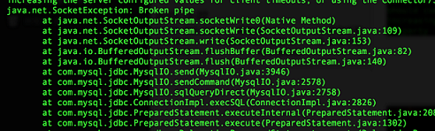
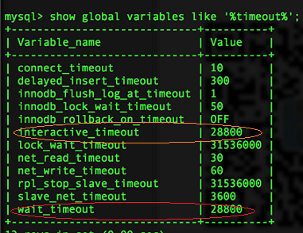
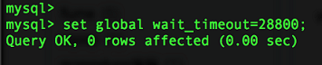
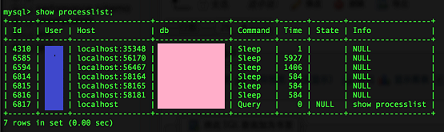

# Java Mysql连接池配置和案例分析--超时异常和处理
***
编辑人：__**酷酷的诚**__  邮箱：**zhangchengk@foxmail.com** 
***
内容：

前言:
　　最近在开发服务的时候, 发现服务只要一段时间不用, 下次首次访问总是失败. 该问题影响虽不大, 但终究影响用户体验. 观察日志后发现, mysql连接因长时间空闲而被关闭, 使用时没有死链检测机制, 导致sql执行失败.
　　问题的表层根源, 看似简单, 但实际解决之路, 却显得有些曲折坎坷. 因此有必须分析下本质的原因, 以及Java Mysql连接池的处理策略和相关的配置项.

异常现象和问题本源:
　　服务的持久层依赖mysql, 采用连接池的机制来优化性能. 但服务空闲一段时间(切确地讲是mysql connection空闲一段时间), 下次使用时执行sql失败.
　　具体的异常, 可反映到具体的异常日志:



当然除了异常的原因以外, 里面也提供了一个解决方案.　　
```
com.mysql.jdbc.exceptions.jdbc4.CommunicationsException:
The last packet successfully received from the server was 47,302,202 milliseconds ago. 
The last packet sent successfully to the server was 47,302,202 milliseconds ago.
is longer than the server configured value of 'wait_timeout'.
You should consider either expiring and/or testing connection validity before use in your application, increasing the server configured values for client timeouts,
or using the Connector/J connection property 'autoReconnect=true' to avoid this problem.　
```
暂且不管这个**autoReconnect=true**的解决方案是否有效, 我们来分析下问题本质.  
Mysql进程对拥有的资源, 都有其相应的回收策略. 比如空闲连接, 超过一段时间间隔后, mysql就会主动关闭该连接. 而这个时间间隔就由**wait_timeout**和**interactive_timeout**来确定.  
Mysql服务器关闭该空闲连接后，而客户端的连接并没有主动去关闭，导致首次使用时，执行失败.  
顺便谈谈mysql里面涉及的两个概念: 交互式连接和非交互式连接.    
网上争议和吐槽都很多, 但从官网的解读来看, 或许**只是mysql_real_connect()调用时, 是否打开CLIENT_INTERACTIVE开关**. 再深入的区别解读, 或许已经没有意义了.  
**交互式连接, 由interactive_timeout来确定, mysql的命令行工具即是该类型**.   
**非交互式连接, 则由wait_timeout来决定, jdbc/odbc等方式的连接即为该类型, 一般而言, Java Mysql连接池属于该类别，需关注wait_timeout项.**

_**曲折的路途:**_  
先后采用两种方式，一种是设置重连选项，另一种是连接池主动淘汰.  
• **设置重连选项**  
按照异常中附带的建议，再jdbc的url中添加了属性autoReconnect=true.  
原本以为妥妥的，没想到事与愿违, 还是出现了类似的错误.  
参照网上革命战友的说法, **mysql5以后autoReconnet=true已经失效了**, 具体可以参考[Bug #5020](http://bugs.mysql.com/bug.php?id=5020).   
• **连接池主动淘汰**  
在配置的连接池中，按一定的规则淘汰掉空闲连接，降低死链被使用的概率.  
1). **testBeforeUse/testAfterUse**  
testBeforeUse顾名思义, 就是把连接从连接池中取出时, 先执行validation sql，再执行目标的sql语句. testAfterUse则刚好相反,再放回连接池时进行检测.  
虽然每次执行，都会额外的执行一次validation sql，但还是完美的解决上述的问题。不过需要注意的是，其代价昂贵，在高并发情况下需慎用.  
2). **定时任务+按空闲阈值淘汰**  
按一定时间间隔执行清理任务，设定空闲时间的上限，一旦检测到连接其空闲时间超过该阈值，则主动关闭掉. 当然定时周期和空闲阈值都小于wait_timeout值.  
3). **定时任务+validation sql检测淘汰**  
按一定时间间隔执行清理任务，对空闲连接进行validation sql检测, 若失败则主动关闭. 这种方式是testBeforeUse/testAfterUse的有益补充, 有效减少了执行validation sql的次数，解决了代价高昂的窘境. 当然定时周期小于wait_timeout值.

_**DBCP举例：**_  
我们选用DBCP作为连接池配置的样例, 看看它如何实现上述谈到的主动淘汰策略的.  
先来看下DBCP关于空闲连接处理的配置项：

col 1                             | col 2          | col 3                                                                                  
--------------------------------- | -------------- | ---------------------------------------------------------------------------------------
**validationQuery**               |                | SQL查询,用来验证从连接池取出的连接,在将连接返回给调用者之前.如果指定,则查询必须是一个SQL SELECT并且必须返回至少一行记录                   
**testOnBorrow**                  | true           | 指明是否在从池中取出连接前进行检验,如果检验失败,则从池中去除连接并尝试取出另一个.注意: 设置为true后如果要生效,validationQuery参数必须设置为非空字符串
**testOnReturn**                  | false          | 指明是否在归还到池中前进行检验注意: 设置为true后如果要生效,validationQuery参数必须设置为非空字符串                           
**testWhileIdle**                 | false          | 指明连接是否被空闲连接回收器(如果有)进行检验.如果检测失败,则连接将被从池中去除.注意: 设置为true后如果要生效,validationQuery参数必须设置为非空字符串
**timeBetweenEvictionRunsMillis** | -1             | 在空闲连接回收器线程运行期间休眠的时间值,以毫秒为单位. 如果设置为非正数,则不运行空闲连接回收器线程                                    
**numTestsPerEvictionRun**        | 3              | 在每次空闲连接回收器线程(如果有)运行时检查的连接数量                                                            
**minEvictableIdleTimeMillis**    | 1000 * 60 * 30 | 连接在池中保持空闲而不被空闲连接回收器线程(如果有)回收的最小时间值，单位毫秒                                                

注：如果想看更多DBCP的配置项, 请参考博文: [DBCP的参数配置](http://blog.csdn.net/yxpjx/article/details/5773998);   
1). **testBeforeUse/testAfterUse**

```xml
<bean id="dataSource" class="org.apache.commons.dbcp.BasicDataSource"
　　　　destroy-method="close">
　　<property name="testOnBorrow" value="true" />
　　<property name="testOnReturn" value="false" />
</bean>
```

2). **定时任务+按空闲阈值淘汰**

```xml
<bean id="dataSource" class="org.apache.commons.dbcp.BasicDataSource"
　　　　destroy-method="close">
　　<!-- validation query -->
　　<property name="validationQuery" value="SELECT 1" />
　　<!-- 定时周期间隔 -->
　　<property name="timeBetweenEvictionRunsMillis" value="90000" />
　　<property name="numTestsPerEvictionRun" value="3" />
　　<!-- 空闲连接的生存阈值 -->
　　<property name="minEvictableIdleTimeMillis" value="1800000" /> 
</bean>  
```

3). **定时任务+validation sql检测淘汰**

```xml
<bean id="dataSource" class="org.apache.commons.dbcp.BasicDataSource"
　　　　destroy-method="close">
　　<!-- validation query -->
　　<property name="validationQuery" value="SELECT 1" />
　　<!-- 定时周期间隔 -->
　　<property name="timeBetweenEvictionRunsMillis" value="900000" />
　　<property name="numTestsPerEvictionRun" value="3" />
 
　　<!-- 开启空闲状态检测 -->
　　<property name="testWhileIdle" value="true" />
</bean>
```

事实上，**这三种策略除了单独配置，还可以组合，甚至全部启用.**

_**附带：**_  
其实mysql有很多特性, 我们未必真得熟悉.  
如何展示mysql的配置变量值:  
  
注：**可以看到wait_timeout为28800(28800=60 * 60 * 8), 这就是著名的8小时问题的出处**.  
如何修改变量：  
  
注：**需要注意全局变量和会话变量，以及如何生效.**  
如何查看mysql的连接数：  
  

_**总结：**_  
算是一个总结归纳之作, 对于很多革命战友提议说把wait_timeout设长, 我感觉还是治标不治本. 因此就没阐述这个想法, 权当笔记.