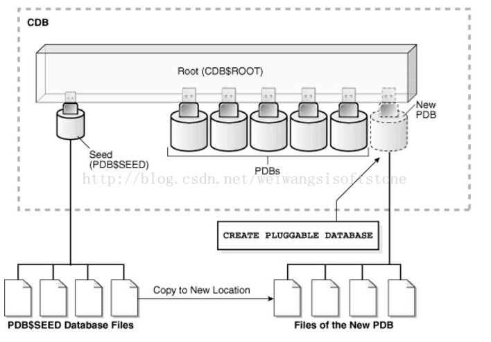

# oracle 12C的新特性-CDB和PDB

***
编辑人：__**酷酷的诚**__  邮箱：**zhangchengk@foxmail.com** 
***
内容：

## 1.前言

CDB与PDB是Oracle 12C引入的新特性，在ORACLE 12C数据库引入的多租用户环境（Multitenant Environment）中，允许一个数据库容器（CDB）承载多个可插拔数据库（PDB）。CDB全称为ContainerDatabase，中文翻译为数据库容器，PDB全称为Pluggable Database，即可插拔数据库。在ORACLE 12C之前，实例与数据库是一对一或多对一关系（RAC）：即一个实例只能与一个数据库相关联，数据库可以被多个实例所加载。而实例与数据库不可能是一对多的关系。当进入ORACLE 12C后，实例与数据库可以是一对多的关系。  
关于CDB与PDB的关系图



12c中 oracle引入了容器数据库 CDB（container database），和可插拔数据库 PDB（pluggable database）。oracle 将CDB看成一个容器，用来存放数据库。  
在CDB中可以有多个PDB，其中存在一个root根容器（PDB$ROOT）、一个种子容器（PDB$SEED）和多个PDBS。所有的PDB共用一个硬件系统资源、sga和pga、redo、临时段、控制文件、参数文件、还原段（还可对每个PDB单独指定）。

`PDB$ROOT`：根容器用来做所有容器的跟，用来对每个PDB进行统一管理，sqlplus / as  sysdba连接进来默认是连接的根容器，需要切换到其他的PDB容器才可以对单独的PDB操作。其中有 system数据文件、sysaux数据文件、（undo数据文件、temp数据文件、redo、控制文件）。一般不存放生产数据文件  
PDB$SEED：种子容器作为插入PDB的模板而存在，每个CDB都有一个种子容器，且不可对其中对象进行修改。其中有 system数据文件、sysaux数据文件、其他数据文件。  
PDB：新插入容器，该容器用来存放数据库。其中有 system数据文件、sysaux数据文件、其他数据文件。12c中可以插入多个容器进行统一管理，来减少BDA的工作量。其中的数据库可以插入或拔出。  
用户：12c中PDB$ROOT中的普通目录可以通过权限分配来访问一个或多个指定的PDB容器，最大权限用户是sysdba。其中PDB也可单独创建普通用户来管理该容器的数据库。  
PDB资源管理：12c中将多个数据库运行在一个硬件资源上，CDB性能上得到优化。在CDB中为每个PDB确定使用CPU最低份额，CDB会按照一个PDB份额/分配的总份额数*100%，来保证PDB最低份额数。

## **容器管理**

连接数据库

[oracle@master ~]$ sqlplus / as sysdba

### 查询该容器是CDB 还是非CDB

```sql
SQL> select name,cdb,open_mode,con_id from v$database;

NAME      CDB OPEN_MODE                CON_ID--------- --- -------------------- ----------
ORCL      YES READ WRITE                    0
```

### 查看当前容器

```sql
SQL> show con_name;

CON_NAME------------------------------
CDB$ROOT
```

### 查看所创建的PDB

```sql
SQL>  show pdbs;

    CON_ID CON_NAME                       OPEN MODE  RESTRICTED---------- ------------------------------ ---------- ----------
         2 PDB$SEED                       READ ONLY  NO
         3 PDBORCL                        MOUNTED
```

### 创建一个新PDB

```sql
SQL> create pluggable database pdb1 admin user pdb1 identified by pdb1 file_name_convert=('/u01/app/oracle/oradata/orcl/pdbseed/','/u01/app/oracle/oradata/orcl/pdb1/');

Pluggable database created.

SQL> show pdbs;

    CON_ID CON_NAME                       OPEN MODE  RESTRICTED---------- ------------------------------ ---------- ----------
         2 PDB$SEED                       READ ONLY  NO
         3 PDBORCL                        MOUNTED
         4 PDB1                           MOUNTED
```


### 启动一个创建好的PDB


```sql
SQL> alter pluggable database pdb1 open;

Warning: PDB altered with errors.

SQL> select message,time from pdb_plug_in_violations;

MESSAGE--------------------------------------------------------------------------------
TIME---------------------------------------------------------------------------
Sync PDB failed with ORA-959 during 'CREATE USER c##dm_ca IDENTIFIED BY * PROFIL
E DEFAULT DEFAULT TABLESPACE casdb ACCOUNT UNLOCK container = all'
26-DEC-18 11.26.27.070262 AM

SQL> alter session set container=pdb1;

Session altered.

SQL> create tablespace users datafile '/u01/app/oracle/oradata/orcl/pdb1/users01.dbf' size 800M;

Tablespace created.

SQL> alter pluggable database pdb1 close;

Pluggable database altered.

SQL> alter pluggable database pdb1 open;
Warning: PDB altered with errors.             #还是会报错，不知是何原因了，查看没有报错信息

SQL> select message,time from pdb_plug_in_violations;

no rows selected

SQL> show pdbs;

    CON_ID CON_NAME                       OPEN MODE  RESTRICTED---------- ------------------------------ ---------- ----------
         4 PDB1                           READ WRITE YES
```

[](javascript:void(0); "复制代码")

也可以通过sqlplus使用传统的startup和shutdown命令来启动和关闭PDB

[](javascript:void(0); "复制代码")

```sql
SQL> alter session set container=pdb1;
Session altered.
SQL>SQL> show pdbs;

    CON_ID CON_NAME                       OPEN MODE  RESTRICTED---------- ------------------------------ ---------- ----------
         4 PDB1                           MOUNTED
SQL> startup

Warning: PDB altered with errors.

Pluggable Database opened.
SQL> show pdbs;

    CON_ID CON_NAME                       OPEN MODE  RESTRICTED---------- ------------------------------ ---------- ----------
         4 PDB1                           READ WRITE YES
SQL> shutdown immediate;
Pluggable Database closed.
SQL> show pdbs;

    CON_ID CON_NAME                       OPEN MODE  RESTRICTED---------- ------------------------------ ---------- ----------
         4 PDB1                           MOUNTED
SQL> alter session set container=CDB$ROOT;

Session altered.
```


### 配置监听文件

监听文件目录在$ORACLE_HOME/network/admin


```sql
[oracle@master admin]$ cat tnsnames.ora 
\# tnsnames.ora Network Configuration File: /u01/app/oracle/product/12.1.0/db_1/network/admin/tnsnames.ora
\# Generated by Oracle configuration tools.

ORCL =  (DESCRIPTION =    (ADDRESS = (PROTOCOL = TCP)(HOST = master)(PORT = 1521))
    (CONNECT_DATA =      (SERVER = DEDICATED)
      (SERVICE_NAME = orcl)
    )
  )

PDBORCL =  (DESCRIPTION =    (ADDRESS = (PROTOCOL = TCP)(HOST = master)(PORT = 1521))
    (CONNECT_DATA =      (SERVER = DEDICATED)
      (SERVICE_NAME = PDBORCL)
    )
  )

PDB1 =  (DESCRIPTION =    (ADDRESS = (PROTOCOL = TCP)(HOST = 192.168.1.200)(PORT = 1521))
    (CONNECT_DATA =      (SERVER = DEDICATED)
      (SERVICE_NAME = PDB1)
    )
  )
```


```sql
listener.ora 文件内容
```


```sql
[oracle@master admin]$ cat listener.ora 
\# listener.ora Network Configuration File: /u01/app/oracle/product/12.1.0/db_1/network/admin/listener.ora
\# Generated by Oracle configuration tools.

SID_LIST_LISTENER =  (SID_LIST =    (SID_DESC =      (GLOBAL_DBNAME = orcl)
      (ORACLE_HOME = /u01/app/oracle/product/12.1.0/db_1)
      (SID_NAME = ORCL)
    )  
   (SID_DESC=  
      (GLOBAL_DBNAME = PDB1)  
      (SID_NAME = PDB1)  
    )
  )

LISTENER =  (DESCRIPTION_LIST =    (DESCRIPTION =      (ADDRESS = (PROTOCOL = TCP)(HOST = master)(PORT = 1521))
    )
    (DESCRIPTION =      (ADDRESS = (PROTOCOL = IPC)(KEY = EXTPROC1521))
    )
  )

ADR_BASE_LISTENER = /u01/app/oracle
```


测试一下

```sql
[oracle@master admin]$ tnsping pdb1

TNS Ping Utility for Linux: Version 12.1.0.2.0 - Production on 26-DEC-2018 11:55:36Copyright (c) 1997, 2014, Oracle.  All rights reserved.

Used parameter files:/u01/app/oracle/product/12.1.0/db_1/network/admin/sqlnet.ora

Used TNSNAMES adapter to resolve the alias
Attempting to contact (DESCRIPTION = (ADDRESS = (PROTOCOL = TCP)(HOST = 192.168.1.200)(PORT = 1521)) (CONNECT_DATA = (SERVER = DEDICATED) (SERVICE_NAME = PDB1)))
OK (0 msec)
```


#### 连接pdb1


```sql
方法一：  
[oracle@master admin]$  sqlplus sys/admin@pdb1 as sysdba

SQL\*Plus: Release 12.1.0.2.0 Production on Wed Dec 26 14:23:22 2018Copyright (c) 1982, 2014, Oracle.  All rights reserved.

Connected to:
Oracle Database 12c Enterprise Edition Release 12.1.0.2.0 - 64bit ProductionWith the Partitioning, OLAP, Advanced Analytics and Real Application Testing options

SQL> startup

Warning: PDB altered with errors.

Pluggable Database opened.
SQL> show pdbs;

    CON_ID CON_NAME                       OPEN MODE  RESTRICTED---------- ------------------------------ ---------- ----------
         4 PDB1                           READ WRITE YES
SQL>   
方法二：  
[oracle@master ~]$ sqlplus pdb1/pdb1@pdb1  

SQL*Plus: Release 12.1.0.2.0 Production on Wed Dec 26 15:27:35 2018  

Copyright (c) 1982, 2014, Oracle.  All rights reserved.  


Connected to:  
Oracle Database 12c Enterprise Edition Release 12.1.0.2.0 - 64bit Production  
With the Partitioning, OLAP, Advanced Analytics and Real Application Testing options  

SQL> 
```


oracle12C中在启动数据库的时候，PDB并不会随着CDB而启动。不过我们可以通过创建一个触发器让PDB能够随CDB启动。如下：


```sql
SQL> alter session set container=CDB$ROOT;

Session altered.

SQL> SHOW CON_NAME  

CON_NAME------------------------------
CDB$ROOT
SQL> CREATE OR REPLACE TRIGGER open_pdbs
   AFTER STARTUP ON DATABASE
   BEGIN
   EXECUTE IMMEDIATE 'ALTER PLUGGABLE DATABASE ALL OPEN';
   END open_pdbs;
    /
Trigger created.
```


重新启动数据库：


```sql
[oracle@master ~]$ sqlplus /as sysdba

SQL\*Plus: Release 12.1.0.2.0 Production on Wed Dec 26 14:32:11 2018Copyright (c) 1982, 2014, Oracle.  All rights reserved.

Connected to:
Oracle Database 12c Enterprise Edition Release 12.1.0.2.0 - 64bit ProductionWith the Partitioning, OLAP, Advanced Analytics and Real Application Testing options

SQL> show pdbs;

    CON_ID CON_NAME                       OPEN MODE  RESTRICTED---------- ------------------------------ ---------- ----------
         2 PDB$SEED                       READ ONLY  NO
         3 PDBORCL                        READ WRITE NO
         4 PDB1                           READ WRITE YES
```


确实已经随着数据库启动，pdb1也启动起来。

但是，RESTRICTED 为YES

我重新创建一个pdb2


```sql
SQL> show con_name;

CON_NAME------------------------------
CDB$ROOT
SQL> create pluggable database pdb2 admin user pdb2 identified by pdb2 file_name_convert=('/u01/app/oracle/oradata/orcl/pdbseed/','/u01/app/oracle/oradata/orcl/pdb2/');

Pluggable database created.

SQL> show pdbs;

    CON_ID CON_NAME                       OPEN MODE  RESTRICTED---------- ------------------------------ ---------- ----------
         2 PDB$SEED                       READ ONLY  NO
         3 PDBORCL                        READ WRITE NO
         4 PDB1                           READ WRITE YES
         5 PDB2                           MOUNTED
SQL> alter pluggable database pdb2 open;

Pluggable database altered.

SQL> show pdbs;

    CON_ID CON_NAME                       OPEN MODE  RESTRICTED---------- ------------------------------ ---------- ----------
         2 PDB$SEED                       READ ONLY  NO
         3 PDBORCL                        READ WRITE NO
         4 PDB1                           READ WRITE YES
         5 PDB2                           READ WRITE NO
```


pdb2完全正确。

pdb1解决如下：

```sql
SQL>select message from pdb_plug_in_violations where name='PDB1';

MESSAGE--------------------------------------------------------------------------------
Sync PDB failed with ORA-959 during 'CREATE USER c##dm_ca IDENTIFIED BY * PROFIL
E DEFAULT DEFAULT TABLESPACE casdb ACCOUNT UNLOCK container = all'Sync PDB failed with ORA-1918 during 'drop user c##dm_ca cascade'SQL> alter session set container=PDB1;

Session altered.

SQL> select name from v$tablespace;

NAME------------------------------
UNDOTBS1
SYSTEM
SYSAUXTEMPUSERS

SQL> create tablespace casdb datafile '/u01/app/oracle/oradata/orcl/pdb1/casdb01.dbf' size 800M;

Tablespace created.

SQL> conn / as sysdba
Connected.

SQL> alter pluggable database pdb1 close;

Pluggable database altered.

SQL>  alter pluggable database pdb1 open;

Pluggable database altered.

SQL> show pdbs;

    CON_ID CON_NAME                       OPEN MODE  RESTRICTED---------- ------------------------------ ---------- ----------
         2 PDB$SEED                       READ ONLY  NO
         3 PDBORCL                        READ WRITE NO
         4 PDB1                           READ WRITE NO
         5 PDB2                           READ WRITE NO
SQL>
```

[原文](https://www.cnblogs.com/hello-wei/p/10179313.html)