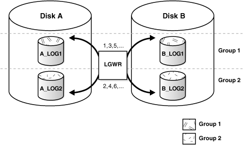
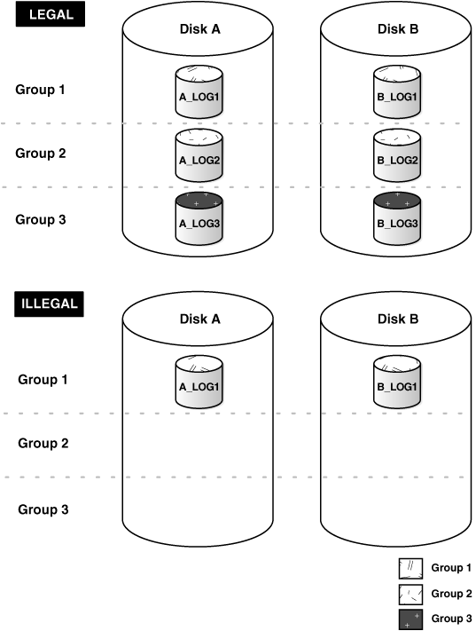

# Managing the Redo Log
***
编辑人：__**酷酷的诚**__  邮箱：**zhangchengk@foxmail.com** 
***
内容：

通过完成诸如创建重做日志组和成员、重新定位和重命名重做日志成员、删除重做日志组和成员以及强制切换日志等任务，您可以管理重做日志。

## What Is the Redo Log?

恢复操作最关键的结构是重做日志，它由两个或多个预先分配的文件组成，这些文件存储数据库中发生的所有更改。Oracle数据库的每个实例都有一个相关的重做日志，以便在实例失败时保护数据库。

### Redo Threads

在多个数据库实例的上下文中，每个数据库实例的重做日志也称为重做线程。

在典型的配置中，只有一个数据库实例访问Oracle数据库，因此只有一个线程。然而，在Oracle Real Application Clusters环境中，两个或多个实例同时访问单个数据库，每个实例都有自己的重做线程。每个实例的单独重做线程避免了对一组重做日志文件的争用，从而消除了潜在的性能瓶颈。

本章描述如何在一个标准的单实例Oracle数据库上配置和管理重做日志。在所有的讨论和语句示例中，线程数可以假定为1。有关Oracle Real应用程序集群环境中的重做日志组的信息，请参阅Oracle Real应用程序集群管理和部署指南。

### Redo Log Contents

重做日志文件用重做记录填充。

重做记录(也称为重做条目)由一组更改向量组成，每个更改向量是对数据库中单个块的更改的描述。例如，如果更改employee表中的salary值，则会生成一个redo记录，其中包含描述对表的数据段块、undo段数据块和undo段事务表的更改向量。

重做条目记录数据，您可以使用这些数据来重构对数据库所做的所有更改，包括撤消段。因此，重做日志也保护回滚数据。当使用重做数据恢复数据库时，数据库将读取重做记录中的更改向量，并将更改应用于相关块。

重做条目记录数据，您可以使用这些数据来重构对数据库所做的所有更改，包括撤消段。因此，重做日志也保护回滚数据。当使用重做数据恢复数据库时，数据库将读取重做记录中的更改向量，并将更改应用于相关块。

在提交相应的事务之前，也可以将重做记录写入重做日志文件。如果重做日志缓冲区被填满，或者另一个事务被提交，LGWR会将重做日志缓冲区中的所有重做日志项刷新到重做日志文件中，即使有些重做记录可能没有被提交。如果需要，数据库可以回滚这些更改。

### How Oracle Database Writes to the Redo Log

数据库的重做日志由两个或多个重做日志文件组成。数据库至少需要两个文件，以确保一个文件在另一个文件存档时始终可用(如果数据库处于ARCHIVELOG模式)。

See "[ Managing Archived Redo Log Files](https://docs.oracle.com/en/database/oracle/oracle-database/19/admin/managing-archived-redo-log-files.html#GUID-5EE4AC49-E1B2-41A2-BEE7-AA951EAAB2F3 "You manage the archived redo log files by completing tasks such as choosing between NOARCHIVELOG or ARCHIVELOG mode and specifying archive destinations.")" for more information.

LGWR以循环方式写入重做日志文件。当当前重做日志文件被填满时，LGWR开始向下一个可用的重做日志文件写入数据。当最后一个可用的重做日志文件被填满时，LGWR返回到第一个重做日志文件并对其进行写操作，再次开始循环。图11-1说明了重做日志文件的循环写入。每一行旁边的数字表示LGWR写入每个重做日志文件的顺序。

填充的重做日志文件可用于LGWR，以根据是否启用归档进行重用。

* 如果归档被禁用(数据库处于NOARCHIVELOG模式)，则在将记录在其中的更改写入数据文件之后，一个已填充的重做日志文件是可用的。

* 如果启用了归档(数据库处于ARCHIVELOG模式)，那么LGWR将记录在其中的更改写入数据文件并存档之后，就可以使用填充的重做日志文件。

####  Active (Current) and Inactive Redo Log Files
Oracle数据库一次只使用一个重做日志文件来存储从重做日志缓冲区写入的重做记录。LGWR正在主动写入的重做日志文件称为当前重做日志文件。

实例恢复所需的重做日志文件称为活动重做日志文件。实例恢复不再需要的重做日志文件称为非活动重做日志文件。

如果启用了归档(数据库处于ARCHIVELOG模式)，则在归档后台进程(ARCn)之一归档其内容之前，数据库不能重用或覆盖活动的在线日志文件。如果归档被禁用(数据库处于NOARCHIVELOG模式)，那么当最后一个重做日志文件已满时，LGWR将继续覆盖下一个日志文件，直到它变得不活动。

#### Log Switches and Log Sequence Numbers

日志开关是指数据库停止写入一个重做日志文件并开始写入另一个重做日志文件的点。

通常，当当前重做日志文件被完全填满并且写入必须继续到下一个重做日志文件时，会发生日志切换。

但是，可以将日志切换配置为定期发生，而不管当前重做日志文件是否已完全填满。

您还可以手动强制日志开关。每次发生日志切换和LGWR开始写入日志时，Oracle数据库都会为每个重做日志文件分配一个新的日志序列号。当数据库归档时重做日志记录

## Planning the Redo Log

### Multiplexing Redo Log Files

为了防止涉及重做日志本身的故障，Oracle数据库允许一个多路重做日志，这意味着可以在不同的位置自动维护两个或多个相同的重做日志副本。

为了获得最大的好处，这些位置应该位于单独的磁盘上。但是，即使重做日志的所有副本都在同一个磁盘上，这种冗余也有助于防止I/O错误、文件损坏等。当重做日志文件被复用时，LGWR并发地将相同的重做日志信息写入多个相同的重做日志文件，从而消除了重做日志失败的单一点。

复用是通过创建重做日志文件组来实现的。组由重做日志文件及其多路复制组成。每个相同的副本被称为组的一个成员。每个重做日志组由一个数字定义，比如组1、组2等等。

在图11-2中，A_LOG1和B_LOG1都是组1的成员，A_LOG2和B_LOG2都是组2的成员，以此类推。组中的每个成员的大小必须相同。

日志文件组的每个成员都是并发活动的(即lgr并发写入的)，这由LGWR分配的相同日志序列号表示。在图11-2中，首先LGWR并发地写A_LOG1和B_LOG1。然后它同时写入A_LOG2和B_LOG2，以此类推。LGWR从不并发地写不同组的成员(例如，写A_LOG1和B_LOG2)。

注意:Oracle建议您复用重做日志文件。如果需要恢复，日志文件数据的丢失可能是灾难性的。注意，当您复用重做日志时，数据库必须增加它执行的I/O数量。根据您的配置，这可能会影响整个数据库的性能。

#### Responding to Redo Log Failure

当LGWR不能写入组的成员时，数据库将该成员标记为无效，并向LGWR跟踪文件和数据库警报日志写入错误消息，以指示不可访问文件的问题。

当重做日志成员不可用时，LGWR的具体反应取决于缺乏可用性的原因，如下表所示。

Condition                                                                                       | LGWR Action                                                                                                                                                                                                                                                                                                                                                                                                                                                                                                                                                            
----------------------------------------------------------------------------------------------- | -----------------------------------------------------------------------------------------------------------------------------------------------------------------------------------------------------------------------------------------------------------------------------------------------------------------------------------------------------------------------------------------------------------------------------------------------------------------------------------------------------------------------------------------------------------------------
LGWR can successfully write to at least one member in a group                                   | Writing proceeds as normal. LGWR writes to the available members of a group and ignores the unavailable members.                                                                                                                                                                                                                                                                                                                                                                                                                                                       
LGWR cannot access the next group at a log switch because the group must be archived            | Database operation temporarily halts until the group becomes available or until the group is archived.                                                                                                                                                                                                                                                                                                                                                                                                                                                                 
All members of the next group are inaccessible to LGWR at a log switch because of media failure | Oracle Database returns an error, and the database instance shuts down. In this case, you may need to perform media recovery on the database from the loss of a redo log file.If the database checkpoint has moved beyond the lost redo log, media recovery is not necessary, because the database has saved the data recorded in the redo log to the data files. You need only drop the inaccessible redo log group. If the database did not archive the bad log, use `ALTER DATABASE CLEAR LOGFILE UNARCHIVED` to disable archiving before the log can be dropped.
All members of a group suddenly become inaccessible to LGWR while it is writing to them         | Oracle Database returns an error and the database instance immediately shuts down. In this case, you may need to perform media recovery. If the media containing the log is not actually lost--for example, if the drive for the log was inadvertently turned off--media recovery may not be needed. In this case, you need only turn the drive back on and let the database perform automatic instance recovery.                                                                                                                                                      
#### Legal and Illegal Configurations

在大多数情况下，复用重做日志应该是对称的:重做日志的所有组应该具有相同数量的成员。但是，数据库并不要求多路复用重做日志是对称的。

例如，一个组只能有一个成员，而其他组可以有两个成员。这种配置可以防止磁盘故障，因为磁盘故障会暂时影响某些重做日志成员，但不会影响其他成员。

实例重做日志的惟一要求是它至少有两个组。图11-3显示了合法和非法的多路复用重做日志配置。第二个配置是非法的，因为它只有一个组。

### Placing Redo Log Members on Different Disks

设置多路复用重做日志时，将组的成员放在不同的物理磁盘上。如果单个磁盘出现故障，那么LGWR只能访问组中的一个成员，而LGWR仍然可以访问其他成员，因此实例可以继续运行。

如果您归档了重做日志，请将重做日志成员分散到磁盘上，以消除LGWR和ARCn后台进程之间的争用。例如，如果您有两组多路复用重做日志成员(双路复用重做日志)，则将每个成员放在不同的磁盘上，并将归档目标设置为第五个磁盘。这样做可以避免LGWR(向成员写入数据)和ARCn(读取成员数据)之间的争用。

还应该将数据文件放在与重做日志文件不同的磁盘上，以减少写入数据块和重做记录时的争用。

### Planning the Size of Redo Log FilesPlanning the Size of Redo Log Files

在设置重做日志文件的大小时，请考虑是否要归档重做日志。应该调整重做日志文件的大小，以便将填充的组归档到单个脱机存储媒体单元(如磁带或磁盘)，同时使介质上未使用的空间最少。

例如，假设一个磁带上只能容纳一个已填充的重做日志组，并且49%的磁带存储容量仍然没有使用。在这种情况下，最好稍微减少重做日志文件的大小，以便在每个磁带上归档两个日志组。

