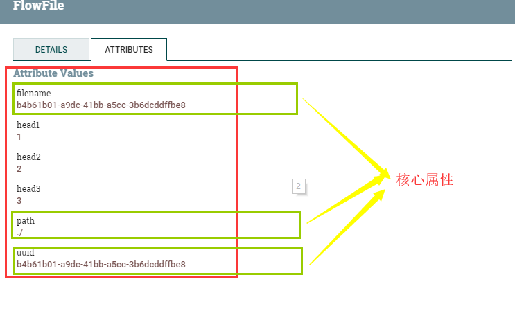
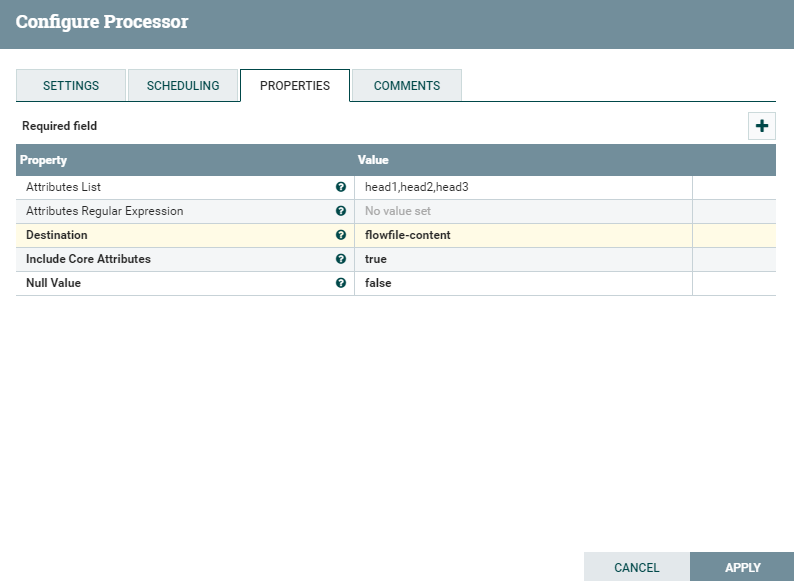
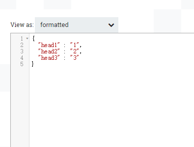

# AttributesToJSON
***
编辑人：__**酷酷的诚**__  邮箱：**zhangchengk@foxmail.com** 
***
内容：

## 描述

 该处理器将输入流文件属性转成JSON表示形式。生成的JSON可以被写入一个名为“JSONAttributes”的新属性，也可以作为内容写入到流文件中。

## 属性配置

在下面的列表中，必需属性的名称以粗体显示。任何其他属性(不是粗体)都被认为是可选的，并且指出属性默认值（如果有默认值），以及属性是否支持表达式语言。

|属性名称|默认值|可选值|描述|
|:-|:-|:-|:-|
|Attribute List|||逗号分隔的属性名列表，这些属性及属性值将包含在结果JSON中。如果该值为空，则将包含所有现有属性。此属性列表区分大小写，并支持包含逗号的属性名称。如果列表中指定的属性没有找到，它将以空字符串或空值被发送到结果JSON中 。 支持表达式语言:true|
|Attributes Regular Expression|||将根据流文件属性计算的正则表达式，以选择匹配的属性。此属性可与属性列表属性组合使用。 支持表达式语言:true|
|**Destination**|flowfile-attribute|<li>flowfile-attribute</li><li>flowfile-content</li>|控制JSON值是作为新属性“JSONAttributes”写入，还是写入到流文件内容中。|
|**Include Core Attributes**|true|<li>true</li><li>false</li>|设置JSON是否包含FlowFile org.apache.nifi.flowfile.attributes.CoreAttributes（每个流文件都有的核心属性）。|
|**Null Value**|false|<li>true</li><li>false</li>|如果为true，则结果JSON中不存在或为空的属性将为“null”。如果为false，将在JSON中放置一个空字符串|

## 连接关系

|名称|描述|
|:-|:-|
|success|成功地将属性转换为JSON|
|failure|未能将属性转换为JSON|

## 读取属性

没有指定。

## 写属性

|名称|描述|
|:-|:-|
|JSONAttributes|JSON 数据|

## 状态管理

此组件不存储状态。

## 限制

此组件不受限制。

## 输入要求

此组件需要传入关系。

## 系统资源方面的考虑

没有指定。

## 应用场景

该处理器就是将流文件的若干属性转成JSON数据，输出到输出流文件的属性或者内容当中 。

## 示例说明

示例流程模板xml

流程图

GenerateFlowFile负责生成带特定attribute的流文件，AttributesToJSON配置json输出到流属性

流程模板xml(1.9.2)

链接: <a target="_blank" href="https://pan.baidu.com/s/1zthgUtOV46K4vI1SvM0gZw&shfl=shareset">百度云盘</a> 提取码: wh47 

1：如图为GenerateFlowFile生成的流文件，AttributesToJSON配置json输出到流属性中，包含核心属性 

配置如下：

结果为：

2：例子1中同样的配置，但json输出到输出流的content中

结果为

