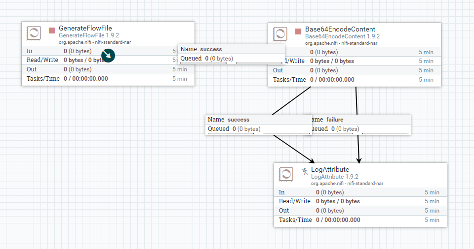
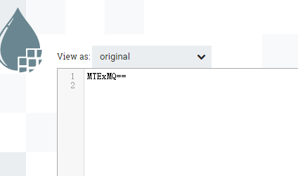

# Base64EncodeContent
***
编辑人：__**酷酷的诚**__  邮箱：**zhangchengk@foxmail.com** 
***
内容：

**描述：**    

该处理器对base64和base64之间的内容进行编码或解码

**属性配置**：

在下面的列表中，必需属性的名称以粗体显示。任何其他属性(不是粗体)都被认为是可选的，并且指出属性默认值（如果有默认值），以及属性是否支持表达式语言。

属性名称     |  默认值   | 可选值               | 描述             
-------- |:------:| ----------------- | ---------------
**Mode** | Encode | <li>Encode</li><li>Decode</li> | 指定应该对内容进行编码还是解码

**连接关系：**

名称      | 描述                       
------- | -------------------------
sucess  | 任何被成功编码或解码的流文件都将被路由到此关系 
failure | 任何没有被成功编码或解码的流文件都将被路由到此关系

**读取属性:**

没有指定。

**写属性:**

没有指定。

**状态管理:**

此组件不存储状态。

**限制:**

此组件不受限制。

**输入要求:**

此组件需要传入连接关系。

**系统资源方面的考虑:**

没有指定。

**应用场景：**

该处理器比较简单，就是对base64和base64之间的内容进行编码或解码

**示例说明：**

流程模板xml(1.9.2)

<a href="../template/Base64EncodeContent.xml" download="Base64EncodeContent.xml">Base64EncodeContent.xml</a>

1：编码   内容为  1111

结果为

2：解码   内容为  

MTExMQ==

结果为：

