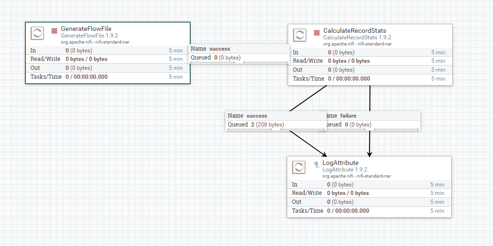
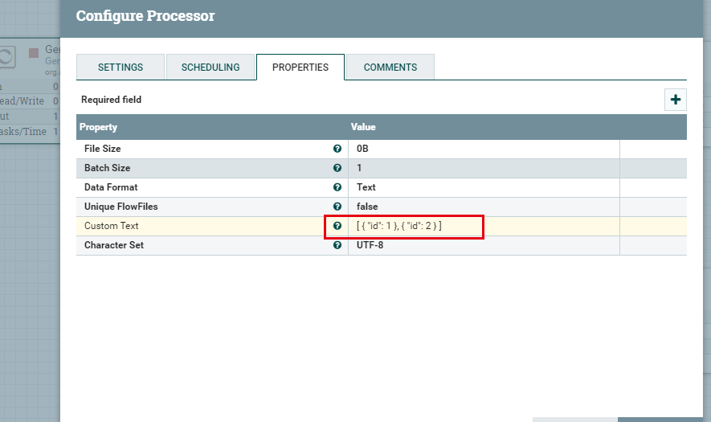
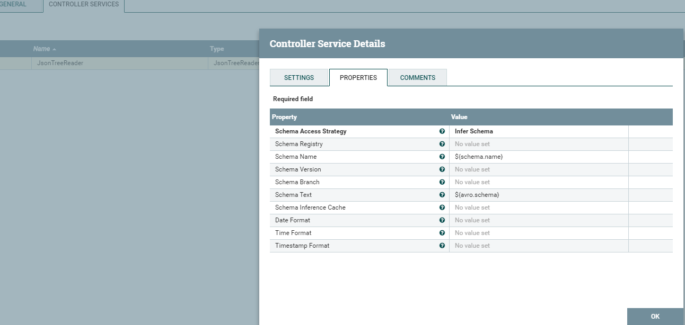
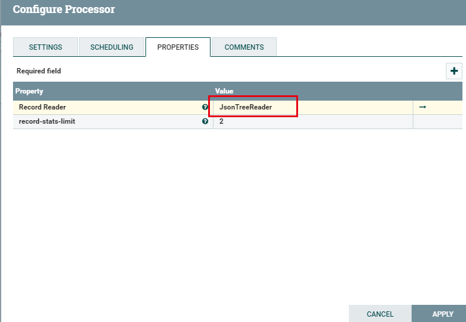
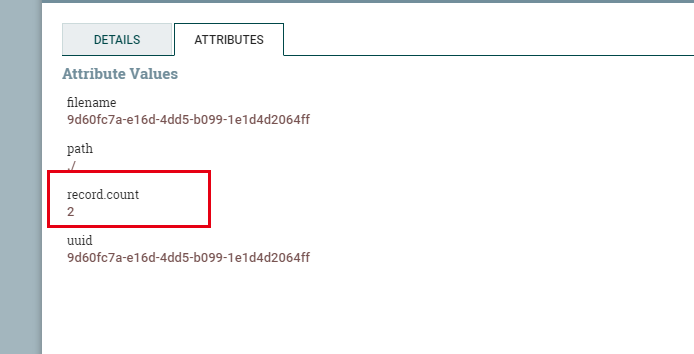
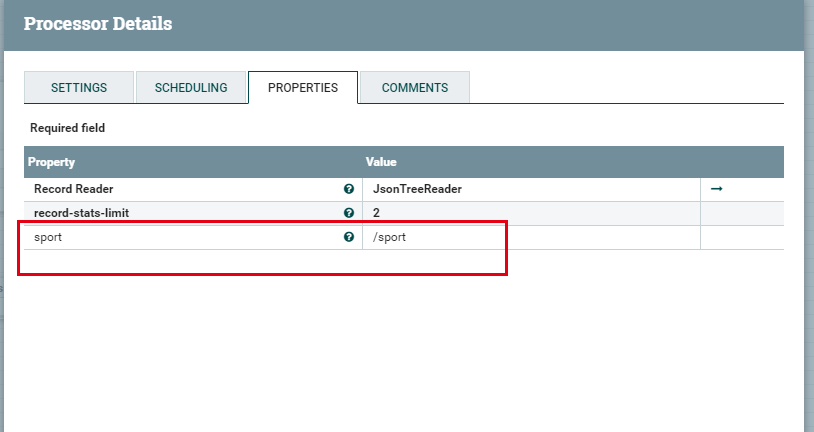
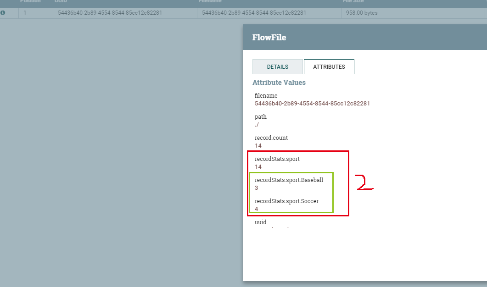
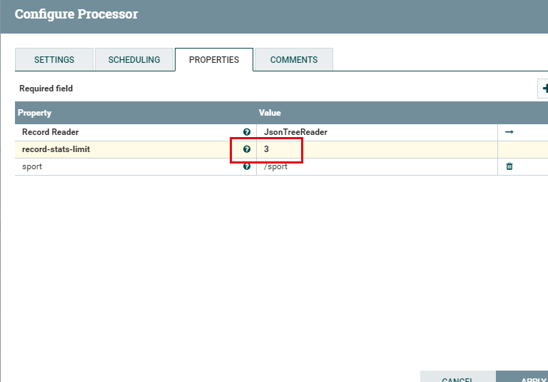
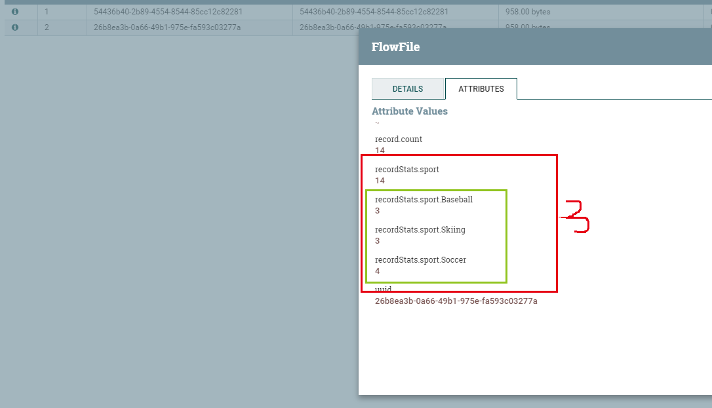

# CalculateRecordStats
***
编辑人：__**酷酷的诚**__  邮箱：**zhangchengk@foxmail.com** 
***
内容：

**描述：**    

该处理器可以计算记录集中的项数，也可以根据用户定义的记录集子集的条件提供计数。

**属性配置**：

在下面的列表中，必需属性的名称以粗体显示。任何其他属性(不是粗体)都被认为是可选的，并且指出属性默认值（如果有默认值），以及属性是否支持表达式语言。

属性名称                   | 默认值 | 可选值                                                                                                                                                                                                             | 描述                                                           
---------------------- |:---:| --------------------------------------------------------------------------------------------------------------------------------------------------------------------------------------------------------------- | -------------------------------------------------------------
**Record Reader**      |     | **Controller Service API:**  <br>RecordReaderFactory  <br>**Implementations:** Syslog5424Reader<br>GrokReader  <br>JsonTreeReader<br>ScriptedReader<br>XMLReader<br>AvroReader<br>SyslogReader  <br>CSVReader<br>JsonPathReader | 用于读取记录的记录阅读器。                                                
**record-stats-limit** | 10  |                                                                                                                                                                                                                 | 限制每个记录路径返回到前N个结果的单个统计信息的数量。<br>支持表达式语言:true(将使用流文件属性和变量注册表进行计算)

**连接关系：**

名称      | 描述                      
------- | ------------------------
sucess  | 如果一个流文件被成功地处理了，它会转到这里。  
failure | 如果一个流文件没有被成功地处理了，它会转到这里。

**读取属性:**

没有指定。

**写属性:**

名称                                                     | 描述                                              
------------------------------------------------------ | ------------------------------------------------
record.count                                           | 在flowfile中设置的记录中的记录的计数。                         
recordStats.`<User Defined Property Name>`.count         | 包含用户定义属性值的记录的计数。                                
recordStats.`<User Defined Property Name>`.`<value>`.count | 为用户定义的属性发现的每个值都有自己的count属性。要添加的前N个值计数的总数由极限配置定义。

**状态管理:**

此组件不存储状态。

**限制:**

此组件不受限制。

**输入要求:**

此组件需要传入连接关系。

**系统资源方面的考虑:**

没有指定。

**应用场景：**

该处理器用来统计一个特定格式的FlowFile中有多少个元素；

**示例说明：**

1：用GenerateFlowFile模拟生产一个json数组，用CalculateRecordStats统计这个数组有多少元素 

流程图：


简单的json数组：

Reader设置：



结果：


2:record-stats-limit 属性用于统计用户自定义值，看示例：


输入一个稍微复杂点的json数组 ：
```json
[
    {
        "name": "zhangsan",
        "sport": "Soccer"
    },
    {
        "name": "zhangsan",
        "sport": "Soccer"
    },
    {
        "name": "zhangsan",
        "sport": "Soccer"
    },
    {
        "name": "zhangsan",
        "sport": "Skiing"
    },
    {
        "name": "zhangsan",
        "sport": "Skiing"
    },
    {
        "name": "zhangsan",
        "sport": "Skiing"
    },
    {
        "name": "zhangsan",
        "sport": "Soccer"
    },
    {
        "name": "zhangsan",
        "sport": "Basketball"
    },
    {
        "name": "zhangsan",
        "sport": "Basketball"
    },
    {
        "name": "zhangsan",
        "sport": "Football"
    },
    {
        "name": "zhangsan",
        "sport": "Football"
    },
    {
        "name": "zhangsan",
        "sport": "Baseball"
    },
    {
        "name": "zhangsan",
        "sport": "Baseball"
    },
    {
        "name": "zhangsan",
        "sport": "Baseball"
    }
]
```
自定义 属性 sport。limit设置为2：

结果可以发现，额外输出统计了自定义的两个属性

limit改为3：

结果可以发现，额外输出统计了自定义的三个属性
