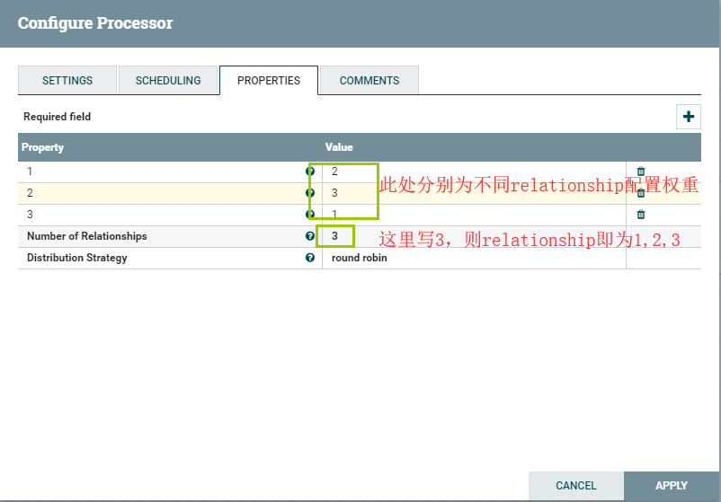
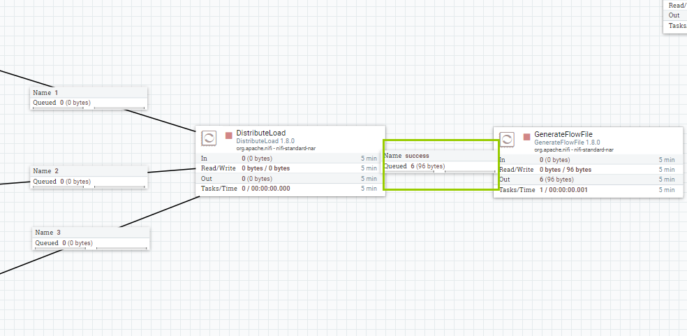
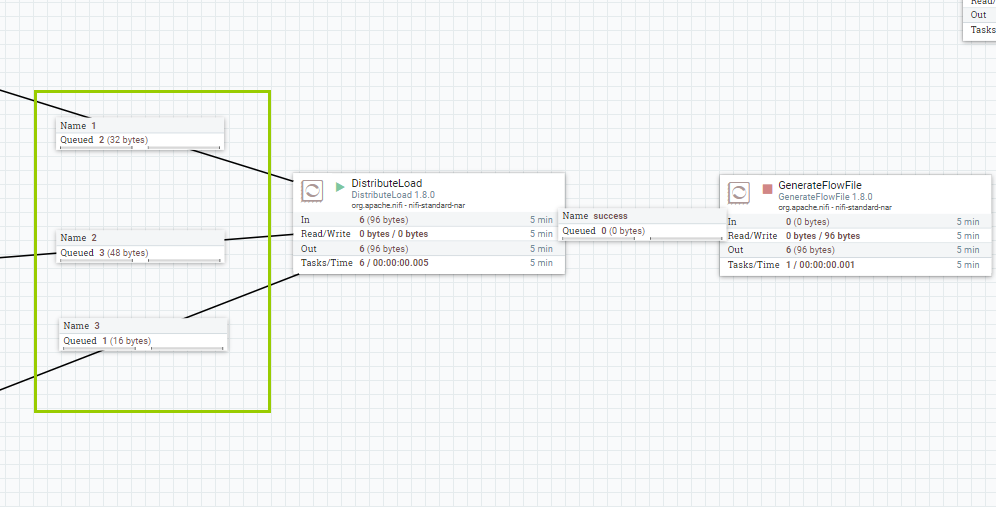

# DistributeLoad
***
编辑人：__**酷酷的诚**__  邮箱：**zhangchengk@foxmail.com** 
***
内容：

## 描述

该处理器根据分发策略将流文件分发给下游处理器。如果使用循环策略，默认情况下为每个目的地分配1个权重(均匀分布)。当然，权重与 relationship都是灵活可配的，比如自定义 属性名‘5’，值‘2’，那么relationship为‘5’的权重为2。

## 属性配置

在下面的列表中，必需属性的名称以粗体显示。任何其他属性(不是粗体)都被认为是可选的，并且指出属性默认值（如果有默认值），以及属性是否支持表达式语言。

|属性名称|默认值|可选值|描述|
|:-|:-|:-|:-|
|**Number of Relationships**|1||确定负载应该分布到的关系的数量|
|**Distribution Strategy**|round robin|<li>round robin</li><li>next available</li><li>load distribution service</li>|确定负载将如何分配。如果使用循环，将不会分发任何流文件，除非所有目的地都可以接受流文件;当使用Next Available时，只要至少有一个目的地可以接受流文件，就会分发流文件。|

## 动态属性：

该处理器允许用户指定属性的名称和值。

|属性名称|属性值|描述|
|:-|:-|:-|
|The relationship name(positive number)|The relationship Weight(positive number)|添加名称为“5”和值为“10”的属性意味着名称为“5”的关系将在每次迭代中接收10个流文件，而不是1个。 支持表达式语言:false|

## 连接关系

|名称|描述|
|:-|:-|
|1||

## 自定义连接关系

可以根据用户配置处理器的方式创建动态关系。

|名称|描述|
|:-|:-|
|数字|按照<分发策略>将流文件发送到这个关系|

## 读取属性

没有指定。

## 写属性

没有指定。

## 状态管理

此组件不存储状态。

## 限制

此组件不受限制。

## 输入要求

此组件需要传入关系。

## 系统资源方面的考虑

没有指定。

## 应用场景

按权重向下游多个处理器分发数据。在单个流程处理数据达到瓶颈，而整体环境资源充足，这种情况有可能需要多个流程来分担数据处理压力。而该处理器充当一个分发数据的角色；（注：与connection的Load Balance要区分开）

## 示例说明

流程模板xml(1.9.2)

<a href="../template/DistributeLoad.xml" download="DistributeLoad.xml">DistributeLoad.xml</a>

配置3个relationship，再分别配置不同的权重。

测试中使得数据分配前队列中有6个flowfile

结果：

