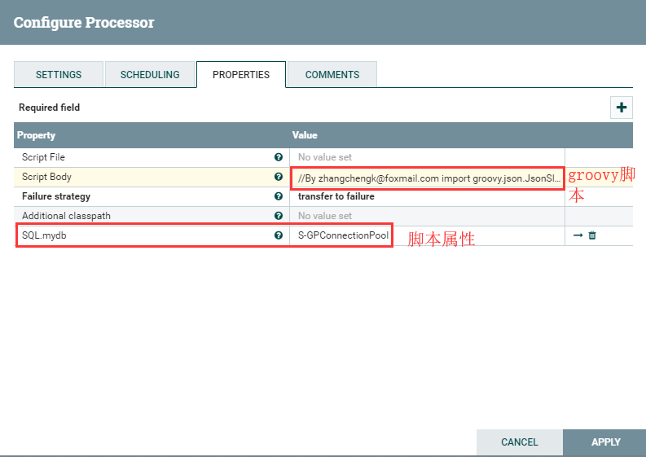

# ExecuteGroovyScript
***
编辑人：__**酷酷的诚**__  邮箱：**zhangchengk@foxmail.com** 
***
内容：


## 描述

Groovy脚本处理器。脚本负责处理传入的流文件以及任何脚本创建的流文件(例如，转移到成功或删除)。如果处理不完整或不正确，会话将回滚。

## 属性配置

在下面的列表中，必需属性的名称以粗体显示。任何其他属性(不是粗体)都被认为是可选的，并且指出属性默认值（如果有默认值），以及属性是否支持表达式语言。

|属性名称|默认值|可选值|描述|
|:-|:-|:-|:-|
|Script File|||要执行的脚本文件的路径。只能使用一个脚本文件或脚本主体<br>支持表达式语言:true|
|Script Body|||要执行的脚本体。只能使用一个脚本文件或脚本主体|
|**Failure strategy**|rollback|<li>rollback</li><li>transfer to failure</li>|如何对待未处理的异常。如果希望通过代码管理异常，请保留默认值“rollback”。如果选中“transfer to failure”且有未处理异常发生，则此会话会将从传入队列接收的所有流文件都传输到“failure”关系，并带有附加属性:ERROR_MESSAGE和ERROR_STACKTRACE。如果选择 “rollback”且有未处理异常发生，则将从传入队列接收到的所有流文件进行惩罚并返回。如果处理器没有传入连接，则此参数无效。|
|Additional classpath|||用分号分隔的类路径列表。<br>支持表达式语言:true|

## 动态属性：

该处理器允许用户指定属性的名称和值。

|属性名称|属性值|描述|
|:-|:-|:-|
|要更新的脚本引擎属性|要将其设置为的值|用动态属性的值指定的值更新由动态属性的键指定的脚本引擎属性。<br>支持表达式语言:true|

## 连接关系

|名称|描述|
|:-|:-|
|failure|处理失败的流文件|
|sucess|成功处理的流文件|

## 读取属性

没有指定。

## 写属性

没有指定。

## 状态管理

此组件不存储状态。

## 限制

|Required Permission|Explanation|
|:-|:-|
|execute code|提供操作符执行任意代码的能力，假设NiFi具有所有权限。|

## 输入要求

没有指定。

## 系统资源方面的考虑

没有指定。

## 应用场景

该处理器用于执行groovy脚本，可以灵活处理Flowfile.

## 示例说明

1.使用Groovy脚本组装数据



groovy脚本:这段脚本的意思是根据主表的数据，去查询子表，并且将主子表的数据进行 组装 

```groovy
//By zhangchengk@foxmail.com
import groovy.json.JsonSlurper
import groovy.sql.Sql
import groovy.json.JsonOutput 
//get the flowfile  
def ff = session.get()
if(!ff)return
String text = ff.read().getText("UTF-8")
def jsonSlurper = new JsonSlurper()
//get Map
def map = jsonSlurper.parseText(text)
// get attributes of this flowfile
def join_value = ff.getAttribute('join_value')//主子表关联键value
def tablename= ff.getAttribute('slaveTableName')//子表表名
def tsLt= ff.getAttribute('tsLt')
def slaveJoinColumn= ff.getAttribute('slaveJoinColumn')
def slaveJsonField= ff.getAttribute('slaveJsonField')
// build the sql which select from slave table
def sql = "select distinct id from ${tablename} where ${slaveJoinColumn}= '${join_value}' and dr !='2' and ts < '${tsLt}'"
//SQL.mydb references http://docs.groovy-lang.org/2.4.10/html/api/groovy/sql/Sql.html object
List list = SQL.mydb.rows(sql .toString()) //important to cast to String
List result = []
//查询子表一定时间范围（<tsLt）的最新状态
for(int i=0;i<list.size();i++){
	sql = "select  * from test.fi_note_cusl_ysbxd_b where id = '${ list[i].id}' and dr !='2' order by ts DESC limit 1"
	result.add( SQL.mydb.firstRow(sql .toString()))
}
map.put(slaveJsonField.toString(),result)//主子表数据json组合
def output = JsonOutput.toJson(map)
session.remove(ff)
def newff = session.create()
newff.putAttribute("data", output )
//transfer flow file to success
REL_SUCCESS << newff
```