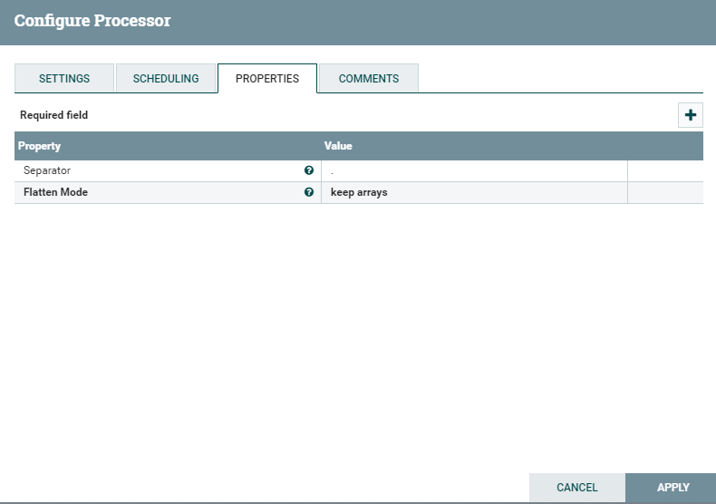
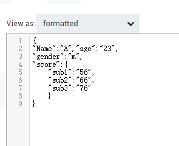
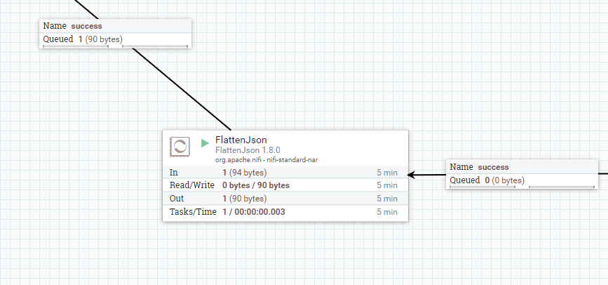

# FlattenJson
***
编辑人：__**酷酷的诚**__  邮箱：**zhangchengk@foxmail.com** 
***
内容：

## 描述

该处理器为用户提供了获取嵌套JSON文档，并将其平展成简单的键/值对文档的能力。json的键在每一层与用户定义分隔符（默认为'.'）组合。支持三种flatten模式，normal，keep arrays和针对MongoDB查询dot notation。默认的flatten模式是“keep-arrays”。

## 属性配置

在下面的列表中，必需属性的名称以粗体显示。任何其他属性(不是粗体)都被认为是可选的，并且指出属性默认值（如果有默认值），以及属性是否支持表达式语言。

|属性名称|默认值|可选值|描述|
|:-|:-|:-|:-|
|Separator|||用于连接键的分隔符。必须是JSON-legal字符。 支持表达式语言:true|
|**Flatten Mode**|keep arrays|<li>normal </li><li>keep arrays </li><li>dot notation</li>|指定如何平铺json|

## 连接关系

|名称|描述|
|:-|:-|
|failure|不能平展的文件将转到此关系。|
|sucess|成功地将扁平文件转换为这种关系。|

## 读取属性

没有指定。

## 写属性

没有指定。

## 状态管理

此组件不存储状态。

## 限制

此组件不受限制。

## 输入要求

此组件需要传入关系。

## 系统资源方面的考虑

没有指定。

## 应用场景

该处理器主要是将复杂的多层次结构的json数据，转换成只有key-value形式的json 。

## 示例说明

使用默认配置：

输入json：

输出json：

